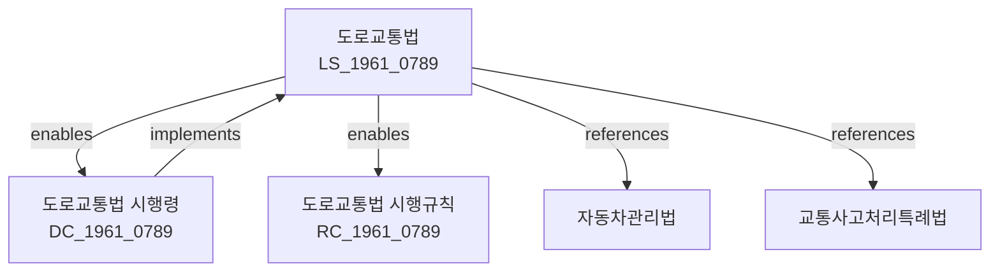

---
# === 식별 정보 ===
law_id: DC_1961_0789
law_serial: 제24676호
title: 도로교통법 시행령
abbreviation: 도로교통법시행령

# === 분류 정보 ===
law_type: decree
ministry: 행정안전부
category: 교통 > 도로교통

# === 날짜 정보 ===
promulgation_date: 1962-06-27
enforcement_date: 1962-07-01
last_amendment: 2024-02-20

# === 참조 정보 ===
source_url: https://law.go.kr/LSW/lsInfoP.do?lsiSeq=241039
parent_law: LS_1961_0789
parent_law_title: 도로교통법

# === 구조 정보 ===
total_articles: 68
attachments: true

# === 메타 정보 ===
status: 시행
version: 2024-02-20
---

# 도로교통법 시행령

> [대통령령 제24676호, 1962. 6. 27., 제정]

---

## 관계 그래프

**상위 법령**: [[도로교통법]] (제121조 위임)

---

## 제1장 총칙

### 제1조 (목적)

이 영은 「도로교통법」에서 위임된 사항과 그 시행에 필요한 사항을 규정함을 목적으로 한다.

### 제2조 (정의)

이 영에서 사용하는 용어의 뜻은 「도로교통법」(이하 "법"이라 한다)에서 사용하는 용어의 뜻과 같다.

---

## 제2장 운전면허

### 제5조 (운전면허의 구분)

① 법 제2조제2항에 따른 운전면허의 종류는 다음 각 호와 같다.

1. 제1종 대형면허: 대형승용자동차를 운전할 수 있는 면허
2. 제1종 보통면허: 승용자동차·승합자동차(대형 제외)·화물자동차를 운전할 수 있는 면허
3. 제2종 보통면허: 승용자동차·4톤 이하 화물자동차를 운전할 수 있는 면허
4. 제2종 소형면허: 이륜자동차·원동기장치자전거를 운전할 수 있는 면허
5. 원동기장치자전거면허: 원동기장치자전거를 운전할 수 있는 면허
6. 특수면허: 특수자동차를 운전할 수 있는 면허

② 제1항에 따른 운전면허를 받을 수 있는 자격요건은 별표 1과 같다.

### 제6조 (운전면허시험)

① 법 제75조제2항에 따른 운전면허시험은 필기시험·실기시험 및 도로주행시험으로 구분한다.

② 필기시험은 다음 각 호의 사항에 관하여 실시한다.

1. 도로교통에 관한 법령
2. 자동차등의 취급방법 및 안전운전에 필요한 지식
3. 운전자가 갖추어야 할 도덕심 및 에티켓

③ 실기시험은 자동차등의 운전기능에 관하여 실시한다.

④ 도로주행시험은 도로에서의 안전운전 능력에 관하여 실시한다.

### 제7조 (운전면허증의 교부)

① 지방경찰청장은 운전면허시험에 합격한 사람에게 지체 없이 운전면허증을 교부하여야 한다.

② 운전면허증에는 다음 각 호의 사항을 기재하여야 한다.

1. 면허번호
2. 성명·생년월일 및 주소
3. 면허의 종류
4. 면허를 받은 날
5. 면허의 유효기간
6. 그 밖에 행정안전부령으로 정하는 사항

### 제8조 (운전면허의 효력정지 기준)

① 법 제79조에 따라 지방경찰청장이 운전면허의 효력을 정지할 수 있는 기준은 별표 2와 같다.

② 효력정지 기간은 1년의 범위에서 정한다.

---

## 제3장 자동차등의 안전운전

### 제15조 (속도제한)

① 법 제14조에 따른 속도제한은 다음 각 호와 같다.

1. 일반도로: 시속 60킬로미터
2. 자동차전용도로: 시속 100킬로미터
3. 고속도로: 시속 100킬로미터

② 제1항에도 불구하고 다음 각 호의 구역에서는 시속 30킬로미터로 제한한다.

1. 어린이 보호구역
2. 스쿨존
3. 주택가 도로

### 제16조 (앞지르기 방법)

① 법 제15조에 따라 앞지르기할 때에는 앞차의 좌측으로 통과하여야 한다.

② 다만, 다음 각 호의 어느 하나에 해당하는 경우에는 앞차의 우측으로 앞지르기할 수 있다.

1. 앞차가 좌회전하려고 좌측으로 진로를 변경하는 경우
2. 도로의 우측에 앞지르기할 수 있는 충분한 공간이 있는 경우
3. 그 밖에 앞지르기가 불가피한 경우로서 안전을 확보한 경우

### 제17조 (교차로 통행방법)

① 교차로에서 좌회전하려는 차마는 미리 도로의 중앙선을 따라 교차로의 중심 안쪽을 서행하면서 좌회전하여야 한다.

② 교차로에서 우회전하려는 차마는 도로의 우측 가장자리을 따라 서행하면서 우회전하여야 한다.

---

## 제4장 보행자 보호

### 제25조 (횡단보도에서의 보행자 보호)

① 차마는 횡단보도에서 보행자가 통행하고 있거나 통행하려고 할 때에는 일시정지하여야 한다.

② 횡단보도에서 보행자에게 우선권이 있다는 것을 알리기 위하여 횡단보도 앞에 「도로교통법」 제5조에 따른 횡단보도 표시를 하여야 한다.

### 제26조 (어린이 보호구역)

① 다음 각 호의 시설 주변 도로는 어린이 보호구역으로 지정할 수 있다.

1. 유치원
2. 초등학교
3. 특수학교
4. 어린이집
5. 학원

② 어린이 보호구역에서의 속도는 시속 30킬로미터로 제한한다.

③ 어린이 보호구역에서는 경적을 울리지 아니하고 서행하여야 한다.

---

## 제5장 음주운전

### 제30조 (혈중알코올농도 측정)

① 경찰공무원은 다음 각 호의 어느 하나에 해당하는 사람에 대하여는 혈중알코올농도 측정을 할 수 있다.

1. 술에 취한 상태에서 운전하였다고 인정할 만한 상당한 이유가 있는 사람
2. 교통사고를 일으킨 사람

② 제1항의 측정은 호흡분석기로 한다.

③ 측정을 요구받은 사람은 정당한 사유 없이 이에 응하여야 한다.

### 제31조 (운전자 음주측정 요구에 대한 거부금지)

① 누구든지 경찰공무원의 정당한 음주측정 요구를 거부하지 못한다.

② 제1항에 따른 측정에 응하지 아니하는 사람은 혈중알코올농도가 0.03퍼센트 이상인 것으로 추정한다.

---

## 제6장 벌칙

### 제45조 (범칙행위 및 범칙금)

① 법 제118조에 따른 과태료 부과 기준은 별표 3과 같다.

② 시·군경찰서장은 다음 각 호의 사항을 고려하여 제1항의 과태료 금액의 2분의 1의 범위에서 가중 또는 감경할 수 있다.

1. 위반행위의 내용 및 정도
2. 위반행위의 횟수
3. 그 밖에 위반행위와 관련된 사항

---

## 부칙 <제24676호, 1962.06.27.>

제1조(시행일) 이 영은 1962년 7월 1일부터 시행한다.

---

## 개정 이력

| 개정일       | 공포번호   | 개정유형   | 주요내용                        |
|-------------|-----------|-----------|--------------------------------|
| 2024-02-20  | 제34091호  | 일부개정   | 음주운단 처벌 강화 관련          |
| 2023-09-19  | 제33723호  | 일부개정   | 어린이 보호구역 속도 제한         |
| 2020-12-29  | 제32224호  | 일부개정   | 횡단보도 보행자 보호 강화        |
| 1962-06-27  | 제24676호  | 제정       | 도로교통법 시행령 제정            |

---

## 관련 법령

### 상위 법령
- [[LS_1961_0789|도로교통법]] - 제121조 위임

### 관련 법령
- [[LS_1961_0788|자동차관리법]]
- [[LS_1981_0356|교통사고처리특례법]]
- [[DC_1961_0788|자동차관리법 시행령]]

### 하위 법령
- [[RC_1961_0789|도로교통법 시행규칙]]

---

## 별표

> 📎 [별표 1] 운전면허 종류별 자격요건
>
> 📎 [별표 2] 운전면허 효력정지 기준
>
> 📎 [별표 3] 과태료 부과기준
