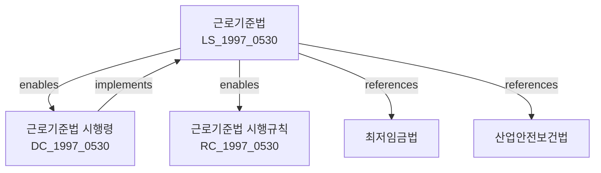

---
# === 식별 정보 ===
law_id: DC_1997_0530
law_serial: 제17107호
title: 근로기준법 시행령
abbreviation: 근로기준법시행령

# === 분류 정보 ===
law_type: decree
ministry: 고용노동부
category: 노동 > 근로

# === 날짜 정보 ===
promulgation_date: 1997-03-27
enforcement_date: 1997-03-27
last_amendment: 2024-02-20

# === 참조 정보 ===
source_url: https://law.go.kr/LSW/lsInfoP.do?lsiSeq=240989
parent_law: LS_1997_0530
parent_law_title: 근로기준법

# === 구조 정보 ===
total_articles: 47
attachments: true

# === 메타 정보 ===
status: 시행
version: 2024-02-20
---

# 근로기준법 시행령

> [대통령령 제17107호, 1997. 3. 27., 제정]

---

## 관계 그래프

**상위 법령**: [[근로기준법]] (제123조 위임)

---

## 제1장 총칙

### 제1조 (목적)

이 영은 「근로기준법」에서 위임된 사항과 그 시행에 필요한 사항을 규정함을 목적으로 한다.

### 제2조 (적용범위)

이 영은 「근로기준법」 제10조에 따른 적용범위 안에서 적용한다.

### 제3조 (근로계약의 서면교부)

「근로기준법」 제17조제2항에 따라 근로계약 체결 시 교부하는 문서에는 다음 각 호의 사항이 포함되어야 한다.

1. 근로계약기간에 관한 사항
2. 근로 장소 및 근로 내용에 관한 사항
3. 소정근로시간에 관한 사항
4. 임금의 구성항목·계산방법 및 지급방법
5. 임금 지급일
6. 휴가에 관한 사항
7. 취업규칙에서 정하는 사항
8. 그 밖의 근로계약의 내용이 되는 사항

---

## 제2장 임금

### 제6조 (평균임금 산정방법)

① 「근로기준법」 제2조제1항제6호에 따른 평균임금은 이를 산정하여야 할 사유가 발생한 날 이전 3개월 동안에 지급된 임금 총액을 그 기간의 총일수로 나눈 금액으로 한다.

② 제1항에도 불구하고 다음 각 호의 어느 하나에 해당하는 경우에는 별도로 정하는 바에 따른다.

1. 근로한 기간이 3개월 미만인 경우
2. 임금의 일부 또는 전부가 확정되지 아니한 경우
3. 그 밖에 제1항의 방법으로 산정하기 곤란한 경우

### 제7조 (임금지급 방법)

① 임금은 통화(通貨)로 직접 근로자에게 그 전액을 지급하여야 한다.

② 다만, 법령 또는 단체협약에 특별한 규정이 있는 경우에는 예외로 한다.

### 제8조 (임금대장)

① 사용자는 각 사업장별로 임금대장을 작성하여야 한다.

② 임금대장에는 다음 각 호의 사항을 기록하여야 한다.

1. 근로자의 성명
2. 임금의 구성항목 및 금액
3. 임금 지급일
4. 근로일수 및 근로시간

---

## 제3장 근로시간 및 휴게

### 제11조 (탄력적 근로시간제)

① 「근로기준법」 제51조에 따른 탄력적 근로시간제의 단위기간은 3개월 이내로 한다.

② 제1항의 기간 동안의 평균 주당 근로시간은 40시간을 초과할 수 없다.

### 제12조 (연장근로의 제한)

① 「근로기준법」 제53조에 따른 연장근로는 1주당 12시간을 초과할 수 없다.

② 다만, 다음 각 호의 어느 하나에 해당하는 경우에는 근로자의 동의를 받아 1주당 12시간을 초과할 수 있다.

1. 사고가 발생하거나 불가피한 사유가 생긴 경우
2. 법령에 따라 건강진단을 받은 결과 이상 징후가 없는 근로자가 요청하는 경우

### 제13조 (휴게시간)

① 「근로기준법」 제54조에 따른 휴게시간은 근로시간 4시간마다 30분 이상 부여하여야 한다.

② 휴게시간은 근로자가 자유롭게 이용할 수 있다.

---

## 제4장 휴가

### 제15조 (연차 유급휴가)

① 사용자는 1년간 80퍼센트 이상 출근한 근로자에게 15일의 유급휴가를 부여하여야 한다.

② 사용자는 1년간 개근한 근로자에게 10일의 유급휴가를 부여하여야 한다.

③ 사용자는 3년 이상 계속 근로한 근로자에게는 최초 1년을 초과하는 계속 근로 연수 매 2년에 대하여 1일의 유급휴가를 가산하여 부여하여야 한다.

④ 제3항에 따른 가산휴가를 포함한 총 연차휴가일수는 25일을 한도로 한다。

### 제16조 (월차 유급휴가)

① 사용자는 1개월간 개근한 근로자에게 1일의 유급휴가를 부여하여야 한다.

② 제1항의 휴가는 근로자가 청구한 날짜에 부여하여야 한다。

---

## 제5장 여성과 소년

### 제20조 (생리휴가)

「근로기준법」 제62조에 따른 생리휴가는 월 1일로 한다.

### 제21조 (산전후휴가)

① 「근로기준법」 제63조에 따른 산전후휴가는 90일로 한다.

② 산전후휴가 중 산후 45일 이상을 확보하여야 한다.

③ 사용자는 산전후휴가 기간 중 근로자에게 통상임금의 100분의 100을 지급하여야 한다.

### 제22조 (육아휴직)

① 「근로기준법」 제64조에 따른 육아휴직 기간은 1년 이내로 한다.

② 사용자는 육아휴직을 이유로 근로자에 대하여 해고나 그 밖의 불리한 처우를 하지 못한다。

---

## 제6장 재해보상

### 제30조 (요양보상)

① 사용자는 근로자가 업무상 부상 또는 질병에 걸린 경우 치료가 필요한 기간 동안 요양보상을 하여야 한다.

② 요양보상은 다음 각 호의 비용을 포함한다.

1. 진찰·입원·수술 기타 치료비
2. 약제·치료재료비
3. 이송비
4. 그 밖의 요양에 필요한 비용

### 제31조 (휴업보상)

① 사용자는 근로자가 업무상 부상 또는 질병으로 요양하고 있는 동안 평균임금의 100분의 70에 해당하는 휴업보상금을 지급하여야 한다.

② 제1항에도 불구하고 평균임금의 100분의 70에 해당하는 금액이 통상임금보다 적은 경우에는 통상임금을 지급한다.

---

## 부칙 <제17107호, 1997.03.27.>

제1조(시행일) 이 영은 공포한 날부터 시행한다.

---

## 개정 이력

| 개정일       | 공포번호   | 개정유형   | 주요내용                        |
|-------------|-----------|-----------|--------------------------------|
| 2024-02-20  | 제34091호  | 일부개정   | 연장근로 제한 조항 개정          |
| 2023-07-19  | 제33723호  | 일부개정   | 육아휴직 기간 연장              |
| 2018-03-20  | 제28478호  | 일부개정   | 주52시간제 관련 조항 개정        |
| 1997-03-27  | 제17107호  | 제정       | 근로기준법 시행령 제정            |

---

## 관련 법령

### 상위 법령
- [[LS_1997_0530|근로기준법]] - 제123조 위임

### 관련 법령
- [[LS_1986_0392|최저임금법]]
- [[LS_1981_0344|산업안전보건법]]
- [[DC_1981_0344|산업안전보건법 시행령]]

### 하위 법령
- [[RC_1997_0530|근로기준법 시행규칙]]
