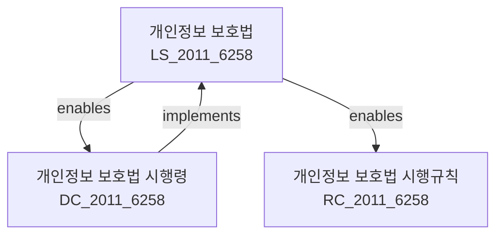

---
# === 식별 정보 ===
law_id: DC_2011_6258
law_serial: 제22166호
title: 개인정보 보호법 시행령
abbreviation: 개인정보보호법시행령

# === 분류 정보 ===
law_type: decree
ministry: 행정안전부
category: 행정 > 정보관리

# === 날짜 정보 ===
promulgation_date: 2011-09-30
enforcement_date: 2011-09-30
last_amendment: 2024-03-20

# === 참조 정보 ===
source_url: https://law.go.kr/LSW/lsInfoP.do?lsiSeq=241479
parent_law: LS_2011_6258
parent_law_title: 개인정보 보호법

# === 구조 정보 ===
total_articles: 63
attachments: true

# === 메타 정보 ===
status: 시행
version: 2024-03-20
---

# 개인정보 보호법 시행령

> [대통령령 제22166호, 2011. 9. 30., 제정]

---

## 관계 그래프

**상위 법령**: [[개인정보 보호법]] (제78조 위임)

---

## 제1장 총칙

### 제1조 (목적)

이 영은 「개인정보 보호법」에서 위임된 사항과 그 시행에 필요한 사항을 규정함을 목적으로 한다.

### 제2조 (정의)

이 영에서 사용하는 용어의 뜻은 「개인정보 보호법」(이하 "법"이라 한다)에서 사용하는 용어의 뜻과 같다.

---

## 제2장 개인정보의 처리

### 제3조 (다른 법률에 따른 개인정보의 처리)

법 제15조제1항제3호에서 "대통령령으로 정하는 공공기관"이란 다음 각 호의 기관을 말한다.

1. 국회
2. 법원
3. 헌법재판소
4. 중앙선거관리위원회
5. 감사원
6. 중앙행정기관과 그 소속기관
7. 지방자치단체

### 제4조 (민감정보의 범위)

법 제23조제1항에 따른 민감정보의 범위는 다음 각 호와 같다.

1. 사상, 신념, 종교, 노동조합·정당의 가입·탈퇴, 정치적 견해, 건강, 성생활 등에 관한 정보
2. 인종 및 민족, 출신지역, 본적, 범죄경력, 과거의 행적 등에 관한 정보

### 제5조 (고유식별정보의 범위)

법 제24조제1항에 따른 고유식별정보의 범위는 다음 각 호와 같다.

1. 주민등록번호
2. 외국인등록번호
3. 그 밖에 대통령령으로 정하는 개인을 식별할 수 있는 정보

---

## 제3장 개인정보의 안전성 확보

### 제15조 (개인정보의 안전조치 기준)

① 법 제30조제1항에 따라 개인정보처리자가 취하여야 할 안전조치는 다음 각 호와 같다.

1. 개인정보의 안전관리 체계 구축
2. 개인정보 취급 직원의 최소화 및 교육
3. 개인정보에 대한 접근 권한의 관리
4. 접속기록의 위조·변조 방지 및 보관
5. 개인정보의 암호화
6. 보안프로그램의 설치 및 갱신
7. 물리적 보호 조치

② 제1항에 따른 안전조치의 구체적인 방법·절차 등에 관하여 필요한 사항은 개인정보보호위원회가 고시로 정한다.

### 제16조 (접속기록의 보관)

① 법 제30조제1항에 따른 접속기록의 보관기간은 다음 각 호와 같다.

1. 개인정보처리시스템에 대한 접속기록: 1년 이상
2. 개인정보처리시스템의 운영·관리에 관한 기록: 5년 이상

② 제1항에 따른 접속기록에는 다음 각 호의 사항이 포함되어야 한다.

1. 접속일시
2. 접속자의 식별정보
3. 접속한 개인정보의 내용
4. 그 밖에 접속과 관련된 사항

---

## 제4장 개인정보 보호위원회

### 제30조 (위원회의 기능)

개인정보보호위원회(이하 "위원회"라 한다)는 다음 각 호의 사항을 심의·의결한다.

1. 개인정보 보호 정책의 수립 및 시행에 관한 사항
2. 개인정보 보호 기본계획의 수립에 관한 사항
3. 개인정보 처리 실태조사에 관한 사항
4. 개인정보 유출 등에 대한 조사 및 조치에 관한 사항
5. 그 밖에 개인정보 보호와 관련하여 위원장이 부의하는 사항

### 제31조 (위원회의 구성)

① 위원회는 위원장을 포함한 15인 이내의 위원으로 구성한다.

② 위원장은 국무조정실장이 된다.

③ 위원은 다음 각 호의 어느 하나에 해당하는 자 중에서 국무총리가 위촉 또는 지명한다.

1. 개인정보 보호 관련 분야의 전문성이 있는 자
2. 관계 중앙행정기관의 공무원
3. 법률·경영·정보통신 분야의 전문가

---

## 제5장 보칙

### 제60조 (과태료의 부과기준)

① 법 제76조에 따른 과태료의 부과기준은 별표와 같다.

② 시장·군수·구청장은 과태료를 부과할 때 위반행위의 내용, 횟수, 정도 등을 고려하여 제1항에 따른 금액의 2분의 1의 범위에서 가중 또는 감경할 수 있다.

---

## 부칙 <제22166호, 2011.09.30.>

제1조(시행일) 이 영은 2011년 9월 30일부터 시행한다.

제2조(다른 법령의 개정) 생략

---

## 개정 이력

| 개정일       | 공포번호   | 개정유형   | 주요내용                        |
|-------------|-----------|-----------|--------------------------------|
| 2024-03-20  | 제34117호  | 일부개정   | 제15조 개정                     |
| 2023-09-19  | 제33723호  | 일부개정   | 접속기록 보관 기준 개정          |
| 2020-02-04  | 제31102호  | 일부개정   | 암호화 기준 개정                |
| 2011-09-30  | 제22166호  | 제정       | 개인정보보호법 시행령 제정        |

---

## 관련 법령

### 상위 법령
- [[LS_2011_6258|개인정보 보호법]] - 제78조 위임

### 관련 법령
- [[DC_2011_0658|정보통신망법 시행령]]
- [[DC_2011_0658|신용정보법 시행령]]

### 하위 법령
- [[RC_2011_6258|개인정보 보호법 시행규칙]]

---

## 별표

> 📎 [별표 1] 과태료 부과기준
>
> 📎 [별표 2] 안전조치 세부기준
