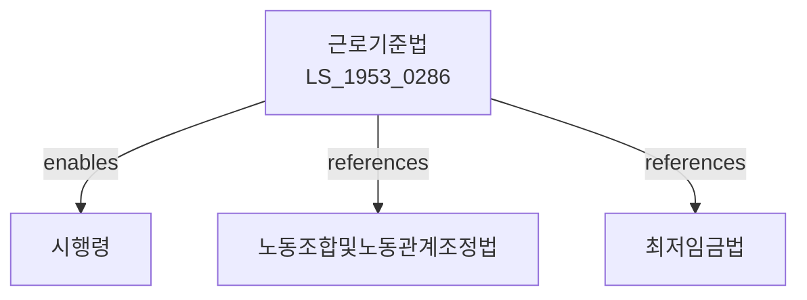

# 근로기준법

> [법률 제20123호, 2024. 1. 9., 일부개정]

---

---

## 제1장 총칙

### 제1조 (목적)

이 법은 헌법에 따라 근로조건의 기준을 정함으로써 근로자의 기본생활을 보장ㆍ향상시키고 균형 있는 국민경제의 발전을 도모함을 목적으로 한다。

### 제2조 (정의)

이 법에서 사용하는 용어의 뜻은 다음과 같다。

1. "근로자"란 직업의 종류를 불문하고 임금을 목적으로 사업이나 사업장에 사용되는 자를 말한다。
2. "사용자"란 사업주 또는 사업경영 담당자, 그 밖에 근로자에 관한 사항에 대하여 사업주를 위하여 행위하는 자를 말한다。
3. "근로계약"이란 근로자가 사용자에게 근로를 제공하고 사용자는 이에 대하여 임금을 지급하는 것을 목적으로 체결된 계약을 말한다。
4. "임금"이란 사용자가 근로의 대상으로 근로자에게 임금, 봉급, 그 밖에 어떠한 명칭으로든지 지급하는 일체의 금품을 말한다。

---

## 제2장 근로계약

### 第10条 (근로계약의 원칙)

근로계약은 근로자가 사용자에게 근로를 제공하고 사용자는 이에 대하여 임금을 지급하는 계약이다。

### 第11条 (강제근로의 금지)

사용자는 폭행, 협박, 감금, 그 밖에 정신상 또는 신체상의 자유를 부당하게 구속하는 수단으로써 근로를 강요하여서는 아니 된다。

### 第12条 (차별대우의 금지)

사용자는 근로자에 대하여 남녀의 차별대우를 하지 못한다。

### 第13条 (임금 지급)

사용자는 근로자에게 임금을 직접, 그 전액을 매월 1회 이상 기일을 정하여 지급하여야 한다。

### 第14条 (근로계약의 기간)

근로계약기간은 1년을 초과하지 아니한다。 다만, 당사자 간의 합의로 갱신할 수 있다。

---

## 제3장 임금

### 第30条 (최저임금)

사용자는 최저임금법에 따른 최저임금 이상의 임금을 지급하여야 한다。

### 第31条 (임금의 지급방법)

임금은 통화로 직접 근로자에게 그 전액을 지급하여야 한다。 다만, 법령 또는 단체협약에 특별한 규정이 있는 경우에는 예외로 한다。

### 第32条 (비상시 지급)

근로자가 출산, 질병, 그 밖에 긴급한 사유로 임금 지급기일 전에 지급을 청구하는 경우 사용자는 지급기일 전이라도 기간에 해당하는 임금을 지급하여야 한다。

---

## 제4장 근로시간과 휴식

### 第50条 (근로시간)

① 1주 간의 근로시간은 휴게시간을 제외하고 40시간을 초과하지 아니한다。

② 1일의 근로시간은 휴게시간을 제외하고 8시간을 초과하지 아니한다。

### 第51条 (탄력적 근로시간제)

사용자는 근로자대표와의 서면 합의에 따라 2주 이내의 단위기간을 평균하여 1주 간의 근로시간이 40시간을 초과하지 아니하는 범위에서 특정 주의 근로시간을 48시간까지 연장할 수 있다。

### 第52条 (휴게시간)

사용자는 근로시간이 4시간인 경우 30분 이상, 8시간인 경우 1시간 이상의 휴게시간을 근로시간 도중에 주어야 한다。

### 第53条 (휴일)

사용자는 근로자에게 매주 1회 이상의 유급휴일을 주어야 한다。

### 第54条 (연차유급휴가)

사용자는 1년간 80퍼센트 이상 출근한 근로자에게 15일의 유급휴가를 주어야 한다。

---

## 제5장 여성과 소년

### 第60条 (여성의 근로시간)

사용자는 임신 중인 여성에 대하여 산전후를 통하여 90일의 보호휴가를 주어야 한다。

### 第61条 (육아휴직)

사용자는 생후 만 8세 이하의 자녀를 양육하기 위하여 근로자가 청구하는 경우 육아휴직을 주어야 한다。

### 第62条 (생리휴가)

사용자는 여성근로자에게 월 1일의 유급생리휴가를 주어야 한다。

### 第63条 (야간근로의 제한)

사용자는 임신 중인 여성과 생후 1년 미만의 아기를 양육하는 여성에 대하여 야간근로를 시키지 못한다。

---

## 제6장 안전과 보건

### 第70条 (안전보건)

사용자는 근로자의 안전과 보건을 위하여 필요한 조치를 하여야 한다。

### 第71条 (안전교육)

사용자는 근로자에 대하여 정기적으로 안전보건교육을 실시하여야 한다。

---

## 第7장 벌칙

### 第90条 (벌칙)

다음 각 호의 어느 하나에 해당하는 자는 5년 이하의 징역 또는 1억원 이하의 벌금에 처한다。

1. 강제근로를 시킨 자
2. 임금을 체불한 자

### 第91条 (과태료)

다음 각 호의 어느 하나에 해당하는 자에게는 2천만원 이하의 과태료를 부과한다。

1. 근로시간을 위반한 자
2. 휴게시간을 주지 아니한 자

---

## 관계 그래프

**상위 법령**
- [[헌법]] 제32조 (근로의 권리)
- [[근로기준법]]

**관련 법령**
- [[노동조합및노동관계조정법]]
- [[최저임금법]]
- [[산업안전보건법]]
- [[근로자퇴직급여보장법]]
- [[남녀고용평등과일ㆍ가정양립지원에관한법률]]

**하위 법령**
- [[근로기준법 시행령]]
