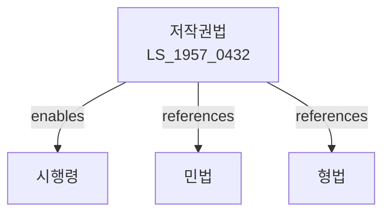

# 저작권법

> [법률 제20097호, 2024. 1. 9., 일부개정]

---

---

## 제1장 총칙

### 제1조 (목적)

이 법은 저작자의 권리와 이에 인접하는 권리를 보호하고 저작물의 공정한 이용을 도모함으로써 문화의 향상과 발전에 이바지함을 목적으로 한다.

### 제2조 (정의)

이 법에서 사용하는 용어의 뜻은 다음과 같다.

1. "저작물"이란 인간의 사상 또는 감정을 표현한 창작물을 말한다.
2. "저작자"란 저작물을 창작한 자를 말한다.
3. "저작권"이란 저작재산권과 저작인격권을 말한다.
4. "저작인격권"이란 저작자의 인격적 이익을 보호하기 위한 권리를 말한다.
5. "저작재산권"이란 저작물을 재산적으로 이용할 권리를 말한다.
6. "2차적저작물"이란 원저작물을 번역ㆍ편곡ㆍ변형ㆍ각색 또는 영화화 등 제작ㆍ창작한 저작물을 말한다.

---

## 제2장 저작자 및 저작물

### 제3조 (저작자의 추정)

저작물의 원본이나 그 복제물에 저작자로서의 성명 또는 이명(異名)이 일반적으로 알려진 방법으로 표시된 자는 저작자로 추정한다。

### 제4조 (저작물의 예시)

이 법에서 보호받는 저작물은 다음 각 호와 같다.

1. 어문저작물: 소설ㆍ시ㆍ논문ㆍ강연ㆍ각본 그 밖의 어문으로 표현된 것
2. 음악저작물: 가사 및 악곡
3. 연극저작물: 연극ㆍ무용ㆍ묘극 그 밖에 무대상으로 공연할 목적으로 창작된 것
4. 미술저작물: 회화ㆍ서예ㆍ조각ㆍ공예 그 밖의 미술적 가치가 있는 것
5. 건축저작물: 건축물의 설계도ㆍ모형 및 건축물
6. 사진저작물: 사진 및 사진적 표현이 유사한 방법으로 창작된 것
7. 영상저작물: 영화ㆍ텔레비전영화ㆍ비디오 그 밖의 영상물
8. 도면저작물: 기계ㆍ전자ㆍ건축 등의 도면
9. 컴퓨터프로그램저작물: 컴퓨터프로그램

---

## 제3장 저작권

### 제10조 (저작권의 발생)

① 저작권은 저작물의 창작 완료 시 발생한다.

② 저작권은 등록이나 그 밖의 절차를 거치지 아니하고 발생한다。

### 제11조 (저작인격권의 내용)

저작자는 다음 각 호의 권리를 가진다.

1. 공표권: 저작물을 공중에게 공개할 것인지를 결정할 권리
2. 성명표시권: 저작물의 원본이나 복제물에 저작자의 성명을 표시할 것인지를 결정할 권리
3. 동일성유지권: 저작물의 내용ㆍ형식 및 제호의 동일성을 유지할 권리

### 제21조 (복제권)

저작자는 그 저작물을 복제할 권리를 가진다。

### 제22조 (공연권)

저작자는 그 저작물을 공연할 권리를 가진다。

### 제23조 (전시권)

미술저작물의 저작자는 그 원본이나 복제물을 전시할 권리를 가진다。

### 第24条 (배포권)

저작자는 저작물의 원본이나 복제물을 공중에게 배포할 권리를 가진다(대여를 제외한다).

### 第25条 (대여권)

저작자는 저작물의 원본이나 복제물을 대여할 권리를 가진다.

---

## 제4장 저작재산권의 보호기간

### 第30条 (보호기간의 원칙)

① 저작재산권은 저작자의 생존 기간 및 사망 후 70년간 존속한다.

② 제1항의 보호기간은 저작자가 사망한 후 70년이 지나는 해의 12월 31일에 만료된다。

---

## 제5장 저작재산권의 제한

### 第40条 (사적복제)

① 공표된 저작물은 영리를 목적으로 하지 아니하고 개인적으로 이용하거나 가정 및 그에 준하는 한정된 장소 안에서 이용하는 목적으로 복제할 수 있다.

② 다만, 다음 각 호의 어느 하나에 해당하는 경우에는 그러하지 아니하다.

1. 복제하는 자가 알고 있는 복제가 불법으로 제작된 것
2. 기술적 보호조치를 무력화하여 복제하는 경우

---

## 제6장 저작인접권

### 第60条 (실연자의 권리)

① 실연자는 그 실연을 녹음ㆍ영상 또는 사진 등의 방법으로 복제하거나 전송할 권리를 가진다。

### 第70条 (음반제작자의 권리)

음반제작자는 그 음반을 복제ㆍ배포ㆍ대여 또는 디지털음원송신할 권리를 가진다。

---

## 제7장 벌칙

### 第100条 (벌칙)

다음 각 호의 어느 하나에 해당하는 자는 5년 이하의 징역 또는 5천만원 이하의 벌금에 처한다。

1. 저작재산권을 침해한 자
2. 기술적 보호조치를 무력화한 자
3. 저작자의 의사에 반하여 저작인격권을 침해한 자

### 第101条 (몰수)

저작권을 침해하여 만든 물건이나 그 수익은 몰수한다。

---

## 관계 그래프

**상위 법령**
- [[헌법]] 제22조 (학문ㆍ예술의 자유)
- [[민법]] 제751조 (불법행위)

**관련 법령**
- [[컴퓨터프로그램 보호법]]
- [[콘텐츠산업 진흥법]]
- [[출판문화산업 진흥법]]
- [[음악산업진흥법]]

**하위 법령**
- [[저작권법 시행령]]
- [[저작권법 시행규칙]]
