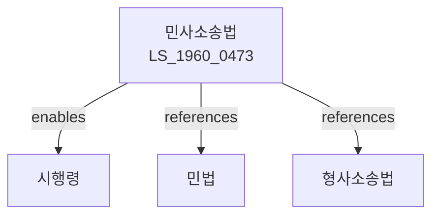

# 민사소송법

> [법률 제20120호, 2024. 1. 9., 일부개정]

---

---

## 제1장 총칙

### 제1조 (목적)

이 법은 민사에 관한 소송절차를 정함으로써 분쟁의 공정하고 신속한 해결을 도모함을 목적으로 한다。

### 제2조 (법원의 관할)

① 소는 피고의 보통재판적 소재지를 관할하는 지방법원에 제기한다。

② 보통재판적은 주소에 의한다。

### 제3조 (사물관할)

소송의 목적의 가액에 따라 단독판사 또는 합의부가 심판한다。

### 제4조 (토지관할)

사건 발생지, 채무이행지 등에서도 소를 제기할 수 있다。

---

## 제2장 당사자

### 第10条 (당사자능력)

소송당사자능력은 민법상의 권리능력에 따른다。

### 第11条 (소송능력)

소송능력은 민법상의 행위능력에 따른다。

### 第12条 (법정대리)

소송무능력자는 법정대리인이 소송행위를 한다。

### 第13条 (소송대리인)

변호사는 소송대리인이 될 수 있다。

---

## 제3장 소

### 第20条 (소의 제기)

소는 소장을 법원에 제출함으로써 제기한다。

### 第21条 (소장의 기재사항)

소장에는 다음 각 호의 사항을 기재하여야 한다。

1. 당사자의 성명 및 주소
2. 소의 목적
3. 청구의 원인
4. 청구취지

### 第22条 (소송비용)

소송비용은 패소한 당사자가 부담한다。

### 第23条 (소의 취하)

원고는 판결확정 전까지 소를 취하할 수 있다。

---

## 제4장 변론

### 第30条 (변론의 원칙)

판결은 변론을 거쳐야 한다。 다만, 서면심리로 충분한 경우는 예외로 한다。

### 第31条 (당사자의 진술)

당사자는 변론기일에 출석하여 진술하여야 한다。

### 第32条 (증거신청)

당사자는 증거를 신청할 수 있다。

### 第33条 (증인신문)

법원은 증인을 신문할 수 있다。

---

## 제5장 증거

### 第40条 (증거의 종류)

증거는 다음 각 호와 같다。

1. 문서
2. 증인
3. 감정
4. 검증
5. 당사자신문

### 第41条 (증명책임)

사실주장자가 그 사실을 증명할 책임을 진다。

### 第42条 (자유심증주의)

법원은 증거의 가치를 자유로이 판단한다。

### 第43条 (증거보전)

당사자는 소제기 전에 증거보전을 신청할 수 있다。

---

## 제6장 판결

### 第50条 (판결의 선고)

판결은 선고 또는 송달로 확정된다。

### 第51条 (판결서의 기재사항)

판결서에는 다음 각 호의 사항을 기재한다。

1. 주문
2. 청구취지
3. 이유
4. 당사자의 표시

### 第52条 (판결의 확정)

상소기간이 도과하면 판결은 확정된다。

### 第53条 (기판력)

확정판결은 당사자 사이에 기판력이 있다。

---

## 제7장 상소

### 第60条 (상소의 종류)

상소는 항소와 상고로 구분한다。

### 第61条 (항소)

제1심 판결에 대하여 항소할 수 있다。

### 第62条 (상고)

제2심 판결에 대하여 상고할 수 있다。

### 第63条 (상소기간)

상소기간은 판결서 송달일부터 2주 이내로 한다。

---

## 제8장 확정판결에 대한 불복

### 第70条 (재심)

확정판결에 대하여 재심사유가 있는 경우 재심을 청구할 수 있다。

### 第71条 (재심사유)

재심사유는 다음 각 호와 같다。

1. 판결의 기초가 된 문서가 위조된 경우
2. 증언이 허위인 경우
3. 사기에 의한 판결인 경우
4. 판결에 관여한 법관이 직무상 죄를 범한 경우

---

## 제9장 강제집행

### 第80条 (강제집행의 요건)

채무명의가 있어야 강제집행을 할 수 있다。

### 第81条 (채무명의)

채무명의는 다음 각 호와 같다。

1. 확정판결
2. 화해조서
3. 조정조서
4. 공정증서

### 第82条 (집행문)

채무명의는 집행문이 부여되어야 집행할 수 있다。

### 第83条 (강제집행의 방법)

강제집행은 다음 각 호의 방법으로 한다。

1. 동산에 대한 강제집행
2. 채권에 대한 강제집행
3. 부동산에 대한 강제집행

---

## 제10장 가압류 및 가처분

### 第90条 (가압류)

채권자는 금전채권의 집행을 보전하기 위하여 가압류를 할 수 있다。

### 第91条 (가처분)

채권자는 권리의 실행을 보전하기 위하여 가처분을 할 수 있다。

### 第92条 (가압류ㆍ가처분의 신청)

가압류 및 가처분은 법원에 신청한다。

### 第93条 (피담보이익의 명시)

신청인은 피담보이익을 명시하여야 한다。

---

## 제11장 벌칙

### 第100条 (벌칙)

다음 각 호의 어느 하나에 해당하는 자는 5년 이하의 징역 또는 5천만원 이하의 벌금에 처한다。

1. 증인으로서 허위진술한 자
2. 증거를 위조한 자

### 第101条 (과태료)

다음 각 호의 어느 하나에 해당하는 자에게는 500만원 이하의 과태료를 부과한다。

1. 정당한 사유 없이 증인출석을 하지 아니한 자
2. 법원의 명령을 위반한 자

---

## 관계 그래프

**상위 법령**
- [[헌법]] 제27조 (재판청구권)
- [[법원조직법]]

**관련 법령**
- [[민법]]
- [[형사소송법]]
- [[행정소송법]]
- [[가사소송법]]
- [[민사조정법]]

**하위 법령**
- [[민사소송법 시행령]]
