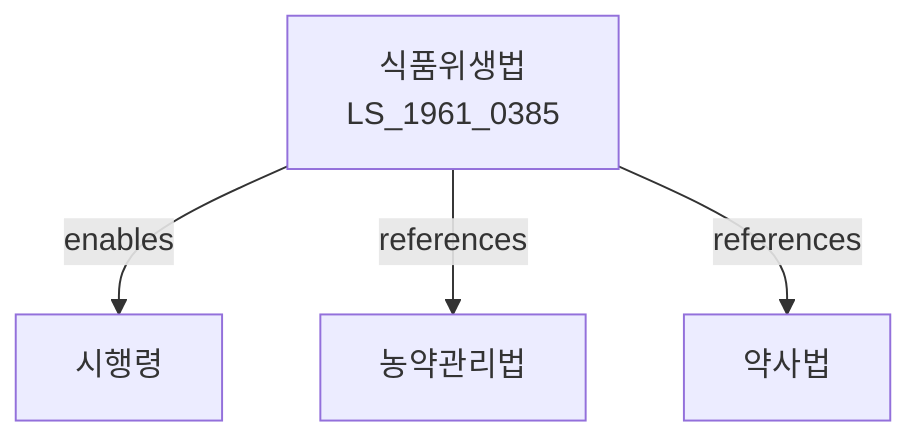

# 식품위생법

> [법률 제21299호, 2025. 12. 30., 일부개정]

---

---

## 제1장 총칙

### 제1조 (목적)

이 법은 식품으로 인하여 생기는 위생상의 위해(危害)를 방지하고 식품영양의 질적 향상을 도모하며 식품에 관한 올바른 정보를 제공함으로써 국민 건강의 보호ㆍ증진에 이바지함을 목적으로 한다.

### 제2조 (정의)

이 법에서 사용하는 용어의 뜻은 다음과 같다.

1. "식품"이란 모든 음식물(의약으로 섭취하는 것은 제외한다)을 말한다.
2. "식품첨가물"이란 식품을 제조ㆍ가공ㆍ조리 또는 보존하는 과정에서 감미(甘味), 착색(着色), 표백(漂白) 또는 산화방지 등을 목적으로 식품에 사용되는 물질을 말한다.
3. "화학적 합성품"이란 화학적 수단으로 원소(元素) 또는 화합물에 분해 반응 외의 화학 반응을 일으켜서 얻은 물질을 말한다.
4. "기구"란 식품 또는 식품첨가물에 직접 닿는 기계ㆍ기구나 그 밖의 물건을 말한다.
5. "용기ㆍ포장"이란 식품 또는 식품첨가물을 넣거나 싸는 것으로서 식품 또는 식품첨가물을 주고받을 때 함께 건네는 물품을 말한다.
6. "위해"란 식품, 식품첨가물, 기구 또는 용기ㆍ포장에 존재하는 위험요소로서 인체의 건강을 해치거나 해칠 우려가 있는 것을 말한다.
7. "영업"이란 식품 또는 식품첨가물을 채ㆍ제조ㆍ가공ㆍ조리ㆍ저장ㆍ소분ㆍ운반 또는 판매하거나 기구 또는 용기ㆍ포장을 제조ㆍ운반ㆍ판매하는 업을 말한다.
8. "영업자"란 제37조 제1항에 따라 영업허가를 받은 자나 같은 조 제4항에 따라 영업신고를 한 자 또는 같은 조 제5항에 따라 영업등록을 한 자를 말한다.
9. "식품위생"이란 식품, 식품첨가물, 기구 또는 용기ㆍ포장을 대상으로 하는 음식에 관한 위생을 말한다.
10. "집단급식소"란 영리를 목적으로 하지 아니하면서 특정 다수인에게 계속하여 음식물을 공급하는 곳의 급식시설로서 대통령령으로 정하는 시설을 말한다.
11. "식품이력추적관리"란 식품을 제조ㆍ가공단계부터 판매단계까지 각 단계별로 정보를 기록ㆍ관리하는 것을 말한다.
12. "식중독"이란 식품 섭취로 인하여 인체에 유해한 미생물 또는 유독물질에 의하여 발생한 감염성 질환 또는 독소형 질환을 말한다.

---

## 제2장 식품과 식품첨가물

### 제4조 (위해식품등의 판매 등 금지)

누구든지 다음 각 호의 어느 하나에 해당하는 식품등을 판매하거나 판매할 목적으로 채ㆍ제조ㆍ수입ㆍ가공ㆍ사용ㆍ조리ㆍ저장ㆍ소분ㆍ운반 또는 진열하여서는 아니 된다.

1. 썩거나 상하거나 설응어서 인체의 건강을 해칠 우려가 있는 것
2. 유독ㆍ유해물질이 들어 있거나 묻어 있는 것 또는 그러할 염려가 있는 것
3. 병(病)을 일으키는 미생물에 오염되었거나 그러할 염려가 있어 인체의 건강을 해칠 우려가 있는 것
4. 불결하거나 다른 물질이 섞이거나 첨가된 것 또는 그 밖의 사유로 인체의 건강을 해칠 우려가 있는 것
5. 제18조에 따른 안전성 심사 대상인 농ㆍ축ㆍ수산물 등 가운데 안전성 심사를 받지 아니하였거나 안전성 심사에서 식용으로 부적합하다고 인정된 것
6. 수입이 금지된 것 또는 「수입식품안전관리 특별법」 제20조 제1항에 따른 수입신고를 하지 아니하고 수입한 것
7. 영업자가 아닌 자가 제조ㆍ가공ㆍ소분한 것

### 제7조 (식품 또는 식품첨가물에 관한 기준 및 규격)

① 식품의약품안전처장은 국민 건강을 보호ㆍ증진하기 위하여 필요하면 판매를 목적으로 하는 식품 또는 식품첨가물에 관한 다음 각 호의 사항을 정하여 고시한다.

1. 제조ㆍ가공ㆍ사용ㆍ조리ㆍ보존 방법에 관한 기준
2. 성분에 관한 규격

---

## 제3장 기구와 용기ㆍ포장

### 제8조 (유독기구 등의 판매ㆍ사용 금지)

유독ㆍ유해물질이 들어 있거나 묻어 있어 인체의 건강을 해칠 우려가 있는 기구 및 용기ㆍ포장과 식품 또는 식품첨가물에 직접 닿으면 해로운 영향을 끼쳐 인체의 건강을 해칠 우려가 있는 기구 및 용기ㆍ포장을 판매하거나 판매할 목적으로 제조ㆍ수입ㆍ저장ㆍ운반ㆍ진열하거나 영업에 사용하여서는 아니 된다.

### 제9조 (기구 및 용기ㆍ포장에 관한 기준 및 규격)

① 식품의약품안전처장은 국민보건을 위하여 필요한 경우에는 판매하거나 영업에 사용하는 기구 및 용기ㆍ포장에 관하여 다음 각 호의 사항을 정하여 고시한다.

1. 제조 방법에 관한 기준
2. 기구 및 용기ㆍ포장과 그 원재료에 관한 규격

---

## 제7장 영업

### 제37조 (영업허가 등)

① 식품 또는 식품첨가물을 제조ㆍ가공하거나 조리하여 판매하는 영업을 하려는 자는 대통령령으로 정하는 바에 따라 관할 시장ㆍ군수 또는 구청장의 허가를 받아야 한다.

② 제1항에 따른 허가를 받으려는 자는 대통령령으로 정하는 바에 따라 식품의약품안전처장이 정하는 시설기준에 적합한 시설을 갖추어야 한다.

③ 영업의 종류, 허가의 절차 및 허가사항의 변경 등에 관하여 필요한 사항은 대통령령으로 정한다.

---

## 제13장 벌칙

### 제93조 (벌칙)

다음 각 호의 어느 하나에 해당하는 자는 무기 또는 10년 이상의 징역에 처한다.

1. 제4조 제2호에 위반하여 유독ㆍ유해물질이 들어 있거나 묻어 있는 식품등을 판매하거나 판매할 목적으로 채ㆍ제조ㆍ수입ㆍ가공ㆍ사용ㆍ조리ㆍ저장ㆍ소분ㆍ운반 또는 진열하여 국민의 건강에 위해를 끼친 자

### 제94조 (벌칙)

다음 각 호의 어느 하나에 해당하는 자는 7년 이하의 징역 또는 1억원 이하의 벌금에 처한다.

1. 제4조 제2호에 위반하여 유독ㆍ유해물질이 들어 있거나 묻어 있는 식품등을 판매하거나 판매할 목적으로 채ㆍ제조ㆍ수입ㆍ가공ㆍ사용ㆍ조리ㆍ저장ㆍ소분ㆍ운반 또는 진열한 자(제93조에 해당하는 자는 제외한다)

### 제101조 (과태료)

다음 각 호의 어느 하나에 해당하는 자에게는 1천만원 이하의 과태료를 부과한다.

1. 제3조에 따른 식품등의 위생적인 취급기준을 위반한 자
2. 제41조에 따른 식품위생교육을 받지 아니한 자

---

## 관계 그래프

**상위 법령**
- [[헌법]] 제36조 (국민의 건강)

**관련 법령**
- [[농약관리법]]
- [[약사법]]
- [[축산물위생관리법]]
- [[수입식품안전관리 특별법]]

**하위 법령**
- [[식품위생법 시행령]]
- [[식품위생법 시행규칙]]
