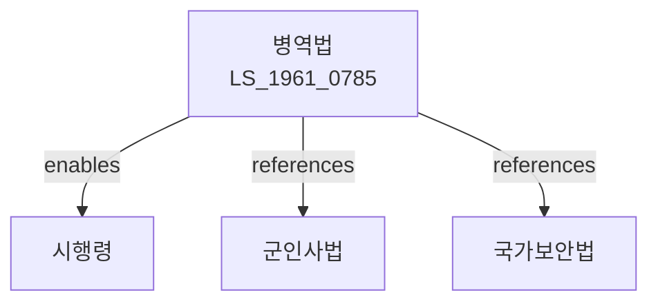

# 병역법

> [법률 제20089호, 2024. 1. 9., 일부개정]

---

---

## 제1장 총칙

### 제1조 (목적)

이 법은 국민의 병역의무의 수행에 관한 사항을 정함으로써 국방에 이바지함을 목적으로 한다。

### 제2조 (정의)

이 법에서 사용하는 용어의 뜻은 다음과 같다。

1. "병역"이란 국방상의 필요에 의하여 국민이 국가에 대하여 부담하는 의무로서 현역, 예비역, 보충역 및 제2국민역으로 구분된다。
2. "현역"이란 군에 복무하는 병역을 말한다。
3. "예비역"이란 현역을 필하고 퇴역한 자로서 전시에 현역으로 소집될 병역을 말한다。
4. "보충역"이란 현역 또는 예비역에 충당할 자가 부족한 때에 이에 충당하는 병역을 말한다。
5. "제2국민역"이란 현역, 예비역 또는 보충역에 충당할 자가 부족한 때에 이에 충당하는 병역을 말한다。

### 제3조 (병역의무)

① 대한민국 국민인 남성은 헌법 및 이 법이 정하는 바에 따라 병역의무를 성실히 수행하여야 한다。

② 여성은 병역의무가 없다。다만, 지원에 의하여 군에 복무할 수 있다。

---

## 제2장 병역판정검사

### 제10조 (병역판정검사)

① 만 19세가 되는 해의 1월 1일부터 12월 31일까지의 기간 중에 병역판정검사를 받아야 한다。

② 병역판정검사는 신체ㆍ심리 및 적성 등을 종합적으로 판정한다。

③ 병역판정검사의 결과에 따라 현역, 보충역, 제2국민역 또는 병역면제로 판정된다。

### 제11조 (병역판정검사 결과)

병역판정검사 결과는 다음 각 호와 같이 구분한다。

1. 1급 ~ 3급: 현역
2. 4급: 보충역
3. 5급: 제2국민역
4. 6급: 병역면제
5. 7급: 재검사대상

---

## 제3장 현역병 입영

### 제20조 (현역병 입영)

① 현역판정을 받은 자는 입영통지서를 받은 날부터 1년 이내에 입영하여야 한다。

② 입영기일은 본인의 희망을 고려하여 결정할 수 있다。

### 제21조 (입영기일 연기)

① 다음 각 호의 어느 하나에 해당하는 사유가 있는 경우 입영기일을 연기할 수 있다。

1. 질병 또는 심신장애
2. 가족의 부양
3. 학업
4. 그 밖에 대통령령으로 정하는 사유

② 연기기간은 대통령령으로 정하는 바에 따른다。

---

## 제4장 병역면제

### 第30条 (병역면제)

다음 각 호의 어느 하나에 해당하는 자는 병역면제 판정을 받을 수 있다。

1. 중증 장애인
2. 중증 질병자
3. 1년 이상 치료를 요하는 질병자
4. 신장 159센티미터 미만 또는 체중 45킬로그램 미만인 자(심신미발육)

---

## 제5장 병역처분변경

### 第35条 (병역처분변경)

① 병역판정검사를 받은 자로서 그 판정결과에 이의가 있는 자는 병역처분변경을 신청할 수 있다。

② 병역처분변경 신청은 판정을 받은 날부터 6개월 이내에 하여야 한다。

### 第36条 (신체검사 재심사)

① 병역처분변경 신청을 받은 병무청장은 신체검사 재심사를 실시한다。

② 재심사 결과에 따라 병역처분을 변경할 수 있다。

---

## 제6장 전시병역

### 第50条 (전시병역소집)

전시 또는 사변에 있어서는 예비역, 보충역 또는 제2국민역을 현역으로 소집할 수 있다。

### 第51条 (병력동원)

전시에는 국민의 병력동원을 위하여 필요한 조치를 취할 수 있다。

---

## 제7장 벌칙

### 第80条 (벌칙)

다음 각 호의 어느 하나에 해당하는 자는 1년 이상 5년 이하의 징역에 처한다。

1. 정당한 사유 없이 병역판정검사를 받지 아니한 자
2. 정당한 사유 없이 입영하지 아니한 자
3. 병역을 기피할 목적으로 신체를 손상하거나 위장한 자

### 第81条 (과태료)

다음 각 호의 어느 하나에 해당하는 자에게는 200만원 이하의 과태료를 부과한다。

1. 제10조에 따른 병역판정검사 통지를 받고 정당한 사유 없이 기간 내에 검사를 받지 아니한 자
2. 거주지 이동 신고를 하지 아니한 자

---

## 관계 그래프

**상위 법령**
- [[헌법]] 제3조 (국토범위), 제39조 (국방의무)
- [[군인사법]]

**관련 법령**
- [[국가보안법]]
- [[예비군법]]
- [[향토예비군 설치법]]
- [[주민등록법]]

**하위 법령**
- [[병역법 시행령]]
