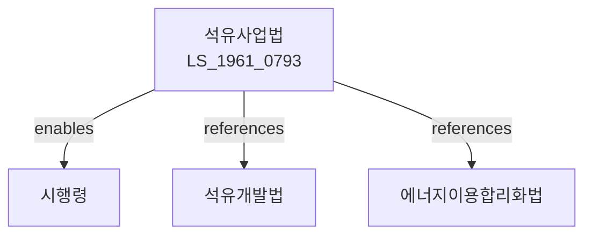

# 석유사업법

> [법률 제20084호, 2024. 1. 9., 일부개정]

---

---

## 제1장 총칙

### 제1조 (목적)

이 법은 석유사업의 건전한 발전과 석유의 안정적인 공급을 도모함으로써 국민경제의 발전과 공공복리의 증진에 이바지함을 목적으로 한다。

### 제2조 (정의)

이 법에서 사용하는 용어의 뜻은 다음과 같다。

1. "석유"이란 원유, 석유정제품, 석유화학제품 등을 말한다。
2. "석유사업"이란 석유를 정제, 수출입, 공급하는 사업을 말한다.
3. "석유정제사업"이란 석유를 정제하는 사업을 말한다。
4. "석유수출입사업"이란 석유를 수출입하는 사업을 말한다。
5. "석유판매사업"이란 석유를 판매하는 사업을 말한다.

---

## 제2장 석유사업의 허가

### 第5条 (석유사업의 허가)

석유사업을 하려는 자는 산업통상자원부장관의 허가를 받아야 한다.

### 第6条 (허가요건)

허가요건은 다음 각 호와 같다.

1. 석유시설의 확보
2. 기술능력의 보유
3. 재무능력의 확보
4. 그 밖에 대통령령으로 정하는 요건

### 第7条 (허가의 결격사유)

다음 각 호의 어느 하나에 해당하는 자는 허가를 받을 수 없다.

1. 금치산자 또는 한정치산자
2. 파산자로서 복권되지 아니한 자
3. 이 법을 위반하여 허가취소 후 2년이 지나지 아니한 자

### 第8条 (허가의 유효기간)

허가의 유효기간은 대통령령으로 정한다.

---

## 제3장 석유정제사업

### 第15条 (정제시설)

석유정제사업자는 정제시설을 설치ㆍ운영한다.

### 第16条 (정제공정)

석유를 정제하는 공정을 갖추어야 한다.

### 第17条 (정제품의 품질)

석유정제품의 품질은 대통령령으로 정하는 기준에 적합하여야 한다.

### 第18条 (석유비축)

석유를 비축하여야 한다.

---

## 제4장 석유수출입사업

### 第25条 (수출입)

석유수출입사업자는 석유를 수출입한다.

### 第26条 (수입요건)

석유수입의 요건은 대통령령으로 정한다.

### 第27条 (수입신고)

석유를 수입하려는 자는 신고하여야 한다.

### 第28条 (수출입균형)

석유의 수출입 균형을 유지하여야 한다.

---

## 제5장 석유판매사업

### 第35条 (석유판매)

석유판매사업자는 석유를 판매한다.

### 第36条 (판매가격)

석유판매가격은 산업통상자원부장관의 인가를 받아야 한다.

### 第37条 (공급의무)

석유판매사업자는 수요자에게 석유를 공급할 의무가 있다.

### 第38条 (품질표시)

석유제품의 품질을 표시하여야 한다.

---

## 제6장 석유비축

### 第45条 (비축의무)

석유사업자는 석유를 비축할 의무가 있다.

### 第46条 (비축량)

비축량은 대통령령으로 정한다.

### 第47条 (비축관리)

석유비축을 적절하게 관리하여야 한다.

### 第48条 (비축해제)

비축석유의 해제는 산업통상자원부장관의 승인을 받아야 한다.

---

## 제7장 감독

### 第55条 (감독)

산업통상자원부장관은 석유사업을 감독한다.

### 第56条 (보고 및 검사)

산업통상자원부장관은 필요한 경우 보고를 명하거나 검사할 수 있다.

### 第57条 (영업정지)

산업통상자원부장관은 이 법을 위반한 자에 대하여 영업정지를 명할 수 있다.

### 第58条 (허가취소)

산업통상자원부장관은 중대한 위반사유가 있는 경우 허가를 취소할 수 있다.

---

## 제8장 벌칙

### 第65条 (벌칙)

다음 각 호의 어느 하나에 해당하는 자는 3년 이하의 징역 또는 3천만원 이하의 벌금에 처한다.

1. 허가 없이 석유사업을 한 자
2. 허위로 허가를 받은 자

### 第66条 (과태료)

다음 각 호의 어느 하나에 해당하는 자에게는 1천만원 이하의 과태료를 부과한다.

1. 정당한 사유 없이 보고를 하지 아니한 자
2. 판매가격을 위반한 자

---

## 관계 그래프

**상위 법령**
- [[헌법]] 제119조 (경제질서)
- [[에너지기본법]]

**관련 법령**
- [[석유개발법]]
- [[에너지이용합리화법]]
- [[가스사업법]]
- [[전기사업법]]

**하위 법령**
- [[석유사업법 시행령]]
