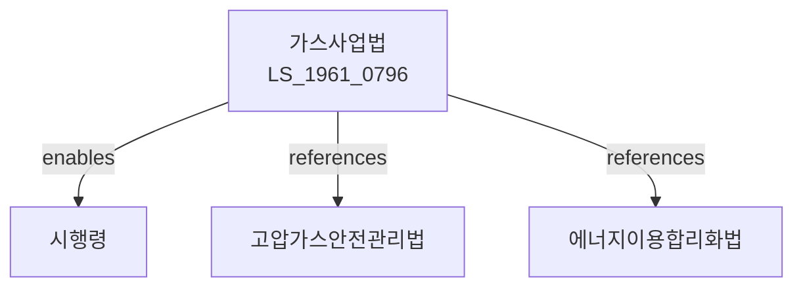

# 가스사업법

> [법률 제20085호, 2024. 1. 9., 일부개정]

---

---

## 제1장 총칙

### 제1조 (목적)

이 법은 가스사업의 건전한 발전과 가스의 안정적인 공급을 도모함으로써 국민경제의 발전과 공공복리의 증진에 이바지함을 목적으로 한다。

### 제2조 (정의)

이 법에서 사용하는 용어의 뜻은 다음과 같다。

1. "가스사업"이란 가스를 제조, 공급하는 사업을 말한다.
2. "도시가스사업"이란 가스를 공급하는 사업을 말한다.
3. "가스제조사업"이란 가스를 제조하는 사업을 말한다.
4. "가스"이란 연료가스를 말한다。

---

## 제2장 가스사업의 허가

### 第5条 (가스사업의 허가)

가스사업을 하려는 자는 산업통상자원부장관의 허가를 받아야 한다.

### 第6条 (허가요건)

허가요건은 다음 각 호와 같다。

1. 가스설비의 확보
2. 기술능력의 보유
3. 재무능력의 확보
4. 공급계획의 적정성

### 第7条 (허가의 결격사유)

다음 각 호의 어느 하나에 해당하는 자는 허가를 받을 수 없다.

1. 금치산자 또는 한정치산자
2. 파산자로서 복권되지 아니한 자
3. 이 법을 위반하여 허가취소 후 2년이 지나지 아니한 자

### 第8条 (허가의 유효기간)

허가의 유효기간은 대통령령으로 정한다.

---

## 제3장 가스제조사업

### 第15条 (가스제조시설)

가스제조사업자는 가스제조시설을 설치ㆍ운영한다.

### 第16条 (가스의 제조)

가스는 기술기준에 적합하게 제조하여야 한다.

### 第17条 (가스의 품질)

가스의 품질은 대통령령으로 정하는 기준에 적합하여야 한다.

### 第18条 (가스의 저장)

가스를 저장하는 시설을 갖추어야 한다.

---

## 제4장 도시가스사업

### 第25条 (도시가스공급)

도시가스사업자는 가스를 공급한다.

### 第26条 (공급구역)

공급구역을 정한다.

### 第27条 (요금)

가스요금은 산업통상자원부장관의 인가를 받아야 한다.

### 第28条 (공급규정)

가스공급규정을 정한다.

### 第29条 (공급의무)

도시가스사업자는 수요자에게 가스를 공급할 의무가 있다.

---

## 제5장 가스시설

### 第35条 (가스시설의 설치)

가스시설은 기술기준에 적합하게 설치하여야 한다.

### 第36条 (안전관리)

가스시설의 안전을 관리한다.

### 第37条 (검사)

가스시설은 정기적으로 검사를 받아야 한다.

### 第38条 (가스기술기준)

가스시설의 기술기준은 대통령령으로 정한다.

---

## 제6장 가스안전

### 第45条 (가스안전관리)

가스사업자는 가스안전을 관리하여야 한다.

### 第46条 (안전교육)

가스사업자는 종사자에 대하여 안전교육을 실시하여야 한다.

### 第47条 (가스사고 예방)

가스사고를 예방하기 위한 조치를 하여야 한다.

### 第48条 (비상대응)

가스사고에 대비하여 비상대응체계를 갖추어야 한다.

---

## 제7장 감독

### 第55条 (감독)

산업통상자원부장관은 가스사업을 감독한다.

### 第56条 (보고 및 검사)

산업통상자원부장관은 필요한 경우 보고를 명하거나 검사할 수 있다.

### 第57条 (영업정지)

산업통상자원부장관은 이 법을 위반한 자에 대하여 영업정지를 명할 수 있다.

### 第58条 (허가취소)

산업통상자원부장관은 중대한 위반사유가 있는 경우 허가를 취소할 수 있다.

---

## 제8장 벌칙

### 第65条 (벌칙)

다음 각 호의 어느 하나에 해당하는 자는 3년 이하의 징역 또는 3천만원 이하의 벌금에 처한다.

1. 허가 없이 가스사업을 한 자
2. 허위로 허가를 받은 자

### 第66条 (과태료)

다음 각 호의 어느 하나에 해당하는 자에게는 1천만원 이하의 과태료를 부과한다.

1. 정당한 사유 없이 보고를 하지 아니한 자
2. 요금을 위반한 자

---

## 관계 그래프

**상위 법령**
- [[헌법]] 제119조 (경제질서)
- [[에너지기본법]]

**관련 법령**
- [[고압가스안전관리법]]
- [[에너지이용합리화법]]
- [[전기사업법]]
- [[석유사업법]]

**하위 법령**
- [[가스사업법 시행령]]
