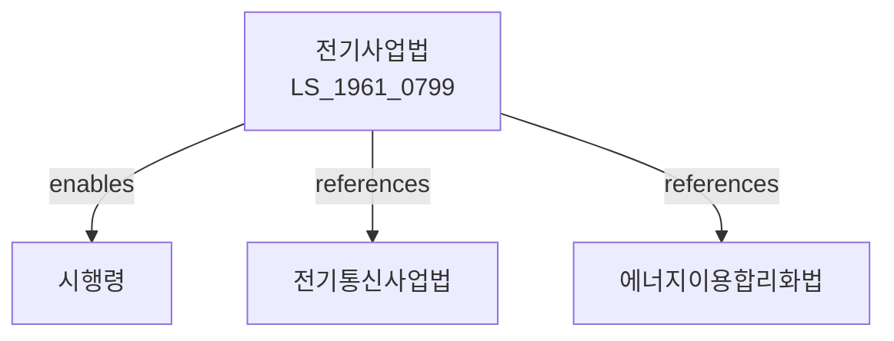

# 전기사업법

> [법률 제20086호, 2024. 1. 9., 일부개정]

---

---

## 제1장 총칙

### 제1조 (목적)

이 법은 전기사업의 건전한 발전과 전기의 안정적인 공급을 도모함으로써 국민경제의 발전과 공공복리의 증진에 이바지함을 목적으로 한다。

### 제2조 (정의)

이 법에서 사용하는 용어의 뜻은 다음과 같다。

1. "전기사업"이란 전기를 발전, 송전, 배전 또는 판매하는 사업을 말한다。
2. "발전사업"이란 전기를 발전하는 사업을 말한다。
3. "송전사업"이란 전기를 송전하는 사업을 말한다。
4. "배전사업"이란 전기를 배전하는 사업을 말한다。
5. "판매사업"이란 전기를 판매하는 사업을 말한다。

---

## 제2장 전기사업의 허가

### 第5条 (전기사업의 허가)

전기사업을 하려는 자는 산업통상자원부장관의 허가를 받아야 한다.

### 第6条 (허가요건)

허가요건은 다음 각 호와 같다。

1. 전기설비의 확보
2. 기술능력의 보유
3. 재무능력의 확보
4. 그 밖에 대통령령으로 정하는 요건

### 第7条 (허가의 결격사유)

다음 각 호의 어느 하나에 해당하는 자는 허가를 받을 수 없다.

1. 금치산자 또는 한정치산자
2. 파산자로서 복권되지 아니한 자
3. 이 법을 위반하여 허가취소 후 2년이 지나지 아니한 자

### 第8条 (허가의 유효기간)

허가의 유효기간은 대통령령으로 정한다.

---

## 제3장 발전사업

### 第15条 (발전시설)

발전사업자는 발전시설을 설치ㆍ운영한다.

### 第16条 (발전방식)

발전방식은 다음 각 호와 같다.

1. 화력발전
2. 수력발전
3. 원자력발전
4. 신재생에너지발전
5. 그 밖에 대통령령으로 정하는 발전

### 第17条 (전원개발)

전원을 개발한다.

### 第18条 (발전량)

발전량은 수급계획에 따라 조절한다.

---

## 제4장 송전 및 배전사업

### 第25条 (송전시설)

송전사업자는 송전시설을 설치ㆍ운영한다.

### 第26条 (배전시설)

배전사업자는 배전시설을 설치ㆍ운영한다.

### 第27条 (전력망)

전력망을 구축한다.

### 第28条 (계통연계)

전기설비는 계통에 연계한다.

---

## 제5장 판매사업

### 第35条 (판매사업)

판매사업자는 전기를 판매한다.

### 第36条 (요금)

전기요금은 산업통상자원부장관의 인가를 받아야 한다.

### 第37条 (공급규정)

전기공급규정을 정한다.

### 第38条 (공급의무)

판매사업자는 수요자에게 전기를 공급할 의무가 있다.

---

## 제6장 전기설비

### 第45条 (전기설비의 설치)

전기설비는 기술기준에 적합하게 설치하여야 한다.

### 第46条 (안전관리)

전기설비의 안전을 관리한다.

### 第47条 (검사)

전기설비는 정기적으로 검사를 받아야 한다.

### 第48条 (전기기술기준)

전기설비의 기술기준은 대통령령으로 정한다.

---

## 제7장 감독

### 第55条 (감독)

산업통상자원부장관은 전기사업을 감독한다.

### 第56条 (보고 및 검사)

산업통상자원부장관은 필요한 경우 보고를 명하거나 검사할 수 있다.

### 第57条 (영업정지)

산업통상자원부장관은 이 법을 위반한 자에 대하여 영업정지를 명할 수 있다.

### 第58条 (허가취소)

산업통상자원부장관은 중대한 위반사유가 있는 경우 허가를 취소할 수 있다.

---

## 제8장 벌칙

### 第65条 (벌칙)

다음 각 호의 어느 하나에 해당하는 자는 3년 이하의 징역 또는 3천만원 이하의 벌금에 처한다.

1. 허가 없이 전기사업을 한 자
2. 허위로 허가를 받은 자

### 第66条 (과태료)

다음 각 호의 어느 하나에 해당하는 자에게는 1천만원 이하의 과태료를 부과한다.

1. 정당한 사유 없이 보고를 하지 아니한 자
2. 요금을 위반한 자

---

## 관계 그래프

**상위 법령**
- [[헌법]] 제119조 (경제질서)
- [[에너지기본법]]

**관련 법령**
- [[전기통신사업법]]
- [[에너지이용합리화법]]
- [[원자력안전법]]
- [[신재생에너지법]]

**하위 법령**
- [[전기사업법 시행령]]
