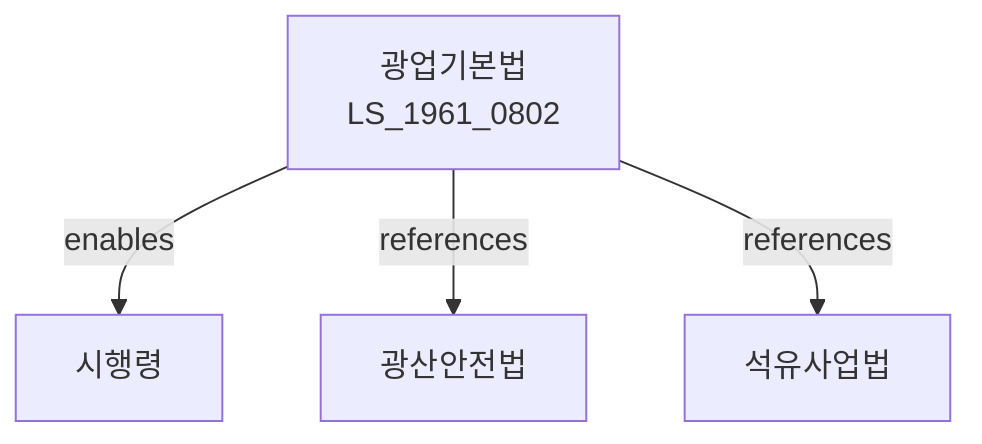

# 광업기본법

> [법률 제20087호, 2024. 1. 9., 일부개정]

---

---

## 제1장 총칙

### 제1조 (목적)

이 법은 광업의 건전한 발전과 광물자원의 합리적인 개발을 도모함으로써 국민경제의 발전에 이바지함을 목적으로 한다。

### 제2조 (정의)

이 법에서 사용하는 용어의 뜻은 다음과 같다。

1. "광업"이란 광물을 채굴하는 사업을 말한다。
2. "광물"이란 광산에서 생산되는 물질을 말한다。
3. "광산"이란 광물을 채굴하는 장소를 말한다.
4. "광업권"이란 광업을 영위할 권리를 말한다。

---

## 제2장 광업정책

### 第5条 (광업정책의 기본방향)

광업정책의 기본방향은 다음 각 호와 같다。

1. 광물자원의 합리적 개발
2. 광업의 안전 확보
3. 광업기술의 개발
4. 환경보전

### 第6条 (광업진흥계획)

산업통상자원부장관은 광업진흥 기본계획을 수립한다。

### 第7条 (시행계획)

산업통상자원부장관은 기본계획에 따라 시행계획을 수립한다。

---

## 제3장 광업권

### 第10条 (광업권의 설정)

광업권은 산업통상자원부장관의 허가를 받아 설정한다。

### 第11条 (광업권의 내용)

광업권은 광물을 채굴할 권리를 내용으로 한다。

### 第12条 (광업권의 존속기간)

광업권의 존속기간은 10년으로 한다。

### 第13条 (광업권의 이전)

광업권은 이전할 수 있다。

---

## 제4장 광산개발

### 第20条 (광산개발계획)

광산개발계획을 수립한다。

### 第21条 (탐광)

광물자원을 탐사한다。

### 第22条 (채굴)

광물을 채굴한다。

### 第23条 (선광)

채굴한 광물을 선별한다.

---

## 제5장 광산안전

### 第30条 (광산안전)

광산의 안전을 확보한다。

### 第31条 (안전시설)

광산에는 안전시설을 갖추어야 한다.

### 第32条 (안전교육)

광산근로자에 대하여 안전교육을 실시한다.

### 第33条 (재해방지)

광산재해를 예방한다.

---

## 제6장 환경보전

### 第40条 (환경보전)

광업으로 인한 환경피해를 방지한다.

### 第41条 (환경영향평가)

광산개발에 대하여 환경영향평가를 실시한다.

### 第42条 (환경복구)

광산폐쇄 후 환경을 복구한다.

### 第43条 (환경보증금)

환경복구를 위하여 보증금을 예치한다.

---

## 제7장 감독

### 第50条 (감독)

산업통상자원부장관은 광업정책을 감독한다.

### 第51条 (보고 및 검사)

산업통상자원부장관은 필요한 경우 보고를 명하거나 검사할 수 있다.

### 第52条 (시정명령)

산업통상자원부장관은 이 법을 위반한 자에 대하여 시정명령을 할 수 있다.

### 第53条 (영업정지)

중대한 위반사유가 있는 경우 영업정지를 명할 수 있다.

### 第54条 (허가취소)

중대한 위반사유가 있는 경우 허가를 취소할 수 있다.

---

## 제8장 벌칙

### 第60条 (벌칙)

다음 각 호의 어느 하나에 해당하는 자는 3년 이하의 징역 또는 3천만원 이하의 벌금에 처한다。

1. 허가 없이 광업을 영위한 자
2. 안전규정을 위반한 자

### 第61条 (과태료)

다음 각 호의 어느 하나에 해당하는 자에게는 1천만원 이하의 과태료를 부과한다。

1. 정당한 사유 없이 보고를 하지 아니한 자
2. 환경보전조치를 하지 아니한 자

---

## 관계 그래프

**상위 법령**
- [[헌법]] 제119조 (경제질서)
- [[광물자원법]]

**관련 법령**
- [[광산안전법]]
- [[석유사업법]]
- [[광해방지법]]
- [[산업안전보건법]]

**하위 법령**
- [[광업기본법 시행령]]
