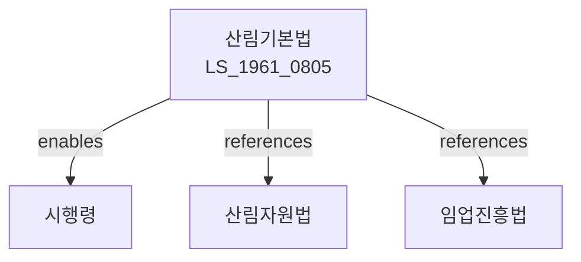

# 산림기본법

> [법률 제20088호, 2024. 1. 9., 일부개정]

---

---

## 제1장 총칙

### 제1조 (목적)

이 법은 산림의 보전ㆍ육성과 산림자원의 지속가능한 이용에 관한 기본적인 사항을 정하여 국토보전과 국민경제의 발전에 이바지함을 목적으로 한다。

### 제2조 (정의)

이 법에서 사용하는 용어의 뜻은 다음과 같다。

1. "산림"이란 목재, 대나무 등을 집단적으로 생육하고 있는 토지와 그 토지에 생육하고 있는 수목을 말한다。
2. "산림자원"이란 산림에서 생산되는 자원을 말한다。
3. "임업"이란 산림을 경영하는 산업을 말한다.
4. "산주"란 산림의 소유자를 말한다。

---

## 제2장 산림정책

### 第5条 (산림정책의 기본방향)

산림정책의 기본방향은 다음 각 호와 같다。

1. 산림의 보전과 육성
2. 산림자원의 지속가능한 이용
3. 임업의 경쟁력 강화
4. 산주의 소득증대
5. 산림의 공익기능 증진

### 第6条 (산림기본계획)

산림청장은 산림기본계획을 수립한다。

### 第7条 (시행계획)

산림청장은 기본계획에 따라 시행계획을 수립한다。

---

## 제3장 산림의 보전

### 第10条 (산림의 보전)

국가는 산림을 보전한다。

### 第11条 (산림의 이용)

산림은 지속가능하게 이용하여야 한다。

### 第12条 (산림의 보호)

산림을 재해, 병해충으로부터 보호한다。

### 第13条 (산불방지)

산불을 예방하고 진화한다。

---

## 제4장 산림자원의 육성

### 第20条 (조림)

산림에 나무를 심는 조림사업을 시행한다。

### 第21条 (육림)

산림을 가꾸는 육림사업을 시행한다。

### 第22条 (종묘생산)

나무의 묘목을 생산한다。

### 第23条 (임도)

산림관리를 위한 임도를 설치한다。

---

## 제5장 임업진흥

### 第30条 (임업경영)

임업을 효율적으로 경영한다。

### 第31条 (임산물생산)

임산물을 생산한다.

### 第32条 (목재이용)

목재를 이용한다.

### 第33条 (산주지원)

산주에 대하여 지원한다.

---

## 제6장 산림의 공익기능

### 第40条 (공익기능)

산림의 공익기능을 증진한다.

### 第41条 (산림휴양)

산림에서 휴양한다.

### 第42条 (산림치수)

산림이 수원을 함양한다.

### 第43条 (산림생태)

산림생태계를 보전한다.

---

## 제7장 감독

### 第50条 (감독)

산림청장은 산림정책을 감독한다.

### 第51条 (보고 및 검사)

산림청장은 필요한 경우 보고를 명하거나 검사할 수 있다.

### 第52条 (시정명령)

산림청장은 이 법을 위반한 자에 대하여 시정명령을 할 수 있다.

---

## 제8장 벌칙

### 第60条 (과태료)

다음 각 호의 어느 하나에 해당하는 자에게는 500만원 이하의 과태료를 부과한다。

1. 정당한 사유 없이 보고를 하지 아니한 자
2. 허위로 보고한 자

---

## 관계 그래프

**상위 법령**
- [[헌법]] 제35조 (환경권)
- [[산림자원의조성및관리에관한법률]]

**관련 법령**
- [[산림자원법]]
- [[임업진흥법]]
- [[자연환경보전법]]
- [[산림문화휴양법]]

**하위 법령**
- [[산림기본법 시행령]]
