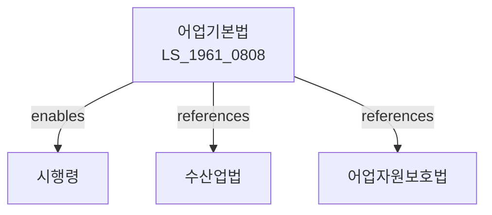

# 어업기본법

> [법률 제20089호, 2024. 1. 9., 일부개정]

---

---

## 제1장 총칙
### 제1조 (목적)
이 법은 어업에 관한 기본적인 사항을 정하여 어업의 건전한 발전과 어업인의 소득증대를 도모함으로써 국민경제의 발전에 이바지함을 목적으로 한다。
### 제2조 (정의)
이 법에서 사용하는 용어의 뜻은 다음과 같다。
1. "어업"이란 수산동식물을 포획 또는 채취하는 사업을 말한다。
2. "어업인"이란 어업을 영위하는 자를 말한다。
3. "어장"이란 어업을 하는 수역을 말한다.
4. "어선"이란 어업에 사용하는 선박을 말한다.

---

## 제2장 어업정책
### 第5条 (어업정책의 기본방향)
어업정책의 기본방향은 다음 각 호와 같다。
1. 어업의 경쟁력 강화
2. 어업인의 소득증대
3. 어장의 보전
4. 어업의 지속가능한 발전
5. 수산자원의 보호
### 第6条 (어업진흥계획)
해양수산부장관은 어업진흥 기본계획을 수립한다。
### 第7条 (시행계획)
해양수산부장관은 기본계획에 따라 시행계획을 수립한다.

---

## 제3장 어장관리
### 第10条 (어장의 보전)
국가는 어장을 보전한다.
### 第11条 (어장이용계획)
어장의 이용계획을 수립한다.
### 第12条 (어장의 지정)
어업을 위하여 어장을 지정할 수 있다.
### 第13条 (어장의 관리)
어장을 적절하게 관리하여야 한다.

---

## 제4장 어업인 지원
### 第20条 (자금지원)
국가는 어업인에 대하여 자금지원을 할 수 있다.
### 第21条 (세제지원)
어업인에 대하여는 조세특례제한법에 따른 세제지원을 할 수 있다.
### 第22条 (기술지원)
국가는 어업기술의 개발과 보급을 지원한다.
### 第23条 (교육지원)
국가는 어업인의 교육을 지원한다.
### 第24条 (어선지원)
국가는 어선의 현대화를 지원한다.

---

## 제5장 수산자원관리
### 第30条 (수산자원의 보호)
수산자원을 보호한다.
### 第31条 (자원조성)
수산자원을 조성한다.
### 第32条 (인공어초)
인공어초를 설치한다.
### 第33条 (방류)
치자가 어패류를 방류한다.

---

## 제6장 어업안전
### 第40条 (어업안전)
어업의 안전을 확보한다.
### 第41条 (통신장비)
어선에는 통신장비를 갖추어야 한다.
### 第42条 (안전교육)
어업인에 대하여 안전교육을 실시한다.
### 第43条 (재해보상)
어업재해에 대하여 보상한다.

---

## 제7장 감독
### 第50条 (감독)
해양수산부장관은 어업정책을 감독한다.
### 第51条 (보고 및 검사)
해양수산부장관은 필요한 경우 보고를 명하거나 검사할 수 있다.
### 第52条 (시정명령)
해양수산부장관은 이 법을 위반한 자에 대하여 시정명령을 할 수 있다.

---

## 제8장 벌칙
### 第60条 (과태료)
다음 각 호의 어느 하나에 해당하는 자에게는 500만원 이하의 과태료를 부과한다。
1. 정당한 사유 없이 보고를 하지 아니한 자
2. 허위로 보고한 자

---

## 관계 그래프
