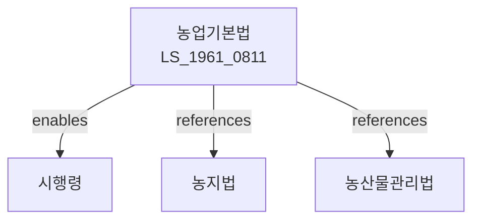

# 농업기본법

> [법률 제20090호, 2024. 1. 9., 일부개정]

---

---

## 제1장 총칙
### 제1조 (목적)
이 법은 농업에 관한 기본적인 사항을 정하여 농업의 건전한 발전과 농업인의 소득증대를 도모함으로써 국민경제의 발전에 이바지함을 목적으로 한다。
### 제2조 (정의)
이 법에서 사용하는 용어의 뜻은 다음과 같다。
1. "농업"이란 작물의 재배와 가축의 사육 등을 영위하는 산업을 말한다。
2. "농업인"이란 농업을 영위하는 자를 말한다.
3. "농지"란 농업을 위하여 이용하는 토지를 말한다.
4. "농산물"이란 농업생산물을 말한다.

---

## 제2장 농업정책
### 第5条 (농업정책의 기본방향)
농업정책의 기본방향은 다음 각 호와 같다。
1. 농업의 경쟁력 강화
2. 농업인의 소득증대
3. 농촌의 활성화
4. 농업의 지속가능한 발전
5. 식량안보의 확보
### 第6条 (농업진흥계획)
농림축산식품부장관은 농업진흥 기본계획을 수립한다。
### 第7条 (시행계획)
농림축산식품부장관은 기본계획에 따라 시행계획을 수립한다.

---

## 제3장 농지관리
### 第10条 (농지의 보전)
국가는 농지를 보전한다。
### 第11条 (농지이용계획)
농지의 이용계획을 수립한다。
### 第12条 (농지전용)
농지를 전용하려는 자는 허가를 받아야 한다。
### 第13条 (농지의 보전부담)
농지를 보전하기 위한 부담을 할 수 있다.

---

## 제4장 농업인 지원
### 第20条 (자금지원)
국가는 농업인에 대하여 자금지원을 할 수 있다。
### 第21条 (세제지원)
농업인에 대하여는 조세특례제한법에 따른 세제지원을 할 수 있다。
### 第22条 (기술지원)
국가는 농업기술의 개발과 보급을 지원한다.
### 第23条 (교육지원)
국가는 농업인의 교육을 지원한다.
### 第24条 (판로지원)
국가는 농산물의 판로를 확대한다.

---

## 제5장 농산물관리
### 第30条 (농산물의 품질관리)
농산물의 품질을 관리한다.
### 第31条 (농산물의 유통)
농산물의 유통을 개선한다.
### 第32条 (농산물의 가격안정)
농산물의 가격을 안정시킨다.
### 第33条 (농산물의 수급조절)
농산물의 수급을 조절한다.

---

## 제6장 농촌개발
### 第40条 (농촌개발사업)
농촌개발사업을 시행한다.
### 第41条 (농촌인프라)
농촌의 인프라를 확충한다.
### 第42条 (농촌생활환경)
농촌의 생활환경을 개선한다.
### 第43条 (농촌문화)
농촌문화를 육성한다.

---

## 제7장 감독
### 第50条 (감독)
농림축산식품부장관은 농업정책을 감독한다.
### 第51条 (보고 및 검사)
농림축산식품부장관은 필요한 경우 보고를 명하거나 검사할 수 있다.
### 第52条 (시정명령)
농림축산식품부장관은 이 법을 위반한 자에 대하여 시정명령을 할 수 있다.

---

## 제8장 벌칙
### 第60条 (과태료)
다음 각 호의 어느 하나에 해당하는 자에게는 500만원 이하의 과태료를 부과한다。
1. 정당한 사유 없이 보고를 하지 아니한 자
2. 허위로 보고한 자

---

## 관계 그래프
