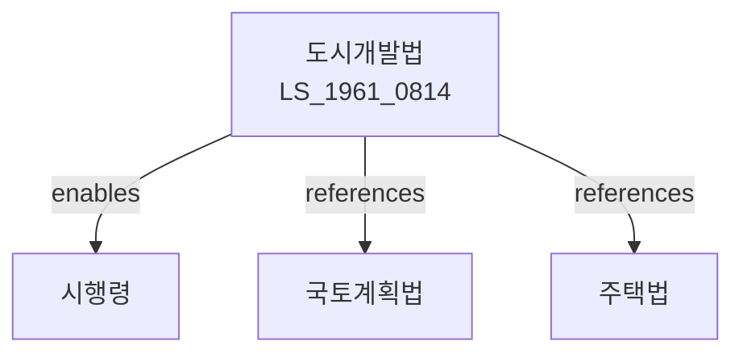

# 도시개발법

> [법률 제20091호, 2024. 1. 9., 일부개정]

---

---

## 제1장 총칙

### 제1조 (목적)

이 법은 도시개발에 관한 사항을 정하여 도시의 건전한 발전과 공공복리의 증진에 이바지함을 목적으로 한다。

### 제2조 (정의)

이 법에서 사용하는 용어의 뜻은 다음과 같다。

1. "도시개발"이란 도시의 기능을 회복하고 정비하는 것을 말한다。
2. "도시개발사업"이란 도시개발을 위한 사업을 말한다.
3. "도시개발구역"이란 도시개발사업을 시행하기 위하여 지정하는 구역을 말한다.
4. "시행자"란 도시개발사업을 시행하는 자를 말한다.

---

## 제2장 도시개발기본계획

### 第5条 (기본계획의 수립)

국토교통부장관은 도시개발 기본계획을 수립한다。

### 第6条 (기본계획의 내용)

기본계획에는 다음 각 호의 사항이 포함되어야 한다。

1. 도시개발의 목표 및 방향
2. 도시개발구역의 지정
3. 도시개발사업의 종류
4. 재원조달 방안
5. 그 밖에 도시개발에 필요한 사항

### 第7条 (도시개발구역의 지정)

도시개발구역은 국토교통부장관이 지정한다.

---

## 제3장 도시개발사업

### 第10条 (사업의 종류)

도시개발사업의 종류는 다음 각 호와 같다。

1. 주거환경개선사업
2. 도로정비사업
3. 공원녹지확보사업
4. 공공시설정비사업
5. 그 밖에 대통령령으로 정하는 사업

### 第11条 (사업시행자)

도시개발사업은 시행자가 시행한다.

### 第12条 (시행자의 지정)

시행자는 국토교통부장관이 지정한다.

### 第13条 (사업시행인가)

도시개발사업을 시행하려는 자는 인가를 받아야 한다.

---

## 제4장 도시개발구역

### 第20条 (구역의 지정)

도시개발구역은 다음 각 호의 요건을 갖추어야 한다.

1. 도시계획에 적합할 것
2. 개발의 필요성이 있을 것
3. 재원조달이 가능할 것

4. 그 밖에 대통령령으로 정하는 요건

### 第21条 (구역의 변경)

도시개발구역은 변경할 수 있다.
### 第22条 (구역의 해제)

도시개발구역은 해제할 수 있다.

### 第23条 (토지의 수용)

도시개발사업을 위하여 토지를 수용할 수 있다.

---

## 제5장 비용

### 第30条 (사업비용)

도시개발사업의 비용은 시행자가 부담한다.
### 第31条 (국고보조)

국가는 도시개발사업에 대하여 보조금을 지급할 수 있다.
### 第32条 (융자)

국가는 도시개발사업에 대하여 융자할 수 있다.
### 第33条 (특별회계)

도시개발사업을 위하여 특별회계를 설치할 수 있다.

---

## 제6장 감독
### 第40条 (감독)
국토교통부장관은 도시개발사업을 감독한다.
### 第41条 (보고 및 검사)
국토교통부장관은 필요한 경우 보고를 명하거나 검사할 수 있다.
### 第42条 (시정명령)
국토교통부장관은 이 법을 위반한 자에 대하여 시정명령을 할 수 있다.
### 第43条 (사업정지)
국토교통부장관은 중대한 위반사유가 있는 경우 사업정지를 명할 수 있다.
### 第44条 (인가취소)
국토교통부장관은 중대한 위반사유가 있는 경우 인가를 취소할 수 있다.

---

## 제7장 보칙
### 第50条 (청문)
국토교통부장관은 필요한 경우 청문을 할 수 있다.
### 第51条 (권한의 위임)
이 법에 따른 권한은 대통령령으로 정하는 바에 따라 위임할 수 있다.
### 第52条 (시행규칙)
이 법의 시행에 필요한 사항은 대통령령으로 정한다.

---

## 제8장 벌칙
### 第60条 (벌칙)
다음 각 호의 어느 하나에 해당하는 자는 3년 이하의 징역 또는 3천만원 이하의 벌금에 처한다。
1. 인가 없이 사업을 시행한 자
2. 허위로 인가를 받은 자
### 第61条 (과태료)
다음 각 호의 어느 하나에 해당하는 자에게는 1천만원 이하의 과태료를 부과한다.
1. 정당한 사유 없이 보고를 하지 아니한 자
2. 시정명령을 이행하지 아니한 자

---

## 관계 그래프
