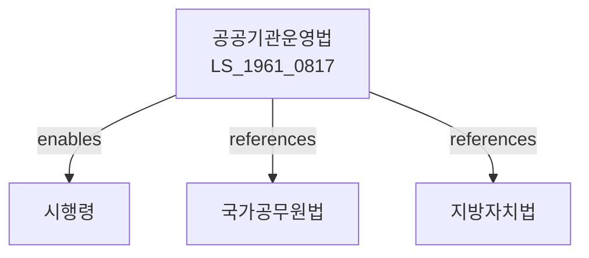

# 공공기관의운영에관한법률

> [법률 제20092호, 2024. 1. 9., 일부개정]

---

---

## 제1장 총칙

### 제1조 (목적)

이 법은 공공기관의 운영에 관한 기본적인 사항을 정하여 공공기관의 효율적인 운영과 책임성을 제고함으로써 국민에 대한 공공서비스의 질을 향상함을 목적으로 한다。

### 제2조 (정의)

이 법에서 사용하는 용어의 뜻은 다음과 같다。

1. "공공기관"이란 국가기관, 지방자치단체, 공공기관 및 그 밖에 대통령령으로 정하는 기관을 말한다。
2. "공공서비스"란 공공기관이 제공하는 서비스를 말한다.
3. "운영"이란 공공기관의 조직, 인사, 재무, 사업 등을 관리하는 것을 말한다。

---

## 제2장 조직 및 인사

### 第5条 (조직관리)

공공기관은 효율적인 조직관리를 하여야 한다。

### 第6条 (인사관리)

공공기관은 공정하고 투명한 인사관리를 하여야 한다。

### 第7条 (직원의 채용)

직원의 채용은 공개경쟁에 의하여 한다。

### 第8条 (교육훈련)

공공기관은 직원에 대하여 정기적으로 교육훈련을 실시하여야 한다.

---

## 제3장 재무관리

### 第15条 (예산편성)

공공기관은 예산을 효율적으로 편성하여야 한다。

### 第16条 (회계관리)

공공기관은 투명한 회계관리를 하여야 한다。

### 第17条 (결산)

공공기관은 매년 결산을 하여야 한다。

### 第18条 (감사)

공공기관은 정기적으로 감사를 받아야 한다.

---

## 제4장 사업관리

### 第25条 (사업계획)

공공기관은 사업계획을 수립하여야 한다.

### 第26条 (사업평가)

공공기관은 사업에 대하여 정기적으로 평가하여야 한다.

### 第27条 (성과관리)

공공기관은 성과관리제도를 운영하여야 한다.

### 第28条 (혁신)

공공기관은 지속적으로 혁신을 추진하여야 한다.

---

## 제5장 공공서비스

### 第35条 (서비스기준)

공공기관은 공공서비스의 기준을 정하여야 한다.

### 第36条 (서비스제공)

공공기관은 국민에게 양질의 공공서비스를 제공하여야 한다.

### 第37条 (민원처리)

공공기관은 민원을 신속하고 공정하게 처리하여야 한다.

### 第38条 (정보공개)

공공기관은 정보공개에 적극 협조하여야 한다.

---

## 제6장 책임경영

### 第45条 (윤리경영)

공공기관은 윤리경영을 실천하여야 한다.

### 第46条 (청렴유지)

공공기관의 임직원은 청렴을 유지하여야 한다.

### 第47条 (공익우선)

공공기관은 공익을 우선하여야 한다.

### 第48条 (국민만족)

공공기관은 국민만족을 최우선으로 한다.

---

## 제7장 감독

### 第55条 (감독)

주무부장관은 공공기관의 운영을 감독한다.

### 第56条 (보고 및 검사)

주무부장관은 필요한 경우 보고를 명하거나 검사할 수 있다.
### 第57条 (시정명령)

주무부장관은 이 법을 위반한 공공기관에 대하여 시정명령을 할 수 있다.

### 第58条 (운영정지)

주무부장관은 중대한 위반사유가 있는 경우 운영정지를 명할 수 있다.

---

## 제8장 보칙

### 第60条 (시행규칙)

이 법의 시행에 필요한 사항은 대통령령으로 정한다.

---

## 제9장 벌칙

### 第62条 (과태료)

다음 각 호의 어느 하나에 해당하는 자에게는 500만원 이하의 과태료를 부과한다.

1. 정당한 사유 없이 보고를 하지 아니한 자
2. 감사를 거부한 자

---

## 관계 그래프

