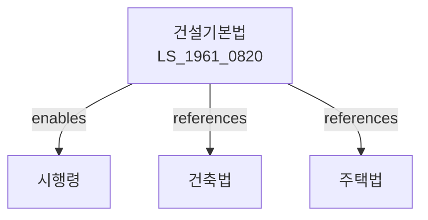

# 건설기본법

> [법률 제20093호, 2024. 1. 9., 일부개정]

---

---

## 제1장 총칙

### 제1조 (목적)

이 법은 건설산업의 건전한 발전을 도모하고 국토의 효율적인 이용과 공공복리의 증진에 이바지함을 목적으로 한다。

### 제2조 (정의)

이 법에서 사용하는 용어의 뜻은 다음과 같다。

1. "건설산업"이란 건축물, 건설, 토목개발, 주택건설 등을 영위하는 산업을 말한다。
2. "건설기술자이란 건설산업에 사용되는 기술을 말한다。
3. "건설사업자"이란 건설산업을 영위하는 자를 말한다。
4. "건설엔무"이란 건설산업의 시행을 말한다。

---

## 제2장 건설산업진흥기본계획

### 第5条 (기본계획의 수립)

국토교통부장관은 건설산업진흥 기본계획을 수립한다。

### 第6条 (기본계획의 내용)

기본계획에는 다음 각 호의 사항이 포함되어야 한다。

1. 건설산업 현황 및 전망
2. 건설산업 진흥목표
3. 건설기술 개발방안
4. 건설인력 양성방안
5. 그 밖에 필요한 사항

### 第7条 (시행계획)

국토교통부장관은 기본계획에 따라 시행계획을 수립한다。

---

## 제3장 건설사업자 등록

### 第10条 (건설사업자의 등록)

건설사업을 하려는 자는 국토교통부장관에게 등록하여야 한다。

### 第11条 (등록요건)

등록요건은 다음 각 호와 같다。

1. 자본금 3억원 이상
2. 기술능력의 보유
3. 건설기계의 보유
4. 기술인력의 확보

### 第12条 (등록결격사유)

다음 각 호의 어느 하나에 해당하는 자는 등록할 수 없다。

1. 금치산자 또는 한정치산자
2. 파산자로서 복권되지 아니한 자
3. 이 법을 위반하여 등록취소 후 2년이 지나지 아니한 자

---

## 제4장 건설기술

### 第20条 (건설기술개발)

국가는 건설기술의 개발을 지원한다.

### 第21条 (기술기준)

건설기술의 기준은 대통령령으로 정한다。

### 第22条 (기술심사)

국토교통부장관은 건설기술을 심사할 수 있다.

### 第23条 (신기술 보급)

새로운 건설기술의 보급을 장려한다。

---

## 제5장 건설인력

### 第30条 (건설인력양성)

국가는 건설인력의 양성을 지원한다.

### 第31条 (교육훈련)

건설인력의 교육훈련을 실시한다.

### 第32条 (자격제도)

건설기술자격제도를 운영할 수 있다。

### 第33条 (기능인력)

기능인력의 양성을 장려한다。

---

## 제6장 건설안전

### 第40条 (안전관리)

건설사업자는 안전관리에 주의하여야 한다。

### 第41条 (안전교육)

건설사업자는 종사자에 대하여 안전교육을 실시하여야 한다.

### 第42条 (안전점검)

건설사업자는 정기적으로 안전점검을 실시하여야 한다。

### 第43条 (재해예방)

건설재해를 예방하기 위한 조치를 하여야 한다。

---

## 제7장 감독

### 第50条 (감독)

국토교통부장관은 건설산업을 감독한다。

### 第51条 (보고 및 검사)

국토교통부장관은 필요한 경우 보고를 명하거나 검사할 수 있다.

### 第52条 (영업정지)

국토교통부장관은 이 법을 위반한 자에 대하여 영업정지를 명할 수 있다.

### 第53条 (등록취소)

국토교통부장관은 중대한 위반사유가 있는 경우 등록을 취소할 수 있다.

---

## 제8장 벌칙

### 第60条 (벌칙)

다음 각 호의 어느 하나에 해당하는 자는 2년 이하의 징역 또는 2천만원 이하의 벌금에 처한다。

1. 등록 없이 건설사업을 한 자
2. 허위로 등록한 자

### 第61条 (과태료)

다음 각 호의 어느 하나에 해당하는 자에게는 1천만원 이하의 과태료를 부과한다.

1. 정당한 사유 없이 보고를 하지 아니한 자
2. 안전관리를 하지 아니한 자

---

## 관계 그래프

