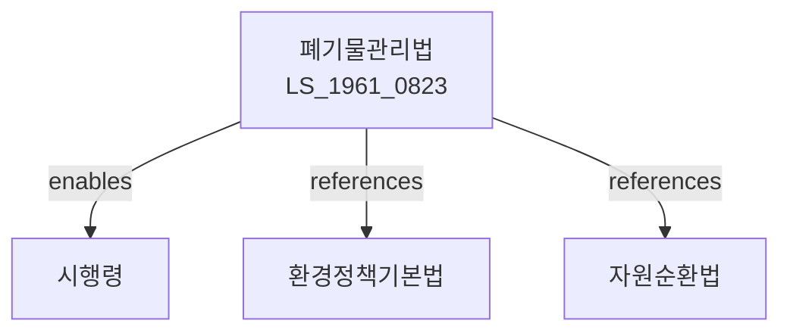

# 폐기물관리법

> [법률 제20094호, 2024. 1. 9., 일부개정]

---

---

## 제1장 총칙

### 제1조 (목적)

이 법은 폐기물의 적정관리와 재활용을 통하여 환경보전과 자원절약에 이바지함을 목적으로 한다。

### 제2조 (정의)

이 법에서 사용하는 용어의 뜻은 다음과 같다。

1. "폐기물"이란 쓰레기, 연소재, 오니, 폐유, 폐산 등으로서 사람의 생활이나 사업활동에 필요하지 아니하게 된 물질을 말한다。
2. "생활폐기물"이란 일상생활에서 배출되는 폐기물을 말한다。
3. "사업장폐기물"이란 사업활동에서 배출되는 폐기물을 말한다。
4. "재활용"이란 폐기물을 원료 또는 재료로 다시 이용하는 것을 말한다。

---

## 제2장 폐기물의 배출 및 수집

### 第5条 (배출자의 의무)

폐기물을 배출하는 자는 폐기물의 양을 줄이고 분리배출하여야 한다。

### 第6条 (생활폐기물의 수집)

생활폐기물은 시장ㆍ군수ㆍ구청장이 수집한다。

### 第7条 (배출방법)

폐기물은 지정된 장소에 지정된 방법으로 배출하여야 한다。

### 第8条 (종량제)

생활폐기물은 종량제에 따라 배출하여야 한다。

---

## 제3장 폐기물의 운반 및 처리

### 第15条 (운반)

폐기물의 운반은 폐기물수집ㆍ운반업자가 행한다。

### 第16条 (처리시설)

폐기물처리시설은 환경부장관의 승인을 받아 설치한다。

### 第17条 (처리방법)

폐기물은 매립, 소각, 재활용 등의 방법으로 처리한다。

### 第18条 (처리기준)

폐기물처리는 대통령령으로 정하는 기준에 따라야 한다。

---

## 제4장 사업장폐기물

### 第25条 (사업장폐기물의 처리)

사업장폐기물은 배출자가 직접 처리하거나 처리위탁하여야 한다。

### 第26条 (처리위탁)

사업장폐기물의 처리위탁은 폐기물처리업자에게 하여야 한다。

### 第27条 (처리비용)

사업장폐기물의 처리비용은 배출자가 부담한다。

### 第28条 (폐기물처리업)

폐기물처리업은 환경부장관의 허가를 받아 영위한다。

---

## 제5장 재활용

### 第35条 (재활용 촉진)

국가는 폐기물의 재활용을 촉진한다。

### 第36条 (분리수거)

재활용 가능한 폐기물은 분리수거하여야 한다。

### 第37条 (재활용제품 우선구매)

국가 및 지방자치단체는 재활용제품을 우선 구매하여야 한다。

### 第38条 (재활용센터)

재활용센터를 설치ㆍ운영할 수 있다。

---

## 제6장 폐기물처리시설

### 第45条 (매립시설)

폐기물매립시설은 침출수 방지시설을 갖추어야 한다。

### 第46条 (소각시설)

폐기물소각시설은 대기오염방지시설을 갖추어야 한다。

### 第47条 (해양배출 금지)

폐기물은 해양에 배출할 수 없다。

---

## 제7장 감독

### 第55条 (감독)

환경부장관은 폐기물관리사업을 감독한다。

### 第56条 (보고 및 검사)

환경부장관은 필요한 경우 보고를 명하거나 검사할 수 있다。

### 第57条 (개선명령)

이 법을 위반한 경우 개선명령을 할 수 있다。

### 第58条 (영업정지)

중대한 위반사유가 있는 경우 영업정지를 명할 수 있다。

---

## 제8장 벌칙

### 第65条 (벌칙)

다음 각 호의 어느 하나에 해당하는 자는 3년 이하의 징역 또는 3천만원 이하의 벌금에 처한다。

1. 무단투기한 자
2. 허가 없이 폐기물처리업을 한 자

### 第66条 (과태료)

다음 각 호의 어느 하나에 해당하는 자에게는 1천만원 이하의 과태료를 부과한다。

1. 정당한 사유 없이 보고를 하지 아니한 자
2. 분리배출을 하지 아니한 자

---

## 관계 그래프

**상위 법령**
- [[헌법]] 제35조 (환경권)
- [[환경정책기본법]]

**관련 법령**
- [[자원순환법]]
- [[대기환경보전법]]
- [[수질환경보전법]]
- [[해양환경관리법]]

**하위 법령**
- [[폐기물관리법 시행령]]
