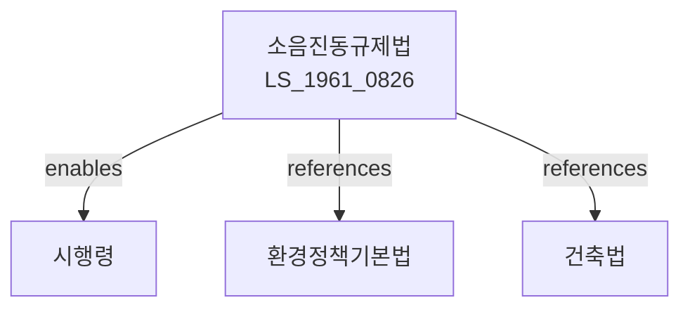

# 소음진동규제법

> [법률 제20095호, 2024. 1. 9., 일부개정]

---

---

## 제1장 총칙

### 제1조 (목적)

이 법은 소음 및 진동을 규제하여 정온한 생활환경을 조성하고 국민의 건강과 환경을 보호함을 목적으로 한다。

### 제2조 (정의)

이 법에서 사용하는 용어의 뜻은 다음과 같다。

1. "소음"이란 사람의 생활에 불쾌감을 주는 소리를 말한다。
2. "진동"이란 사람의 생활에 불쾌감을 주는 진동을 말한다。
3. "소음배출시설"이란 소음을 발생시키는 시설을 말한다。
4. "진동배출시설"이란 진동을 발생시키는 시설을 말한다。

---

## 제2장 소음진동규제기준

### 第5条 (규제기준)

소음 및 진동의 규제기준은 대통령령으로 정한다。

### 第6条 (지역구분)

규제기준은 지역의 용도에 따라 구분하여 적용한다。

### 第7条 (시간대구분)

규제기준은 시간대에 따라 구분하여 적용할 수 있다。

---

## 제3장 배출시설의 관리

### 第10条 (배출시설의 설치)

소음 또는 진동배출시설을 설치하려는 자는 환경부장관에게 신고하여야 한다。

### 第11条 (방지시설의 설치)

배출시설에는 방지시설을 설치하여야 한다。

### 第12条 (배출시설의 운영)

배출시설은 규제기준에 적합하게 운영하여야 한다。

### 第13条 (자가측정)

배출시설의 운영자는 정기적으로 자가측정을 실시하여야 한다。

---

## 제4장 생활소음 관리

### 第20条 (생활소음)

다음 각 호의 소음에 대하여는 생활소음으로 관리한다。

1. 확성기 소음
2. 공장소음
3. 건설소음
4. 교통소음
5. 그 밖에 대통령령으로 정하는 소음

### 第21条 (확성기 소음)

확성기의 사용은 대통령령으로 정하는 시간ㆍ장소에서 제한할 수 있다。

### 第22条 (건설소음)

건설공사의 소음은 규제기준에 적합하여야 한다。

---

## 제5장 교통소음 관리

### 第30条 (자동차소음)

자동차에서 발생하는 소음은 규제기준에 적합하여야 한다。

### 第31条 (철도소음)

철도에서 발생하는 소음에 대하여는 관계 법령에 따라 관리한다。

### 第32条 (항공기소음)

항공기에서 발생하는 소음에 대하여는 관계 법령에 따라 관리한다。

---

## 제6장 방음방진시설

### 第40条 (방음벽)

소음을 차단하기 위하여 방음벽을 설치할 수 있다。

### 第41条 (방진시설)

진동을 차단하기 위하여 방진시설을 설치할 수 있다。

### 第42条 (지원)

방음방진시설의 설치에 대하여 지원할 수 있다。

---

## 제7장 감독

### 第50条 (감독)

환경부장관은 소음진동규제사업을 감독한다。

### 第51条 (보고 및 검사)

환경부장관은 필요한 경우 보고를 명하거나 검사할 수 있다。

### 第52条 (개선명령)

규제기준을 위반한 경우 개선명령을 할 수 있다。

### 第53条 (조업정지)

개선명령을 이행하지 아니한 경우 조업정지를 명할 수 있다。

---

## 제8장 벌칙

### 第60条 (과태료)

다음 각 호의 어느 하나에 해당하는 자에게는 500만원 이하의 과태료를 부과한다。

1. 정당한 사유 없이 보고를 하지 아니한 자
2. 규제기준을 위반한 자

---

## 관계 그래프

**상위 법령**
- [[헌법]] 제35조 (환경권)
- [[환경정책기본법]]

**관련 법령**
- [[건축법]]
- [[도로교통법]]
- [[대기환경보전법]]
- [[수질환경보전법]]

**하위 법령**
- [[소음진동규제법 시행령]]
