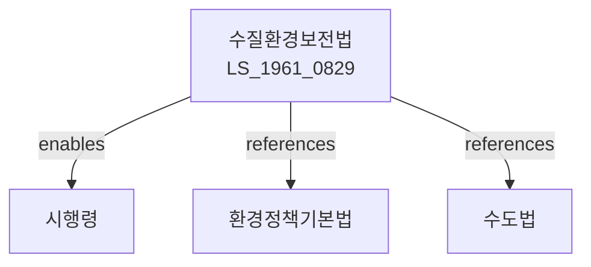

# 수질환경보전법

> [법률 제20096호, 2024. 1. 9., 일부개정]

---

---

## 제1장 총칙

### 제1조 (목적)

이 법은 수질오염을 방지하고 수질환경을 적정하게 관리ㆍ보전하여 국민의 건강과 환경을 보호함을 목적으로 한다。

### 제2조 (정의)

이 법에서 사용하는 용어의 뜻은 다음과 같다。

1. "수질오염"이란 물에 오염물질이 혼입하여 사람의 건강이나 환경에 해를 주는 상태를 말한다。
2. "오염물질"이란 물을 오염시키는 물질을 말한다。
3. "배출시설"이란 오염물질을 배출하는 시설을 말한다。
4. "방지시설"이란 오염물질을 제거하거나 감소시키는 시설을 말한다。

---

## 제2장 수질환경보전기본계획

### 第5条 (기본계획의 수립)

환경부장관은 수질환경보전 기본계획을 수립한다。

### 第6条 (기본계획의 내용)

기본계획에는 다음 각 호의 사항이 포함되어야 한다。

1. 수질환경 현황 및 전망
2. 수질오염 방지대책
3. 수질관리 대책
4. 상수원 보호대책
5. 그 밖에 수질환경 보전에 필요한 사항

### 第7条 (수질측정망)

환경부장관은 수질을 측정하기 위한 측정망을 설치ㆍ운영한다。

---

## 제3장 배출허용기준

### 第10条 (배출허용기준)

오염물질의 배출허용기준은 대통령령으로 정한다。

### 第11条 (배출허용기준의 적용)

배출허용기준은 배출시설의 종류 및 규모에 따라 다르게 적용할 수 있다。

### 第12条 (총량관리)

특정 수역에 대하여는 배출총량관리제도를 적용할 수 있다。

---

## 제4장 배출시설의 관리

### 第20条 (배출시설의 설치)

배출시설을 설치하려는 자는 환경부장관에게 신고하여야 한다。

### 第21条 (방지시설의 설치)

배출시설에는 방지시설을 설치하여야 한다。

### 第22条 (배출시설의 운영)

배출시설은 배출허용기준에 적합하게 운영하여야 한다。

### 第23条 (자가측정)

배출시설의 운영자는 정기적으로 자가측정을 실시하여야 한다。

---

## 제5장 상수원 보호

### 第30条 (상수원보호구역)

상수원의 보호를 위하여 상수원보호구역을 지정할 수 있다。

### 第31条 (행위제한)

상수원보호구역에서는 다음 각 호의 행위를 제한한다。

1. 오염물질 배출시설의 설치
2. 쓰레기 투기
3. 그 밖에 수질오염을 유발하는 행위

### 第32条 (오염총량관리)

상수원보호구역에 대하여는 오염총량관리제도를 적용한다.

---

## 제6장 수질오염 사고 대응

### 第40条 (수질오염사고)

수질오염사고가 발생한 경우 즉시 대응조치를 하여야 한다。

### 第41条 (오염방제)

수질오염사고에 대하여 방제조치를 실시한다。

### 第42条 (비상대책)

수질오염 비상시 비상대책을 수립ㆍ시행한다。

---

## 제7장 감독

### 第50条 (감독)

환경부장관은 수질환경보전사업을 감독한다。

### 第51条 (보고 및 검사)

환경부장관은 필요한 경우 보고를 명하거나 검사할 수 있다。

### 第52条 (개선명령)

배출허용기준을 위반한 경우 개선명령을 할 수 있다。

### 第53条 (조업정지)

개선명령을 이행하지 아니한 경우 조업정지를 명할 수 있다。

---

## 제8장 벌칙

### 第60条 (벌칙)

다음 각 호의 어느 하나에 해당하는 자는 3년 이하의 징역 또는 3천만원 이하의 벌금에 처한다。

1. 배출허용기준을 현저히 위반한 자
2. 조업정지명령을 위반한 자

### 第61条 (과태료)

다음 각 호의 어느 하나에 해당하는 자에게는 1천만원 이하의 과태료를 부과한다。

1. 정당한 사유 없이 보고를 하지 아니한 자
2. 자가측정을 하지 아니한 자

---

## 관계 그래프

**상위 법령**
- [[헌법]] 제35조 (환경권)
- [[환경정책기본법]]

**관련 법령**
- [[수도법]]
- [[하수도법]]
- [[대기환경보전법]]
- [[소음진동규제법]]

**하위 법령**
- [[수질환경보전법 시행령]]
