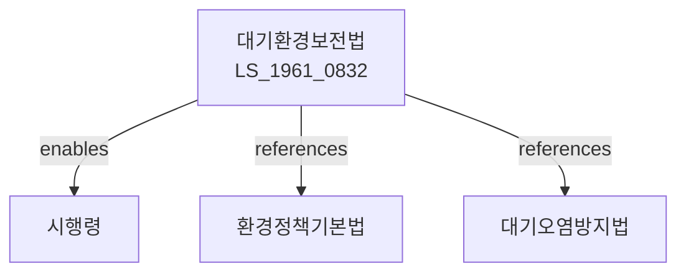

# 대기환경보전법

> [법률 제20097호, 2024. 1. 9., 일부개정]

---

---

## 제1장 총칙

### 제1조 (목적)

이 법은 대기오염을 방지하고 대기환경을 적정하게 관리ㆍ보전하여 국민의 건강과 환경을 보호함을 목적으로 한다。

### 제2조 (정의)

이 법에서 사용하는 용어의 뜻은 다음과 같다。

1. "대기오염"이란 대기 중에 오염물질이 존재하여 사람의 건강이나 환경에 해를 주는 상태를 말한다。
2. "오염물질"이란 대기를 오염시키는 물질을 말한다。
3. "배출시설"이란 오염물질을 배출하는 시설을 말한다。
4. "방지시설"이란 오염물질을 제거하거나 감소시키는 시설을 말한다。

---

## 제2장 대기환경보전기본계획

### 第5条 (기본계획의 수립)

환경부장관은 대기환경보전 기본계획을 수립한다。

### 第6条 (기본계획의 내용)

기본계획에는 다음 각 호의 사항이 포함되어야 한다。

1. 대기환경 현황 및 전망
2. 대기오염 방지대책
3. 대기질 관리대책
4. 미세먼지 관리대책
5. 그 밖에 대기환경 보전에 필요한 사항

### 第7条 (대기환경측정망)

환경부장관은 대기환경을 측정하기 위한 측정망을 설치ㆍ운영한다。

---

## 제3장 배출허용기준

### 第10条 (배출허용기준)

오염물질의 배출허용기준은 대통령령으로 정한다。

### 第11条 (배출허용기준의 적용)

배출허용기준은 배출시설의 종류 및 규모에 따라 다르게 적용할 수 있다。

### 第12条 (총량관리)

특정 지역에 대하여는 배출총량관리제도를 적용할 수 있다。

---

## 제4장 배출시설의 관리

### 第20条 (배출시설의 설치)

배출시설을 설치하려는 자는 환경부장관에게 신고하여야 한다。

### 第21条 (방지시설의 설치)

배출시설에는 방지시설을 설치하여야 한다。

### 第22条 (배출시설의 운영)

배출시설은 배출허용기준에 적합하게 운영하여야 한다。

### 第23条 (자가측정)

배출시설의 운영자는 정기적으로 자가측정을 실시하여야 한다。

---

## 제5장 자동차 배출가스

### 第30条 (자동차배출가스허용기준)

자동차에서 배출되는 가스의 허용기준은 대통령령으로 정한다。

### 第31条 (자동차의 검사)

자동차는 배출가스 검사를 받아야 한다。

### 第32条 (저공해자동차)

저공해자동차의 보급을 장려한다。

---

## 제6장 미세먼지 관리

### 第40条 (미세먼지 경보)

미세먼지 농도가 높은 경우 경보를 발령할 수 있다。

### 第41条 (미세먼지 저감조치)

미세먼지 농도가 높은 경우 저감조치를 할 수 있다。

### 第42条 (비상저감조치)

미세먼지 비상시 비상저감조치를 실시할 수 있다。

---

## 제7장 감독

### 第50条 (감독)

환경부장관은 대기환경보전사업을 감독한다。

### 第51条 (보고 및 검사)

환경부장관은 필요한 경우 보고를 명하거나 검사할 수 있다。

### 第52条 (개선명령)

배출허용기준을 위반한 경우 개선명령을 할 수 있다。

### 第53条 (조업정지)

개선명령을 이행하지 아니한 경우 조업정지를 명할 수 있다。

---

## 제8장 벌칙

### 第60条 (벌칙)

다음 각 호의 어느 하나에 해당하는 자는 3년 이하의 징역 또는 3천만원 이하의 벌금에 처한다。

1. 배출허용기준을 현저히 위반한 자
2. 조업정지명령을 위반한 자

### 第61条 (과태료)

다음 각 호의 어느 하나에 해당하는 자에게는 1천만원 이하의 과태료를 부과한다。

1. 정당한 사유 없이 보고를 하지 아니한 자
2. 자가측정을 하지 아니한 자

---

## 관계 그래프

**상위 법령**
- [[헌법]] 제35조 (환경권)
- [[환경정책기본법]]

**관련 법령**
- [[대기오염방지법]]
- [[수질환경보전법]]
- [[소음진동규제법]]
- [[자동차관리법]]

**하위 법령**
- [[대기환경보전법 시행령]]
