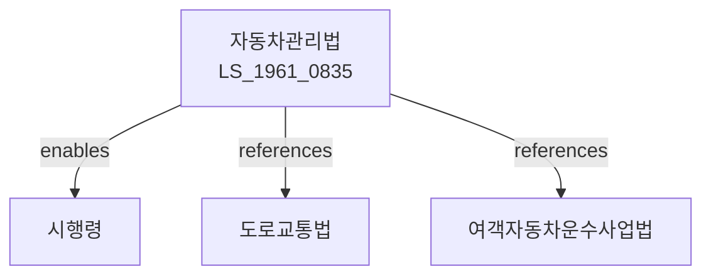

# 자동차관리법

> [법률 제20098호, 2024. 1. 9., 일부개정]

---

---

## 제1장 총칙

### 제1조 (목적)

이 법은 자동차의 등록ㆍ관리 및 그에 관한 사항을 정하여 자동차의 원활한 관리와 도모함으로써 교통의 안전과 원활한 소통에 이바지함을 목적으로 한다。

### 제2조 (정의)

이 법에서 사용하는 용어의 뜻은 다음과 같다。

1. "자동차"란 원동기에 의하여 육상에서 이동할 목적으로 제작된 용구로서 대통령령으로 정하는 것을 말한다。
2. "자동차등록"이란 자동차의 소유권 등을 공부하는 것을 말한다。
3. "자동차번호"란 자동차의 식별을 위한 번호를 말한다。
4. "운행"이란 자동차를 도로에서 운전하는 것을 말한다。

---

## 제2장 자동차의 등록

### 第5条 (자동차등록)

자동차를 소유한 자는 국토교통부장관에게 등록하여야 한다。

### 第6条 (등록신청)

자동차등록은 신청에 의하여 행한다。

### 第7条 (등록필증)

자동차등록이 완료되면 자동차등록필증을 교부한다。

### 第8条 (자동차번호)

자동차에는 자동차번호를 부착하여야 한다。

### 第9条 (번호의 교체)

자동차번호는 대통령령으로 정하는 바에 따라 교체할 수 있다。

---

## 제3장 자동차의 검사

### 第15条 (자동차검사)

자동차는 정기적으로 검사를 받아야 한다。

### 第16条 (검사의 종류)

검사의 종류는 다음 각 호와 같다。

1. 신규검사
2. 정기검사
3. 구조변경검사
4. 임시검사

### 第17条 (검사기관)

자동차검사는 국토교통부장관이 지정하는 기관에서 행한다。

### 第18条 (검사기준)

자동차검사는 대통령령으로 정하는 기준에 따라 행한다。

---

## 제4장 자동차의 운행

### 第25条 (운행의 원칙)

자동차는 안전하게 운행하여야 한다。

### 第26条 (운행제한)

다음 각 호의 자동차는 운행을 제한할 수 있다。

1. 검사를 받지 아니한 자동차
2. 등록되지 아니한 자동차
3. 안전기준에 적합하지 아니한 자동차

### 第27条 (자동차의 정비)

자동차는 항상 정비된 상태를 유지하여야 한다.

### 第28条 (운행기록)

자동차의 운행기록을 작성ㆍ보관하여야 한다。

---

## 제5장 자동차의 형식승인

### 第35条 (형식승인)

자동차의 형식은 국토교통부장관의 승인을 받아야 한다。

### 第36条 (승인요건)

형식승인의 요건은 다음 각 호와 같다。

1. 안전기준에의 적합성
2. 배기가스 기준에의 적합성
3. 소음기준에의 적합성
4. 그 밖에 대통령령으로 정하는 요건

### 第37条 (승인의 취소)

형식승인의 요건에 적합하지 아니하게 된 경우 승인을 취소할 수 있다.

---

## 제6장 자동차의 폐차

### 第45条 (폐차)

자동차를 폐차하려는 자는 등록말소하여야 한다.

### 第46条 (폐차요건)

폐차의 요건은 대통령령으로 정한다.

### 第47条 (폐차인센티브)

폐차하는 자에게 인센티브를 지급할 수 있다.

---

## 제7장 감독

### 第55条 (감독)

국토교통부장관은 자동차의 관리를 감독한다。

### 第56条 (보고 및 검사)

국토교통부장관은 필요한 경우 보고를 명하거나 검사할 수 있다.

### 第57条 (시정명령)

국토교통부장관은 이 법을 위반한 자에 대하여 시정명령을 할 수 있다.

---

## 第8장 벌칙

### 第60条 (벌칙)

다음 각 호의 어느 하나에 해당하는 자는 1년 이하의 징역 또는 1천만원 이하의 벌금에 처한다。

1. 등록 없이 자동차를 운행한 자
2. 검사를 받지 아니한 자동차를 운행한 자

### 第61条 (과태료)

다음 각 호의 어느 하나에 해당하는 자에게는 500만원 이하의 과태료를 부과한다。

1. 정당한 사유 없이 보고를 하지 아니한 자
2. 자동차번호를 부착하지 아니한 자

---

## 관계 그래프

**상위 법령**
- [[헌법]] 제119조 (경제질서)
- [[교통안전법]]

**관련 법령**
- [[도로교통법]]
- [[여객자동차운수사업법]]
- [[자동차손해배상보장법]]
- [[대기환경보전법]]

**하위 법령**
- [[자동차관리법 시행령]]
