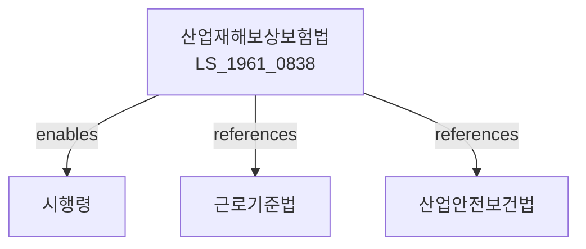

# 산업재해보상보험법

> [법률 제20099호, 2024. 1. 9., 일부개정]

---

---

## 제1장 총칙

### 제1조 (목적)

이 법은 업무상 재해를 당한 근로자를 신속하고 공정하게 보상하고, 재활 및 복귀를 지원함으로써 근로자의 생활안정과 복지증진에 이바지함을 목적으로 한다。

### 제2조 (정의)

이 법에서 사용하는 용어의 뜻은 다음과 같다。

1. "업무상 재해"란 업무수행 중 발생한 재해를 말한다。
2. "산업재해보상보험"이란 업무상 재해에 대하여 보상하는 보험을 말한다。
3. "요양급여"란 재해로 인한 치료비를 지급하는 급여를 말한다。
4. "휴업급여"란 요양으로 인하여 취업하지 못하는 기간에 지급하는 급여를 말한다。

---

## 제2장 적용범위

### 第5条 (적용사업장)

산업재해보상보험은 모든 사업장에 적용한다。 다만, 대통령령으로 정하는 사업장은 예외로 한다。

### 第6条 (피보험자)

피보험자는 사업장에 고용된 근로자로 한다。

### 第7条 (특수고용직)

특수형태근로종사자도 이 법의 적용을 받을 수 있다。

---

## 제3장 보험가입

### 第15条 (당연가입)

사업주는 당연히 보험에 가입하여야 한다。

### 第16条 (가입신고)

사업주는 보험가입신고를 하여야 한다。

### 第17条 (보험관계성립)

보험관계는 가입신고를 한 날부터 성립한다。

---

## 제4장 보험급여

### 第25条 (급여의 종류)

보험급여의 종류는 다음 각 호와 같다。

1. 요양급여
2. 휴업급여
3. 장해급여
4. 간병급여
5. 유족급여
6. 상병보상연금
7. 장의비

### 第26条 (요양급여)

요양급여는 요양에 소요된 비용을 지급한다。

### 第27条 (휴업급여)

휴업급여는 평균임금의 100분의 70을 지급한다。

### 第28条 (장해급여)

장해급여는 장해등급에 따라 연금 또는 일시금으로 지급한다。

### 第29条 (유족급여)

유족급여는 사망한 경우 유족에게 지급한다。

---

## 제5장 요양

### 第40条 (요양기관)

요양은 요양기관에서 행한다。

### 第41条 (요양기간)

요양기간은 치유될 때까지로 한다。

### 第42条 (재요양)

재요양이 필요한 경우 재요양급여를 지급한다。

---

## 제6장 재활

### 第50条 (사회재활)

업무상 재해를 당한 근로자의 사회재활을 지원한다。

### 第51条 (직업재활)

업무상 재해를 당한 근로자의 직업재활을 지원한다。

### 第52条 (심리재활)

업무상 재해를 당한 근로자의 심리재활을 지원한다。

---

## 제7장 보험료

### 第60条 (보험료)

사업주는 보험료를 납부하여야 한다。

### 第61条 (보험료율)

보험료율은 사업의 종류에 따라 대통령령으로 정한다。

### 第62条 (납부)

보험료는 분기별로 납부한다。

---

## 제8장 근로복지공단

### 第70条 (설립)

산업재해보상보험사업을 운영하기 위하여 근로복지공단을 설립한다。

### 第71条 (업무)

근로복지공단은 다음 각 호의 업무를 수행한다。

1. 보험급여의 지급
2. 재활사업
3. 예방사업
4. 그 밖에 산업재해보상에 필요한 업무

---

## 제9장 감독

### 第80条 (감독)

고용노동부장관은 산업재해보상보험사업을 감독한다。

### 第81条 (보고 및 검사)

고용노동부장관은 필요한 경우 보고를 명하거나 검사할 수 있다。

### 第82条 (시정명령)

고용노동부장관은 이 법을 위반한 자에 대하여 시정명령을 할 수 있다。

---

## 제10장 벌칙

### 第90条 (벌칙)

다음 각 호의 어느 하나에 해당하는 자는 3년 이하의 징역 또는 3천만원 이하의 벌금에 처한다。

1. 허위로 보험급여를 받은 자
2. 보험료를 납부하지 아니한 자

### 第91条 (과태료)

다음 각 호의 어느 하나에 해당하는 자에게는 1천만원 이하의 과태료를 부과한다。

1. 정당한 사유 없이 보고를 하지 아니한 자
2. 허위로 신고한 자

---

## 관계 그래프

**상위 법령**
- [[헌법]] 제32조 (근로의 권리)
- [[근로기준법]]

**관련 법령**
- [[산업안전보건법]]
- [[중대재해처벌법]]
- [[고용보험법]]
- [[국민건강보험법]]
- [[근로자복지기본법]]

**하위 법령**
- [[산업재해보상보험법 시행령]]
