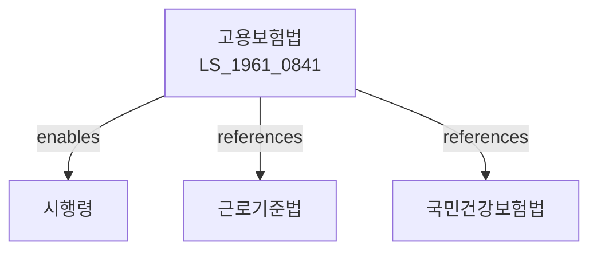

# 고용보험법

> [법률 제20100호, 2024. 1. 9., 일부개정]

---

---

## 제1장 총칙

### 제1조 (목적)

이 법은 고용보험을 실시하여 실업의 예방, 고용의 촉진 및 근로자의 직업능력개발 등을 도모함으로써 근로자의 고용안정과 복지증진에 이바지함을 목적으로 한다。

### 제2조 (정의)

이 법에서 사용하는 용어의 뜻은 다음과 같다。

1. "고용보험"이란 실업에 대하여 급여를 지급하는 보험을 말한다。
2. "피보험자"란 고용보험에 가입된 근로자를 말한다。
3. "실업급여"란 근로자가 실업한 경우에 지급하는 급여를 말한다。
4. "직업능력개발"이란 근로자의 직업능력을 향상시키는 것을 말한다。

---

## 제2장 적용범위

### 第5条 (적용사업장)

고용보험은 모든 사업장에 적용한다。 다만, 대통령령으로 정하는 사업장은 예외로 한다。

### 第6条 (피보험자)

피보험자는 사업장에 고용된 근로자로 한다。

### 第7条 (적용제외)

다음 각 호의 자는 적용에서 제외된다。

1. 65세 이상인 자
2. 일용근로자
3. 그 밖에 대통령령으로 정하는 자

---

## 제3장 보험료

### 第15条 (보험료)

사업주와 피보험자는 보험료를 납부하여야 한다。

### 第16条 (보험료율)

보험료율은 다음 각 호와 같다。

1. 고용안정보험료: 보수총액의 1000분의 6.5
2. 직업능력개발보험료: 보수총액의 1000분의 8.5

### 第17条 (납부)

보험료는 분기별로 납부한다。

### 第18条 (독촉)

보험료를 체납한 경우 독촉장을 발부한다。

---

## 제4장 실업급여

### 第25条 (구직급여)

피보험자가 실업한 경우 구직급여를 지급한다。

### 第26条 (수급요건)

구직급여를 받으려면 다음 각 호의 요건을 충족하여야 한다。

1. 이직 전 18개월간 피보험단위기간 180일 이상
2. 근로의 의사와 능력이 있음
3. 적극적인 구직노력

### 第27条 (지급기간)

구직급여의 지급기간은 90일에서 240일까지로 한다。

### 第28条 (지급액)

구직급여액은 이직 전 평균임금의 100분의 60으로 한다。

---

## 제5장 고용안정사업

### 第35条 (고용유지지원)

고용유지를 위한 지원을 한다。

### 第36条 (고용조정)

고용조정에 따른 지원을 한다。

### 第37条 (직장보육)

직장보육시설 설치를 지원한다。

---

## 제6장 직업능력개발사업

### 第45条 (직업훈련)

직업훈련을 실시한다。

### 第46条 (능력개발)

직업능력개발을 지원한다。

### 第47条 (자격취득)

자격취득을 지원한다。

---

## 제7장 고용보험심사위원회

### 第55条 (설치)

고용보험에 관한 사항을 심사하기 위하여 고용보험심사위원회를 둔다。

### 第56条 (기능)

심사위원회는 다음 각 호의 사항을 심사한다。

1. 실업급여에 관한 분쟁
2. 보험료에 관한 분쟁
3. 그 밖에 고용보험에 관한 분쟁

---

## 제8장 감독

### 第65条 (감독)

고용노동부장관은 고용보험사업을 감독한다。

### 第66条 (보고 및 검사)

고용노동부장관은 필요한 경우 보고를 명하거나 검사할 수 있다。

### 第67条 (시정명령)

고용노동부장관은 이 법을 위반한 자에 대하여 시정명령을 할 수 있다。

---

## 제9장 벌칙

### 第75条 (벌칙)

다음 각 호의 어느 하나에 해당하는 자는 1년 이하의 징역 또는 1천만원 이하의 벌금에 처한다。

1. 허위로 실업급여를 받은 자
2. 보험료를 납부하지 아니한 자

### 第76条 (과태료)

다음 각 호의 어느 하나에 해당하는 자에게는 500만원 이하의 과태료를 부과한다。

1. 정당한 사유 없이 보고를 하지 아니한 자
2. 허위로 신고한 자

---

## 관계 그래프

**상위 법령**
- [[헌법]] 제32조 (근로의 권리)
- [[근로기준법]]

**관련 법령**
- [[국민건강보험법]]
- [[국민연금법]]
- [[산업재해보상보험법]]
- [[직업안정법]]
- [[근로자직업능력개발법]]

**하위 법령**
- [[고용보험법 시행령]]
