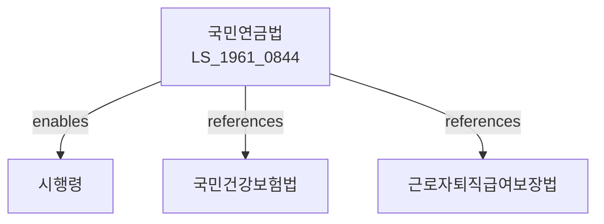

# 국민연금법

> [법률 제20101호, 2024. 1. 9., 일부개정]

---

---

## 제1장 총칙

### 제1조 (목적)

이 법은 국민의 노후ㆍ장애 또는 사망 등에 대하여 연금급여를 실시함으로써 국민의 생활안정과 복지증진에 이바지함을 목적으로 한다。

### 제2조 (정의)

이 법에서 사용하는 용어의 뜻은 다음과 같다。

1. "국민연금"이란 노령, 장애, 사망 등에 대하여 지급하는 연금을 말한다。
2. "가입자"란 국민연금에 가입한 자를 말한다。
3. "연금급여"란 노령연금, 장애연금, 유족연금 등을 말한다。
4. "소득월액"이란 가입자의 월평균소득을 말한다。

---

## 제2장 가입자

### 第5条 (가입대상)

국민연금의 가입대상은 18세 이상 60세 미만의 국민으로 한다。

### 第6条 (당연가입자)

사업장에 고용된 근로자는 당연히 가입한다。

### 第7条 (임의가입자)

당연가입자 외의 자는 임의로 가입할 수 있다。

### 第8条 (가입기간)

가입기간은 최소 10년 이상이어야 연금을 받을 수 있다。

---

## 제3장 보험료

### 第15条 (보험료)

가입자는 보험료를 납부하여야 한다。

### 第16条 (보험료율)

보험료율은 소득월액의 100분의 9로 한다。

### 第17条 (보험료의 부과)

보험료는 월단위로 부과한다。

### 第18条 (납부)

보험료는 매월 납부하여야 한다。

### 第19条 (연체료)

보험료를 체납한 경우 연체료를 부과한다。

---

## 제4장 연금급여

### 第25条 (연금의 종류)

연금의 종류는 다음 각 호와 같다。

1. 노령연금
2. 장애연금
3. 유족연금
4. 반환일시금

### 第26条 (노령연금)

가입기간이 10년 이상인 자가 62세에 달한 때 노령연금을 지급한다。

### 第27条 (장애연금)

가입 중에 질병 또는 부상으로 장애가 발생한 경우 장애연금을 지급한다。

### 第28条 (유족연금)

가입자 또는 수급권자가 사망한 경우 유족연금을 지급한다。

### 第29条 (연금액)

연금액은 가입기간 및 소득월액을 기준으로 산정한다。

---

## 제5장 반환일시금

### 第35条 (반환일시금)

가입기간이 10년 미만인 자가 60세에 달한 때 반환일시금을 지급한다。

### 第36条 (청구)

반환일시금은 청구에 의하여 지급한다。

---

## 제6장 국민연금공단

### 第45条 (설립)

국민연금사업을 운영하기 위하여 국민연금공단을 설립한다。

### 第46条 (업무)

국민연금공단은 다음 각 호의 업무를 수행한다。

1. 가입자의 관리
2. 보험료의 부과ㆍ징수
3. 연금급여의 지급
4. 기금의 운용
5. 그 밖에 국민연금사업에 필요한 업무

### 第47条 (조직)

국민연금공단은 이사장, 이사 및 감사로 구성한다。

---

## 제7장 기금

### 第55条 (국민연금기금)

국민연금의 재원을 확보하기 위하여 국민연금기금을 설치한다。

### 第56条 (기금의 운용)

국민연금기금은 국민연금기금운용위원회의 심의를 거쳐 운용한다。

### 第57条 (기금의 용도)

국민연금기금은 다음 각 호의 용도에 사용한다。

1. 연금급여의 지급
2. 사업비의 지출
3. 그 밖에 대통령령으로 정하는 용도

---

## 제8장 감독

### 第65条 (감독)

보건복지부장관은 국민연금사업을 감독한다。

### 第66条 (보고 및 검사)

보건복지부장관은 필요한 경우 보고를 명하거나 검사할 수 있다。

### 第67条 (시정명령)

보건복지부장관은 이 법을 위반한 자에 대하여 시정명령을 할 수 있다。

---

## 제9장 벌칙

### 第75条 (벌칙)

다음 각 호의 어느 하나에 해당하는 자는 3년 이하의 징역 또는 3천만원 이하의 벌금에 처한다。

1. 허위로 연금급여를 받은 자
2. 보험료를 납부하지 아니한 자

### 第76条 (과태료)

다음 각 호의 어느 하나에 해당하는 자에게는 1천만원 이하의 과태료를 부과한다。

1. 정당한 사유 없이 보고를 하지 아니한 자
2. 허위로 신고한 자

---

## 관계 그래프

**상위 법령**
- [[헌법]] 제34조 (사회보장)
- [[사회보장기본법]]

**관련 법령**
- [[국민건강보험법]]
- [[근로자퇴직급여보장법]]
- [[고용보험법]]
- [[산업재해보상보험법]]
- [[공무원연금법]]

**하위 법령**
- [[국민연금법 시행령]]
