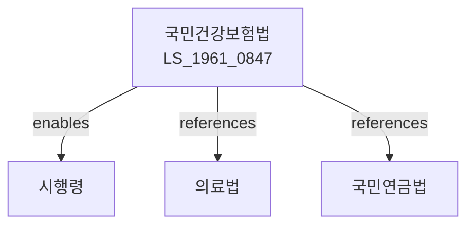

# 국민건강보험법

> [법률 제20102호, 2024. 1. 9., 일부개정]

---

---

## 제1장 총칙

### 제1조 (목적)

이 법은 국민의 질병ㆍ부상 등에 대하여 건강보험을 실시함으로써 국민의 건강을 증진하고 사회보장의 증진에 이바지함을 목적으로 한다。

### 제2조 (정의)

이 법에서 사용하는 용어의 뜻은 다음과 같다。

1. "건강보험"이란 질병ㆍ부상 등에 대하여 요양급여 등을 제공하는 보험을 말한다。
2. "가입자"란 건강보험에 가입한 자를 말한다。
3. "피부양자"란 가입자의 배우자, 직계존속, 직계비속 등을 말한다。
4. "요양급여"란 질병ㆍ부상 등에 대한 의료서비스를 말한다。

---

## 제2장 가입자

### 第5条 (가입대상)

건강보험의 가입대상은 다음 각 호와 같다。

1. 직장가입자: 사업장에 고용된 근로자
2. 지역가입자: 직장가입자 외의 자

### 第6条 (가입)

건강보험의 가입은 의무로 한다。

### 第7条 (피부양자)

가입자의 배우자, 직계존속, 직계비속 등은 피부양자로 등록할 수 있다。

### 第8条 (자격취득 및 상실)

가입자의 자격취득 및 상실은 대통령령으로 정한다。

---

## 제3장 보험료

### 第15条 (보험료)

가입자는 보험료를 납부하여야 한다。

### 第16条 (보험료율)

보험료율은 보수액의 100분의 7.09로 한다。

### 第17条 (보험료의 부과)

보험료는 월단위로 부과한다。

### 第18条 (납부)

보험료는 매월 납부하여야 한다。

### 第19条 (독촉)

보험료를 체납한 경우 독촉장을 발부한다。

---

## 제4장 요양급여

### 第25条 (요양급여의 종류)

요양급여의 종류는 다음 각 호와 같다。

1. 진찰
2. 약제ㆍ치료재료의 지급
3. 처치ㆍ수술
4. 예방접종
5. 입원
6. 그 밖에 대통령령으로 정하는 급여

### 第26条 (급여의 방법)

요양급여는 요양기관에서 행한다。

### 第27条 (본인부담)

요양급여를 받는 자는 일부를 본인이 부담하여야 한다。

### 第28条 (비급여)

요양급여 외의 의료서비스는 비급여로 한다。

---

## 제5장 건강검진

### 第35条 (건강검진)

건강보험공단은 가입자에 대하여 건강검진을 실시한다。

### 第36条 (검진의 종류)

건강검진의 종류는 다음 각 호와 같다。

1. 일반건강검진
2. 종합건강검진
3. 암검진
4. 그 밖에 대통령령으로 정하는 검진

### 第37条 (검진결과)

건강검진 결과를 가입자에게 통지하여야 한다。

---

## 제6장 국민건강보험공단

### 第45条 (설립)

건강보험사업을 운영하기 위하여 국민건강보험공단을 설립한다。

### 第46条 (업무)

국민건강보험공단은 다음 각 호의 업무를 수행한다。

1. 가입자의 관리
2. 보험료의 부과ㆍ징수
3. 요양급여의 관리
4. 건강검진의 실시
5. 그 밖에 건강보험사업에 필요한 업무

### 第47条 (조직)

국민건강보험공단은 이사장, 이사 및 감사로 구성한다。

---

## 제7장 건강보험심사평가원

### 第55条 (설립)

요양급여의 적정성을 심사하기 위하여 건강보험심사평가원을 설립한다。

### 第56条 (업무)

건강보험심사평가원은 다음 각 호의 업무를 수행한다。

1. 요양급여의 심사
2. 요양급여 비용의 심사
3. 의료기관의 평가
4. 그 밖에 건강보험 심사에 필요한 업무

---

## 제8장 재정

### 第65条 (재정)

건강보험의 재정은 보험료, 국고보조금 등으로 충당한다。

### 第66条 (재정운용계획)

건강보험공단은 재정운용계획을 수립하여야 한다。

### 第67条 (적립금)

건강보험의 적립금은 대통령령으로 정하는 바에 따라 관리한다。

---

## 제9장 감독

### 第75条 (감독)

보건복지부장관은 건강보험사업을 감독한다。

### 第76条 (보고 및 검사)

보건복지부장관은 필요한 경우 보고를 명하거나 검사할 수 있다。

### 第77条 (시정명령)

보건복지부장관은 이 법을 위반한 자에 대하여 시정명령을 할 수 있다。

---

## 제10장 벌칙

### 第85条 (벌칙)

다음 각 호의 어느 하나에 해당하는 자는 3년 이하의 징역 또는 3천만원 이하의 벌금에 처한다。

1. 허위로 보험급여를 받은 자
2. 요양기관으로서 허위로 청구한 자

### 第86条 (과태료)

다음 각 호의 어느 하나에 해당하는 자에게는 1천만원 이하의 과태료를 부과한다。

1. 보험료를 납부하지 아니한 자
2. 정당한 사유 없이 보고를 하지 아니한 자

---

## 관계 그래프

**상위 법령**
- [[헌법]] 제34조 (사회보장)
- [[사회보장기본법]]

**관련 법령**
- [[의료법]]
- [[국민연금법]]
- [[고용보험법]]
- [[산업재해보상보험법]]
- [[노인장기요양보험법]]

**하위 법령**
- [[국민건강보험법 시행령]]
