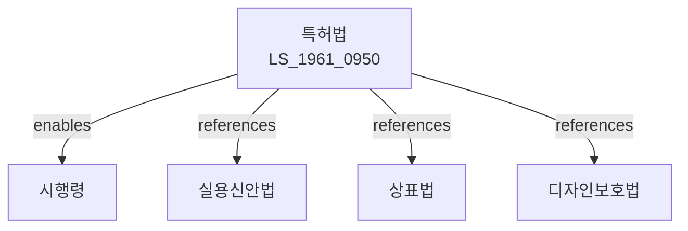

# 특허법

> [법률 제20096호, 2024. 1. 9., 일부개정]

---

---

## 제1장 총칙

### 제1조 (목적)

이 법은 발명을 보호ㆍ장려하고 그 이용을 도모함으로써 기술의 발전을 이루어 산업발전에 이바지함을 목적으로 한다.

### 제2조 (정의)

이 법에서 사용하는 용어의 뜻은 다음과 같다.

1. "발명"이란 자연법칙을 이용한 기술적 사상의 창작으로서 고도한 것을 말한다.
2. "특허발명"이란 특허를 받은 발명을 말한다.
3. "실시"란 발명을 실시한다는 것으로서 다음 각 목의 어느 하나에 해당하는 것을 말한다.
   가. 물건의 발명인 경우에는 그 물건의 생산ㆍ사용ㆍ양도ㆍ대여 또는 수입
   나. 방법의 발명인 경우에는 그 방법의 사용
   다. 방법의 발명 중 물건을 생산하는 방법의 발명인 경우에는 그 방법에 의하여 생산한 물건의 사용ㆍ양도ㆍ대여 또는 수입

### 제3조 (특허를 받을 수 있는 발명)

산업상 이용할 수 있는 발명으로서 다음 각 호의 어느 하나에 해당하지 아니하는 것은 특허를 받을 수 있다.

1. 특허출원 전에 국내에서 공지되었거나 실시된 발명
2. 특허출원 전에 국내 또는 국외에서 반포된 간행물에 기재된 발명

---

## 제2장 특허요건

### 제29조 (특허요건)

① 산업상 이용할 수 있는 발명으로서 다음 각 호의 어느 하나에 해당하지 아니하는 것은 그 발명에 대하여 특허를 받을 수 있다.

1. 특허출원 전에 국내에서 공지되었거나 실시된 발명
2. 특허출원 전에 국내 또는 국외에서 반포된 간행물에 기재된 발명

② 특허출원 전에 그 발명이 속하는 기술분야에서 통상의 지식을 가진 사람이 제1항 각 호의 어느 하나에 해당하는 발명에 의하여 쉽게 발명할 수 있는 것은 그 발명에 대하여 특허를 받을 수 없다。

### 제32조 (특허를 받을 수 없는 발명)

다음 각 호의 어느 하나에 해당하는 발명은 제29조의 규정에 불구하고 특허를 받을 수 없다.

1. 공공의 질서 또는 선량한 풍속을 문란하게 하거나 공중의 위생을 해할 염려가 있는 발명
2. 국가의 안전에 필요한 발명

---

## 제3장 특허출원

### 제35조 (특허를 받을 수 있는 권리)

① 발명을 한 자는 특허를 받을 수 있는 권리를 가진다。

② 특허를 받을 수 있는 권리는 이전할 수 있다。

### 제40조 (특허출원)

① 특허를 받으려는 자는 다음 각 호의 사항을 기재한 특허출원서를 특허청장에게 제출하여야 한다。

1. 특허출원인의 성명 및 주소
2. 발명의 명칭
3. 발명자의 성명 및 주소

② 특허출원서에는 명세서, 도면(필요한 경우) 및 요약서를 첨부하여야 한다。

### 제42조 (명세서)

① 명세서에는 다음 각 호의 사항을 기재하여야 한다。

1. 발명의 명칭
2. 발명의 설명
3. 특허청구범위
4. 도면의 간단한 설명(도면이 있는 경우)

② 발명의 설명에는 그 발명이 속하는 기술분야에서 통상의 지식을 가진 사람이 쉽게 실시할 수 있을 정도로 명확하고 상세하게 기재하여야 한다。

---

## 제4장 특허심사

### 제60조 (방식심사)

특허청장은 특허출원이 다음 각 호의 요건을 갖추었는지 심사한다。

1. 제40조에 따른 특허출원서의 기재사항을 갖출 것
2. 명세서 및 요약서를 첨부할 것
3. 특허료를 납부할 것

### 제62조 (특허거절결정)

특허청 심사관은 특허출원이 다음 각 호의 어느 하나에 해당하는 경우에는 특허거절결정을 하여야 한다。

1. 제29조에 따른 특허요건을 충족하지 아니한 경우
2. 제32조에 따라 특허를 받을 수 없는 발명인 경우
3. 명세서의 기재가 제42조에 따른 요건을 충족하지 아니한 경우

### 第63条 (특허결정)

특허청 심사관은 특허출원이 제62조에 따른 거절이유가 없는 경우에는 특허결정을 하여야 한다。

---

## 제5장 특허권

### 第66条 (특허권의 설정등록)

① 특허출원인은 특허결정등본을 송달받은 날부터 3개월 이내에 특허료를 납부하여야 한다。

② 특허청장은 제1항에 따라 특허료를 납부한 경우 특허권의 설정등록을 한다。

### 第66条의2 (특허권의 존속기간)

① 특허권의 존속기간은 특허출원일부터 20년으로 한다。

② 특허청장은 특허발명의 특허권자의 청구에 의하여 특허권의 존속기간을 연장등록할 수 있다。

### 第69条 (특허권의 효력)

① 특허권자는 업으로서 그 특허발명을 실시할 권리를 독점한다。

② 특허권자는 제1항의 권리를 타인에게 전용실시권 또는 통상실시권을 설정할 수 있다。

---

## 제6장 특허침해

### 第95条 (침해의 금지)

특허권자 또는 전용실시권자는 자기의 권리를 침해한 자 또는 침해할 우려가 있는 자에 대하여 그 침해의 금지 또는 예방을 청구할 수 있다。

### 第96条 (손해배상)

① 특허권자는 고의 또는 과실로 자기의 권리를 침해한 자에 대하여 그 침해로 인한 손해의 배상을 청구할 수 있다。

② 제1항에 따른 손해액은 침해자가 그 침해행위로 인하여 얻은 이익액으로 추정한다。

---

## 제7장 벌칙

### 第225条 (벌칙)

다음 각 호의 어느 하나에 해당하는 자는 7년 이하의 징역 또는 1억원 이하의 벌금에 처한다。

1. 특허권 또는 전용실시권을 침해한 자
2. 사위 행위로 특허를 받은 자

### 第226条 (과태료)

다음 각 호의 어느 하나에 해당하는 자에게는 1천만원 이하의 과태료를 부과한다。

1. 이 법에 따른 특허청장의 명령에 따르지 아니한 자
2. 이 법에 따른 조사를 거부 또는 방해한 자

---

## 관계 그래프

**상위 법령**
- [[헌법]] 제22조 (재산권)
- [[민법]] 제751조 (불법행위)

**관련 법령**
- [[실용신안법]]
- [[상표법]]
- [[디자인보호법]]
- [[부정경쟁방지 및 영업비밀보호에 관한 법률]]

**하위 법령**
- [[특허법 시행령]]
- [[특허법 시행규칙]]
