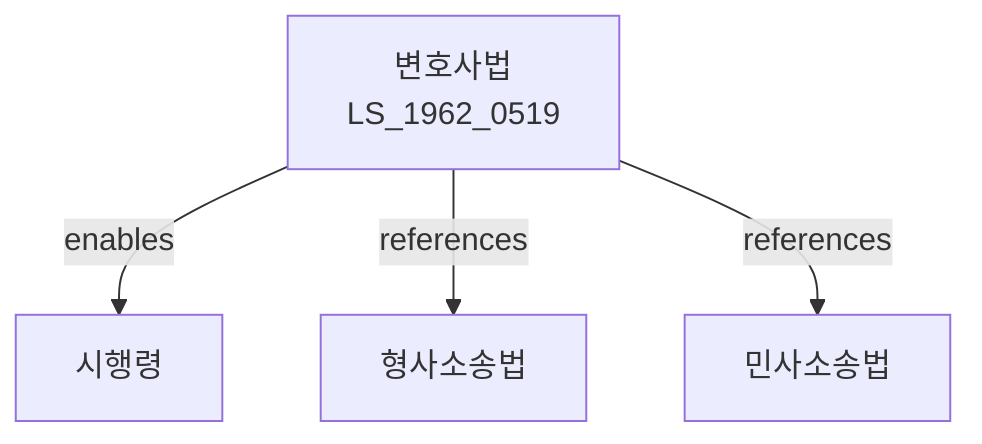

# 변호사법

> [법률 제20088호, 2024. 1. 9., 일부개정]

---

---

## 제1장 총칙

### 제1조 (목적)

이 법은 변호사의 자격, 직무 및 그 밖에 변호사에 관하여 필요한 사항을 정함으로써 국민의 법률생활의 향상과 법치주의의 실현에 이바지함을 목적으로 한다。

### 제2조 (정의)

이 법에서 사용하는 용어의 뜻은 다음과 같다。

1. "변호사"란 법률사건에 관하여 당사자의 의뢰를 받아 소송대리인 또는 대리인으로서 행위를 하거나 그 밖의 법률업무를 수행하는 자로서 이 법에 따라 등록한 자를 말한다。
2. "변호사회"란 변호사가 조직한 단체로서 대한변호사협회의 회원이 된 것을 말한다。
3. "대한변호사협회"란 전국적 규모의 변호사단체를 말한다。

### 제3조 (직무)

① 변호사는 당사자의 의뢰를 받아 다음 각 호의 업무를 수행한다。

1. 소송에 관한 사건
2. 비송사건
3. 등록ㆍ등기에 관한 사건
4. 법률상담 및 법률서류 작성
5. 그 밖에 법률에 관한 사항

② 변호사는 공정하게 직무를 수행하여야 한다。

---

## 제2장 변호사의 자격

### 제4조 (변호사의 자격)

다음 각 호의 어느 하나에 해당하는 자는 변호사가 될 자격이 있다。

1. 사법연수원의 과정을 마친 자
2. 변호사시험에 합격한 자
3. 판사, 검사 또는 군법무관으로서 5년 이상 재직한 자

### 제5조 (결격사유)

다음 각 호의 어느 하나에 해당하는 자는 변호사가 될 수 없다。

1. 대한민국 국민이 아닌 자
2. 금치산자 또는 한정치산자
3. 파산자로서 복권되지 아니한 자
4. 금고 이상의 실형을 선고받고 그 집행이 종료되거나 집행을 받지 아니하기로 확정된 후 3년이 지나지 아니한 자
5. 판사, 검사 또는 공무원으로서 형사사건에 관하여 직무상 의무를 위반하여 파면된 후 3년이 지나지 아니한 자

### 제6조 (변호사 등록)

① 변호사가 되려는 자는 대한변호사협회에 등록하여야 한다。

② 등록의 절차 및 방법 등에 관하여 필요한 사항은 대법원규칙으로 정한다。

---

## 제3장 권리와 의무

### 제10조 (비밀유지 의무)

① 변호사는 직무상 알게 된 비밀을 누설하여서는 아니 된다。

② 제1항의 의무는 변호사의 지위를 상실한 후에도 지속된다。

### 제11조 (성실의무)

변호사는 의뢰인의 권익을 위하여 성실히 직무를 수행하여야 한다。

### 제12조 (진실의무)

변호사는 법원ㆍ검찰 또는 상대방을 기만하는 행위를 하여서는 아니 된다。

### 제13조 (변호사-의뢰인 관계)

① 변호사는 의뢰인과의 사이에 정당한 계약을 체결하여야 한다。

② 변호사는 의뢰인으로부터 받은 금품 등을 직무와 관련되지 아니한 목적으로 사용하여서는 아니 된다。

---

## 제4장 변호사회

### 第30条 (변호사회의 설립)

① 변호사는 지역별로 변호사회를 설립할 수 있다。

② 변호사회는 법인으로 한다。

### 第31条 (대한변호사협회)

① 전국 변호사회를 대표하기 위하여 대한변호사협회를 둔다。

② 모든 변호사회는 대한변호사협회의 회원이 된다。

### 第32条 (변호사 징계)

① 대한변호사협회는 변호사의 비위행위에 대하여 징계를 할 수 있다。

② 징계의 종류는 다음 각 호와 같다。

1. 견책
2. 2년 이하의 업무정지
3. 변호사명부에서 삭제

---

## 제5장 벌칙

### 第100条 (벌칙)

다음 각 호의 어느 하나에 해당하는 자는 3년 이하의 징역 또는 3천만원 이하의 벌금에 처한다。

1. 변호사가 아닌 자가 변호사 명칭을 사용한 자
2. 변호사가 아닌 자가 법률사건을 처리한 자
3. 제10조에 따른 비밀유지 의무를 위반한 자

### 第101条 (과태료)

다음 각 호의 어느 하나에 해당하는 자에게는 1천만원 이하의 과태료를 부과한다。

1. 제6조에 따른 등록을 하지 아니하고 변호사 직무를 수행한 자
2. 대한변호사협회의 회칙을 위반한 변호사

---

## 관계 그래프

**상위 법령**
- [[헌법]] 제12조 (변호인의 조력을 받을 권리)
- [[형사소송법]]
- [[민사소송법]]

**관련 법령**
- [[법무사법]]
- [[변리사법]]
- [[공인중개사법]]
- [[법률구조사업법]]

**하위 법령**
- [[변호사법 시행령]]
