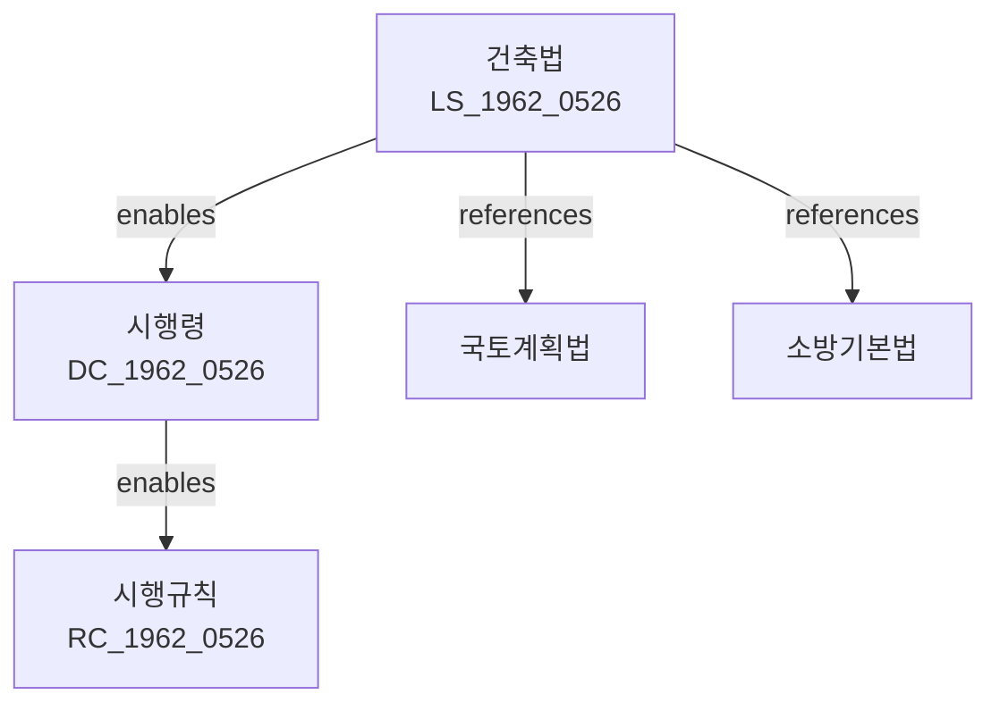

# 건축법

> [법률 제20207호, 2024. 2. 13., 일부개정]

---

---

## 제1장 총칙

### 제1조 (목적)

이 법은 건축물의 대지·구조·설비 및 용도에 관한 기준을 정하고, 건축물의 안전·기능 및 미관을 높여 공공복리의 증진에 이바지함을 목적으로 한다.

### 제2조 (정의)

이 법에서 사용하는 용어의 뜻은 다음과 같다.

1. "건축물"이란 토지에 정착하는 공작물 중 지붕과 기둥 또는 벽이 있는 것과 그 밖에 이에 준하는 시설물로서 대통령령으로 정하는 것을 말한다.
2. "대지"란 건축물이 있는 토지를 말한다.
3. "건축"이란 건축물을 신축·증축·개축·재축 또는 이전하는 것을 말한다.
4. "용도변경"이란 건축물의 용도를 변경하는 것으로서 대통령령으로 정하는 것을 말한다.

---

## 제2장 건축물의 대지

### 제11조 (대지의 안전)

① 건축물의 대지는 건축물의 안전에 지장이 없어야 한다.

② 대지가 다음 각 호의 어느 하나에 해당하는 경우에는 건축을 금지하거나 제한할 수 있다.

1. 붕괴 등의 우려가 있는 곳
2. 수해의 우려가 있는 곳
3. 그 밖에 안전에 지장이 있는 곳

### 제12조 (대지의 도로)

건축물의 대지는 도로에 접하여야 한다. 다만, 대통령령으로 정하는 경우에는 그러하지 아니하다.

---

## 제3장 건축물의 구조

### 제21조 (구조내력)

① 건축물은 자중, 적재하중, 적설하중, 풍압, 지진하중 그 밖의 진동 및 충격에 대하여 안전한 구조로 하여야 한다.

② 건축물의 구조내력 기준은 대통령령으로 정한다.

### 제22조 (내화구조)

① 다음 각 호의 건축물은 내화구조로 하여야 한다.

1. 3층 이상인 건축물
2. 연면적이 200제곱미터를 넘는 건축물
3. 그 밖에 화재 예방상 필요한 건축물로서 대통령령으로 정하는 것

② 내화구조의 기준은 대통령령으로 정한다.

### 제23조 (방화구조)

① 다음 각 호의 부분은 방화구조로 하여야 한다.

1. 방화벽
2. 계단
3. 그 밖에 화재 확산 방지를 위한 부분

---

## 제4장 건축물의 설비

### 第30条 (피난설비)

① 건축물에는 화재나 비상사태 시 피난에 필요한 설비를 설치하여야 한다.

② 피난설비의 종류 및 기준은 다음 각 호와 같다.

1. 피난계단
2. 특별피난계단
3. 비상조명
4. 유도등
5. 그 밖에 피난에 필요한 설비

### 第31条 (승강기)

① 6층 이상인 건축물에는 승강기를 설치하여야 한다.

② 승강기의 설치 기준은 대통령령으로 정한다。

---

## 第5章 건축허가 등

### 第33条 (건축허가)

① 건축물을 건축하려는 자는 시장·군수·구청장의 허가를 받아야 한다. 다만, 대통령령으로 정하는 경미한 사항은 신고로 갈음한다.

② 제1항에 따른 허가를 받으려면 다음 각 호의 서류를 제출하여야 한다.

1. 건축허가신청서
2. 대지권리증명서류
3. 설계도서
4. 그 밖에 대통령령으로 정하는 서류

### 第36条 (착공신고)

건축허가를 받은 자는 착공 전까지 착공신고를 하여야 한다.

---

## 第6章 監督

### 第60条 (감리)

① 다음 각 호의 건축물은 건축사가 감리하여야 한다.

1. 연면적 200제곱미터를 넘는 건축물
2. 4층 이상인 건축물
3. 그 밖에 구조상 안전 확보를 위하여 필요한 건축물

② 감리업무의 범위는 다음 각 호와 같다.

1. 공사 감독
2. 시공 과정 확인
3. 품질 관리
4. 안전 점검

---

## 第7章 罰則

### 第80条 (罰則)

다음 각 호의 어느 하나에 해당하는 자는 3년 이하의 징역 또는 3천만원 이하의 벌금에 처한다.

1. 허가 없이 건축한 자
2. 허위 기타 부정한 방법으로 허가를 받은 자
3. 감리 의무를 위반한 자

---

## 관계 그래프

**상위 법령**
- [[헌법]] 제23조 (재산권)

**관련 법령**
- [[국토계획및이용에관한법률]]
- [[소방기본법]]
- [[장애인·노인·임산부등의편의증진보장에관한법률]]

**하위 법령**
- [[건축법 시행령]]
- [[건축법 시행규칙]]
