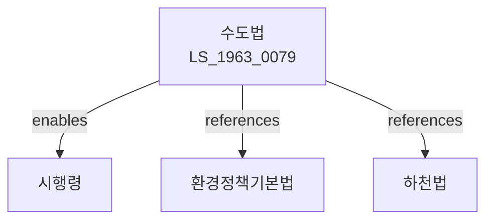

# 수도법

> [법률 제19630호, 2023. 12. 26., 일부개정]

---

---

## 제1장 총칙

### 제1조 (목적)

이 법은 수도사업의 적정한 운영과 수도의 관리를 통하여 양호하고 청결한 수돗물의 공급으로 국민보건 및 생활환경의 개선·향상에 기여함을 목적으로 한다。

### 제2조 (정의)

이 법에서 사용하는 용어의 뜻은 다음과 같다。

1. "수도"란 수도공작물을 말한다。
2. "수도공작물"란 일반공중의 수요에 공급하기 위하여 만드는 정수·송수 및 배수설비를 말한다。
3. "수돗물"란 수도공작물을 통하여 공급되는 물을 말한다。
4. "수도사업"란 일반공중의 수요에 따라 수돗물을 공급하는 사업을 말한다。

---

## 제2장 수도사업

### 제10조 (수도사업의 인가)

수도사업을 경영하려는 자는 관할 시장·군수 또는 구청장의 인가를 받아야 한다。

### 제11조 (수도요금)

수도사업자는 수돗물을 공급하는 데 소요되는 적정한 비용을 충당하는 범위에서 수도요금을 정할 수 있다。

---

## 제3장 수질기준

### 제35조 (수질검사)

수도사업자는 수돗물의 수질이 보건복지부령으로 정하는 수질기준에 적합한지 검사하여야 한다。

### 제36조 (수질공표)

수도사업자는 매년 수돗물의 수질검사 결과를 공표하여야 한다。

---

## 관계 그래프

**상위 법령**
- [[헌법]] 제35조 (생활환경)

**관련 법령**
- [[환경정책기본법]]
- [[수환경보전법]]
- [[먹는물관리법]]

**하위 법령**
- [[수도법 시행령]]
- [[수도법 시행규칙]]
