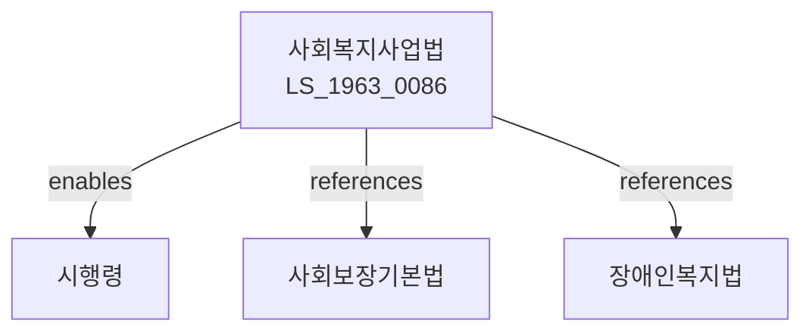

# 사회복지사업법

> [법률 제20095호, 2024. 1. 9., 일부개정]

---

---

## 제1장 총칙

### 제1조 (목적)

이 법은 사회복지사업의 효율적인 추진을 위하여 사회복지사업의 종류와 방법 및 그에 관한 기준 등을 정하고, 사회복지전문인력의 자격 및 지위 향상을 도모함으로써 국민의 복지증진에 이바지함을 목적으로 한다。

### 제2조 (정의)

이 법에서 사용하는 용어의 뜻은 다음과 같다。

1. "사회복지사업"이란 국가ㆍ지방자치단체 또는 민간부문의 자원을 동원하여 수행하는 제반 사회복지활동을 말한다。
2. "사회복지서비스"란 생활이 어려운 자에게 생활지도, 상담, 요보호사항의 발견 등을 통하여 자립을 지원하는 것을 말한다。
3. "사회복지시설"이란 사회복지사업을 수행하기 위한 시설을 말한다。
4. "사회복지사"란 사회복지사업에 관한 전문지식과 기술을 가진 자로서 제11조에 따른 자격을 가진 자를 말한다。

---

## 제2장 사회복지사업의 종류

### 第5条 (사회복지사업의 범위)

사회복지사업은 다음 각 호와 같다。

1. 생활보호사업
2. 아동복지사업
3. 노인복지사업
4. 장애인복지사업
5. 모자복지사업
6. 정신건강증진사업
7. 그 밖에 대통령령으로 정하는 사업

### 第6条 (사회복지서비스의 제공)

국가 및 지방자치단체는 사회복지서비스를 필요로 하는 자에게 적절한 서비스를 제공하여야 한다。

---

## 제3장 사회복지시설

### 第10条 (사회복지시설의 설치)

① 사회복지시설을 설치ㆍ운영하려는 자는 보건복지부장관, 시장ㆍ군수 또는 구청장의 허가를 받아야 한다。

② 허가의 기준 및 절차 등에 관하여 필요한 사항은 대통령령으로 정한다。

### 第11条 (시설의 운영)

사회복지시설의 장은 시설의 종류별로 대통령령으로 정하는 기준에 따라 시설을 운영하여야 한다。

---

## 제4장 사회복지전문인력

### 第20条 (사회복지사 자격)

① 사회복지사가 되려는 자는 보건복지부장관이 실시하는 시험에 합격하거나 제21조에 따른 교육을 이수하여야 한다。

② 사회복지사는 1급과 2급으로 구분한다。

### 第21条 (사회복지사 교육)

① 사회복지사 자격을 취득하려는 자는 보건복지부장관이 지정하는 교육기관에서 교육을 이수하여야 한다。

② 교육의 과정 및 방법 등에 관하여 필요한 사항은 보건복지부령으로 정한다。

### 第22条 (사회복지사의 직무)

사회복지사는 다음 각 호의 직무를 수행한다。

1. 심리사회적 문제의 상담 및 지도
2. 사회복지서비스의 제공 및 관리
3. 지역사회자원의 개발 및 활용
4. 그 밖에 사회복지사업에 필요한 사항

---

## 제5장 재정

### 第30条 (국가의 보조)

국가는 사회복지사업의 추진을 위하여 지방자치단체 또는 사회복지시설에 보조금을 교부할 수 있다。

### 第31条 (지방자치단체의 부담)

지방자치단체는 관할 구역 안의 사회복지사업에 소요되는 비용을 부담한다。

---

## 제6장 감독

### 第40条 (감독)

① 보건복지부장관 및 시장ㆍ군수 또는 구청장은 사회복지시설을 감독한다。

② 감독의 방법 및 절차 등에 관하여 필요한 사항은 대통령령으로 정한다。

### 第41条 (보고 및 검사)

보건복지부장관 또는 시장ㆍ군수나 구청장은 필요한 경우 사회복지시설의 장에게 보고를 명하거나 검사할 수 있다。

---

## 제7장 벌칙

### 第50条 (벌칙)

다음 각 호의 어느 하나에 해당하는 자는 3년 이하의 징역 또는 3천만원 이하의 벌금에 처한다。

1. 제10조에 따른 허가 없이 사회복지시설을 설치한 자
2. 허위로 허가를 받은 자

### 第51条 (과태료)

다음 각 호의 어느 하나에 해당하는 자에게는 1천만원 이하의 과태료를 부과한다。

1. 정당한 사유 없이 보고를 하지 아니한 자
2. 정당한 사유 없이 검사를 거부한 자

---

## 관계 그래프

**상위 법령**
- [[헌법]] 제34조 (사회보장)
- [[사회보장기본법]]

**관련 법령**
- [[장애인복지법]]
- [[노인복지법]]
- [[아동복지법]]
- [[모자복지법]]

**하위 법령**
- [[사회복지사업법 시행령]]
