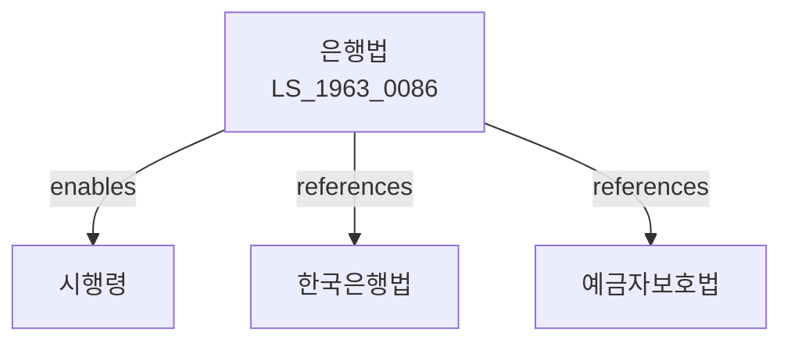

# 은행법

> [법률 제20087호, 2024. 1. 9., 일부개정]

---

---

## 제1장 총칙

### 제1조 (목적)

이 법은 금융기관으로서의 은행업무를 건전하게 운영하게 하고 국가의 경제정책을 원활하게 수행하게 함으로써 국민경제의 균형있는 발전에 이바지함을 목적으로 한다。

### 제2조 (정의)

이 법에서 사용하는 용어의 뜻은 다음과 같다。

1. "은행"이란 금융기관으로서 예금을 받고 자금을 대출하는 업무를 영위하는 주식회사를 말한다。
2. "예금"이란 은행이 불특정 다수로부터 받은 예탁금을 말한다。
3. "대출"이란 은행이 자금을 공여하는 것을 말한다。
4. "자기자본"이란 은행의 자본금, 자본준비금 및 이익준비금 등을 합한 금액을 말한다。

---

## 제2장 은행의 설립

### 第8条 (은행의 설립인가)

① 은행을 설립하려는 자는 금융위원회의 인가를 받아야 한다。

② 제1항에 따른 인가를 받으려면 다음 각 호의 요건을 갖추어야 한다。

1. 자본금이 1,000억원 이상일 것
2. 경영능력이 있는 발기인이 있을 것
3. 건전한 경영을 위한 인력 및 시설을 갖출 것
4. 기타 대통령령으로 정하는 요건

### 第9条 (결격사유)

다음 각 호의 어느 하나에 해당하는 자는 은행의 주주가 될 수 없다。

1. 금치산자 또는 한정치산자
2. 파산자로서 복권되지 아니한 자
3. 이 법 또는 다른 금융관계법률을 위반하여 형을 선고받고 그 집행이 종료된 후 5년이 지나지 아니한 자

### 第10条 (영업신고)

은행은 설립인가를 받은 후 영업을 개시하기 전에 금융위원회에 영업신고를 하여야 한다。

---

## 제3장 은행의 업무

### 第20条 (업무범위)

은행은 다음 각 호의 업무를 영위한다。

1. 예금ㆍ적금의 수입
2. 대출 및 어음할인
3. 어음교환 및 대체결제
4. 환업무
5. 증권업무(인가를 받은 경우)
6. 외국환업무(인가를 받은 경우)
7. 그 밖에 금융위원회가 정하는 업무

### 第21条 (수신업무)

① 은행은 요구불예금, 정기예금, 적금 등의 수신업무를 할 수 있다。

② 예금이자율은 은행이 자율적으로 정한다。

### 第22条 (여신업무)

① 은행은 대출, 어음할인, 지급보증 등의 여신업무를 할 수 있다。

② 은행은 대출심사를 통하여 신용도가 낮은 차주에 대하여는 대출을 제한할 수 있다。

### 第23条 (여신한도)

은행은 차주 1인에 대하여 자기자본의 일정비율을 초과하여 여신을 제공할 수 없다。여신한도의 비율은 대통령령으로 정한다。

---

## 제4장 건전성 규제

### 第30条 (자기자본적정성)

① 은행은 건전한 경영을 위하여 자기자본비율을 일정수준 이상으로 유지하여야 한다。

② 자기자본비율의 기준 및 산출방법은 금융위원회가 정한다。

### 第31条 (유동성 적정성)

은행은 단기 지급능력을 유지하기 위하여 유동성 비율을 일정수준 이상으로 유지하여야 한다。

### 第32条 (대손충당금)

은행은 대출채권의 회수불능에 대비하여 대손충당금을 적립하여야 한다。

### 第33条 (내부통제)

① 은행은 건전하고 효율적인 업무수행을 위하여 내부통제체계를 구축하여야 한다。

② 내부통제체계의 구축 및 운영에 관한 기준은 금융위원회가 정한다。

---

## 제5장 감독

### 第40条 (보고 및 검사)

① 금융위원회는 필요한 경우 은행에 대하여 보고를 하게 하거나 검사를 할 수 있다。

② 은행은 제1항에 따른 보고 또는 검사에 협조하여야 한다。

### 第41条 (시정명령)

금융위원회는 은행이 이 법 또는 다른 법령을 위반한 경우 시정명령을 할 수 있다。

### 第42条 (영업정지 등)

금융위원회는 은행이 다음 각 호의 어느 하나에 해당하는 경우 6개월 이내의 영업정지 또는 인가취소를 할 수 있다。

1. 허위 기타 부정한 방법으로 인가를 받은 경우
2. 영업정지기간 중 영업을 한 경우
3. 인가취소 사유에 해당하는 경우

---

## 제6장 예금자보호

### 第50条 (예금자보호)

예금자보호에 관한 사항은 「예금자보호법」이 정하는 바에 따른다。

---

## 제7장 벌칙

### 第60条 (벌칙)

다음 각 호의 어느 하나에 해당하는 자는 3년 이하의 징역 또는 3천만원 이하의 벌금에 처한다。

1. 제8조에 따른 인가 없이 은행업을 영위한 자
2. 허위 기타 부정한 방법으로 인가를 받은 자

### 第61条 (과태료)

다음 각 호의 어느 하나에 해당하는 자에게는 2천만원 이하의 과태료를 부과한다。

1. 제40조에 따른 보고를 하지 아니하거나 허위로 보고한 자
2. 제40조에 따른 검사를 거부 또는 방해한 자

---

## 관계 그래프

**상위 법령**
- [[헌법]] 제119조 (경제질서)
- [[한국은행법]]

**관련 법령**
- [[예금자보호법]]
- [[은행감독규정]]
- [[자본시장법]]
- [[보험업법]]
- [[여신전문금융업법]]

**하위 법령**
- [[은행법 시행령]]
