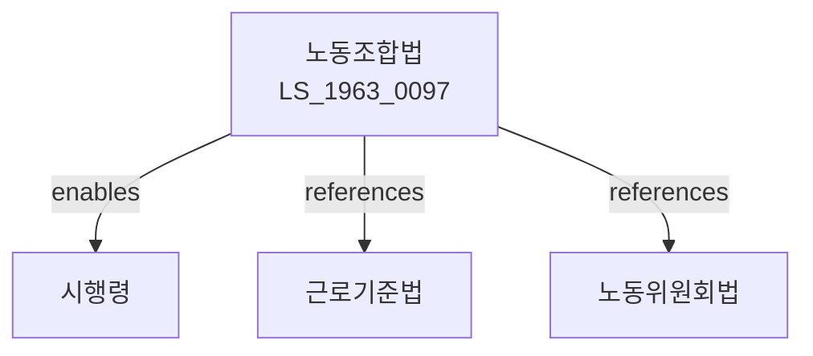

# 노동조합 및 노동관계조정법

> [법률 제20090호, 2024. 1. 9., 일부개정]

---

---

## 제1장 총칙

### 제1조 (목적)

이 법은 헌법에 의한 근로자의 단결권ㆍ단체교섭권 및 단체행동권을 보장하기 위하여 노동조합의 조직과 운영에 관한 사항을 정하고, 노동관계를 공정하게 조정하여 산업평화의 유지와 국민경제의 발전에 이바지함을 목적으로 한다。

### 제2조 (정의)

이 법에서 사용하는 용어의 뜻은 다음과 같다。

1. "근로자"란 직업의 종류를 불문하고 임금ㆍ급료 기타 어떠한 명칭으로든지 받는 보수를 목적으로 사업 또는 사업장에 근로를 제공하는 자를 말한다。
2. "사용자"란 사업주 또는 사업의 경영에 관한 사항에 대하여 사업주를 위하여 행위하는 자를 말한다。
3. "노동조합"이란 근로자가 주체가 되어 자주적으로 단결하여 임금ㆍ근로조건의 유지ㆍ개선 기타 근로자의 경제적ㆍ사회적 지위의 향상을 도모함을 목적으로 조직하는 단체 또는 그 연합단체를 말한다。
4. "단체교섭"이란 노동조합과 사용자가 임금ㆍ근로조건 등에 관하여 교섭하는 것을 말한다。
5. "쟁의행위"이란 파업, 태업, 직장폐쇄 기타 노동관계 당사자가 그 주장을 관철하기 위하여 행하는 행위와 이에 대항하는 행위를 말한다。

---

## 제2장 노동조합

### 第4条 (노동조합의 설립)

① 노동조합을 설립하려면 근로자 2명 이상의 발기인이 정관을 작성하고 근로자 과반수의 찬성을 얻어야 한다。

② 제1항에 따라 설립된 노동조합은 행정관청에 신고함으로써 법인격을 취득한다。

### 第5条 (노동조합의 자주성)

① 노동조합의 조직과 운영은 근로자가 주체가 되어 자주적으로 행한다。

② 사용자는 노동조합의 설립 또는 운영에 관여하거나 지배하는 행위를 하여서는 아니 된다(노조전임자 급여 지원 등).

### 第6条 (노동조합의 정관)

노동조합의 정관에는 다음 각 호의 사항을 기재하여야 한다。

1. 명칭 및 주소
2. 목적 및 사업
3. 조합원의 자격에 관한 사항
4. 조합비에 관한 사항
5. 임원에 관한 사항
6. 회의에 관한 사항
7. 기금 및 회계에 관한 사항

---

## 제3장 단체교섭

### 第10条 (교섭의 의무)

사용자는 노동조합의 단체교섭 요청에 성실하게 응하여야 한다。

### 第11条 (교섭사항)

단체교섭의 대상은 다음 각 호와 같다。

1. 임금 및 그 지급방법
2. 근로시간, 휴게, 휴일 및 휴가
3. 복리후생
4. 안전보건
5. 해고 및 징계
6. 그 밖에 근로자의 처우에 관한 사항

### 第12条 (단체협약)

① 노동조합과 사용자는 단체교섭의 결과를 문서로 작성하여 서명ㆍ날인하여야 한다。

② 제1항에 따른 문서를 단체협약이라 한다。

③ 단체협약의 유효기간은 2년을 초과할 수 없다。

---

## 제4장 쟁의조정

### 第20条 (노동쟁의)

노동쟁의란 노동관계 당사자 사이에 임금ㆍ근로조건 등에 관한 주장의 불일치로 인하여 발생하는 분쟁상태를 말한다。

### 第21条 (쟁의행위)

① 노동조합은 쟁의행위를 할 수 있다。

② 쟁의행위는 평화적 방법으로 하여야 한다。

③ 쟁의행위기간 중의 근로관계에 관하여는 단체협약 또는 취업규칙에 특별한 규정이 없으면 노동조합과 사용자가 대등한 입장에서 협의하여 정한다。

### 第22条 (쟁의행위의 제한)

① 쟁의행위는 공익사업과 방위산업에 있어서는 이를 제한할 수 있다。

② 쟁의행위는 폭력ㆍ파괴행위 기타 공안을 해하는 행위가 되어서는 아니 된다。

---

## 제5장 노동위원회

### 第30条 (노동위원회의 설치)

① 노동쟁의를 조정하기 위하여 중앙노동위원회 및 지방노동위원회를 둔다。

② 노동위원회는 근로자위원, 사용자위원 및 공익위원 각 동수로 구성한다。

### 第31条 (조정)

① 노동위원회는 노동쟁의가 발생한 경우 당사자의 신청에 의하여 조정에 착수한다.

② 조정이 성립한 경우 당사자는 이를 준수하여야 한다.

---

## 제6장 벌칙

### 第80条 (벌칙)

다음 각 호의 어느 하나에 해당하는 자는 5년 이하의 징역 또는 5천만원 이하의 벌금에 처한다.

1. 제5조 제2항에 따른 노동조합에 대한 지배ㆍ개입 행위를 한 사용자
2. 단체교섭을 정당한 사유 없이 거부한 사용자

### 第81条 (과태료)

다음 각 호의 어느 하나에 해당하는 자에게는 1천만원 이하의 과태료를 부과한다.

1. 단체협약의 신고를 하지 아니한 자
2. 노동위원회의 조정에 불응한 자

---

## 관계 그래프

**상위 법령**
- [[헌법]] 제33조 (단결권ㆍ단체교섭권ㆍ단체행동권)
- [[근로기준법]]

**관련 법령**
- [[노동위원회법]]
- [[근로자참여법]]
- [[산업안전보건법]]
- [[최저임금법]]

**하위 법령**
- [[노동조합법 시행령]]
