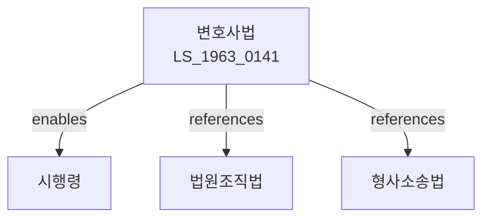

# 변호사법

> [법률 제20096호, 2024. 1. 9., 일부개정]

---

---

## 제1장 총칙

### 제1조 (목적)

이 법은 변호사의 자격ㆍ직무 및 그 직무에 관한 사항을 규정함으로써 변호사의 직분과 사명을 명확히 하고 변호사의 적정한 육성과 지위 향상을 도모하여 국민의 인권옹호와 법률생활의 향상에 이바지함을 목적으로 한다。

### 제2조 (정의)

이 법에서 사용하는 용어의 뜻은 다음과 같다。

1. "변호사"란 법률사건에 관하여 타인의 위임 또는 국가기관 등의 지정에 따라 소송대리인ㆍ대리인 또는 변호인이 되어 직무를 수행하는 자를 말한다。
2. "법률사건"이란 재판ㆍ수사ㆍ조정ㆍ중재 기타 법률문제에 관한 사건을 말한다。
3. "법무법인"이란 변호사가 상호 협동하여 직무를 수행하기 위하여 설립한 법인을 말한다。

---

## 제2장 변호사의 자격

### 第4条 (변호사의 자격)

① 변호사가 되려는 자는 사법시험에 합격하고 사법연수원에서 소정의 과정을 마친 자로서 법무부장관의 면허를 받아야 한다。

② 변호사의 면허에 관하여 필요한 사항은 대통령령으로 정한다。

### 第5条 (결격사유)

다음 각 호의 어느 하나에 해당하는 자는 변호사가 될 수 없다。

1. 금치산자 또는 한정치산자
2. 파산자로서 복권되지 아니한 자
3. 금고 이상의 형을 선고받고 그 집행이 종료되지 아니한 자
4. 이 법에 따라 면허가 취소된 후 3년이 지나지 아니한 자

---

## 제3장 변호사의 직무

### 第10条 (직무의 범위)

① 변호사는 타인의 위임 또는 법원ㆍ수사기관의 지정에 따라 법률사건에 관하여 소송대리인ㆍ대리인 또는 변호인이 되어 직무를 수행한다。

② 변호사는 법률에 특별한 규정이 있는 경우를 제외하고는 법원의 허가를 받아 소송기록을 열람하거나 등사할 수 있다。

### 第11条 (직무의 의무)

변호사는 정직하고 성실하게 직무를 수행하여야 하며 직무상 알게 된 비밀을 누설하여서는 아니 된다。

### 第12条 (직무의 독립)

변호사는 직무를 수행함에 있어 어떠한 부당한 간섭이나 지배를 받지 아니한다。

---

## 제4장 변호사의 권리와 의무

### 第20条 (비밀유지의무)

변호사는 직무상 알게 된 비밀을 누설하여서는 아니 된다。 다만, 본인의 동의가 있거나 정당한 사유가 있는 경우에는 그러하지 아니하다。

### 第21条 (선량한 풍속 유지의무)

변호사는 직무의 내외를 불문하고 품위를 손상하는 행위를 하여서는 아니 된다。

### 第22条 (광고의 제한)

변호사는 직무에 관하여 허위 또는 과장된 광고를 하여서는 아니 된다。

### 第23条 (사건수임의 제한)

변호사는 다음 각 호의 어느 하나에 해당하는 사건을 수임하여서는 아니 된다。

1. 자기 또는 배우자가 이해관계가 있는 사건
2. 자기가 직무상 관여한 사건
3. 그 밖에 공정한 직무수행에 지장을 초래할 우려가 있는 사건

---

## 제5장 법무법인

### 第30条 (법무법인의 설립)

① 변호사는 법무법인을 설립할 수 있다。

② 법무법인은 2인 이상의 변호사가 공동으로 설립한다。

③ 법무법인의 설립에 관하여 필요한 사항은 대통령령으로 정한다。

### 第31条 (등록)

법무법인은 주된 사무소의 소재지에서 등록하여야 한다。

### 第32条 (업무)

법무법인은 변호사의 직무를 영위한다。

---

## 제6장 대한변호사협회

### 第40条 (설립)

변호사는 대한변호사협회를 설립한다。

### 第41条 (업무)

대한변호사협회는 다음 각 호의 업무를 수행한다。

1. 변호사의 품위유지 및 직무향상에 관한 사항
2. 변호사의 연수에 관한 사항
3. 변호사 윤리강령의 제정 및 준수에 관한 사항
4. 그 밖에 법률로 정하는 사항

---

## 제7장 징계

### 第50条 (징계사유)

변호사가 다음 각 호의 어느 하나에 해당하는 때에는 징계한다。

1. 이 법 또는 다른 법률에 위반한 때
2. 변호사 윤리강령에 위반한 때
3. 직무를 게을리한 때
4. 품위에 어긋나는 행위를 한 때

### 第51条 (징계의 종류)

징계는 다음 각 호와 같다。

1. 견책
2. 직무정지: 2년 이내
3. 면허취소

---

## 제8장 벌칙

### 第80条 (벌칙)

다음 각 호의 어느 하나에 해당하는 자는 3년 이하의 징역 또는 3천만원 이하의 벌금에 처한다。

1. 면허 없이 변호사 직무를 수행한 자
2. 변호사의 자격을 사칭한 자

### 第81条 (과태료)

다음 각 호의 어느 하나에 해당하는 자에게는 2천만원 이하의 과태료를 부과한다。

1. 제22조에 따른 광고규정을 위반한 변호사
2. 정당한 사유 없이 보고를 하지 아니한 자

---

## 관계 그래프

**상위 법령**
- [[헌법]] 제27조 (변호인의 조력을 받을 권리)
- [[법원조직법]]

**관련 법령**
- [[형사소송법]]
- [[민사소송법]]
- [[행정소송법]]
- [[공증인법]]

**하위 법령**
- [[변호사법 시행령]]
