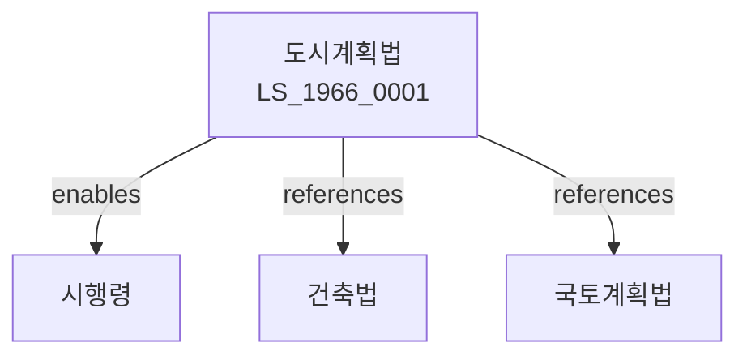

# 도시계획법

> [법률 제20089호, 2024. 1. 9., 일부개정]

---

---

## 제1장 총칙

### 제1조 (목적)

이 법은 도시의 계획적인 개발과 정비를 통하여 도시의 건전한 발전을 도모함으로써 공공복리의 증진에 이바지함을 목적으로 한다.

### 제2조 (정의)

이 법에서 사용하는 용어의 뜻은 다음과 같다.

1. "도시계획"이란 도시의 개발과 정비에 관한 종합계획을 말한다.
2. "도시계획구역"이란 도시계획을 실시하는 구역을 말한다.
3. "지구단위계획"이란 도시계획구역의 일부에 대한 상세계획을 말한다.
4. "용도지역"이란 토지의 이용을 제한하기 위하여 지정하는 지역을 말한다.

---

## 제2장 도시계획의 수립

### 第5条 (도시기본계획)

국토교통부장관은 도시기본계획을 수립한다.

### 第6条 (도시관리계획)

시장ㆍ군수는 도시관리계획을 수립한다.

### 第7条 (주민의견 수렴)

도시계획 수립 시 주민의견을 수렴하여야 한다.

### 第8条 (도시계획의 결정)

도시계획은 국토교통부장관이 결정한다.

---

## 제3장 용도지역

### 第15条 (용도지역의 지정)

용도지역은 다음 각 호와 같다.

1. 주거지역
2. 상업지역
3. 공업지역
4. 녹지지역

### 第16条 (주거지역)

주거지역은 거주의 안녕과 주거환경의 보호를 위한 지역이다.

### 第17条 (상업지역)

상업지역은 상업 및 업무기능의 증진을 위한 지역이다.

### 第18条 (공업지역)

공업지역은 공업의 편익 증진을 위한 지역이다.

### 第19条 (녹지지역)

녹지지역은 자연환경과 녹지공간의 보호를 위한 지역이다.

---

## 제4장 지구단위계획

### 第25条 (지구단위계획의 수립)

지구단위계획은 도시계획구역의 일부에 대하여 수립한다.

### 第26条 (지구단위계획의 내용)

지구단위계획의 내용은 다음 각 호와 같다.

1. 토지이용계획
2. 건축물계획
3. 보도계획
4. 공원계획

### 第27条 (지구단위계획구역)

지구단위계획구역을 지정한다.

### 第28条 (계획관리권역)

지구단위계획의 관리를 위한 권역을 정한다.

---

## 제5장 도시계획시설

### 第35条 (도시계획시설)

도시계획시설은 다음 각 호와 같다.

1. 도로
2. 주차장
3. 공원
4. 녹지
5. 광장
6. 하천

### 第36条 (도시계획시설의 설치)

도시계획시설을 설치ㆍ관리한다.

### 第37条 (도시계획시설사업)

도시계획시설사업을 시행한다.

### 第38条 (비용부담)

도시계획시설사업의 비용은 국가와 지방자치단체가 부담한다.

---

## 제6장 개발행위

### 第45条 (개발행위허가)

개발행위를 하려는 자는 시장ㆍ군수의 허가를 받아야 한다.

### 第46条 (개발행허가의 범위)

개발행위허가의 범위는 대통령령으로 정한다.

### 第47条 (개발행위허가의 기준)

개발행위허가의 기준은 대통령령으로 정한다.

### 第48条 (개발부담금)

개발행위로 인하여 이익을 얻은 자는 개발부담금을 납부한다.

---

## 제7장 감독

### 第55条 (감독)

국토교통부장관은 도시계획을 감독한다.

### 第56条 (보고 및 검사)

국토교통부장관은 필요한 경우 보고를 명하거나 검사할 수 있다.

### 第57条 (시정명령)

국토교통부장관은 이 법을 위반한 자에 대하여 시정명령을 할 수 있다.

### 第58条 (과태료)

다음 각 호의 어느 하나에 해당하는 자에게는 1천만원 이하의 과태료를 부과한다.

1. 허가 없이 개발행위를 한 자
2. 정당한 사유 없이 보고를 하지 아니한 자

---

## 제8장 벌칙

### 第65条 (벌칙)

다음 각 호의 어느 하나에 해당하는 자는 3년 이하의 징역 또는 3천만원 이하의 벌금에 처한다.

1. 허가 없이 개발행위를 한 자
2. 허위로 허가를 받은 자

### 第66条 (과태료)

다음 각 호의 어느 하나에 해당하는 자에게는 1천만원 이하의 과태료를 부과한다.

1. 정당한 사유 없이 보고를 하지 아니한 자
2. 시정명령을 위반한 자

---

## 관계 그래프

**상위 법령**
- [[헌법]] 제35조 (주거권)
- [[국토기본법]]

**관련 법령**
- [[건축법]]
- [[국토계획법]]
- [[주택법]]
- [[도로교통법]]

**하위 법령**
- [[도시계획법 시행령]]
