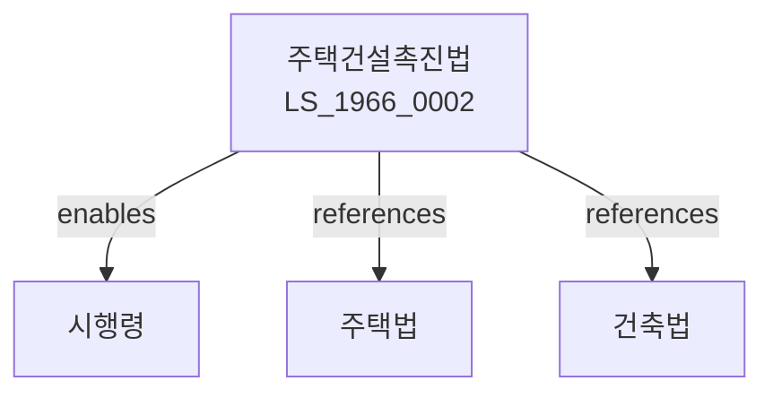

# 주택건설촉진법

> [법률 제20090호, 2024. 1. 9., 일부개정]

---

---

## 제1장 총칙

### 제1조 (목적)

이 법은 주택건설을 촉진하여 주택의 원활한 공급과 주거생활의 안정을 도모함으로써 국민생활의 향상과 공공복리의 증진에 이바지함을 목적으로 한다.

### 제2조 (정의)

이 법에서 사용하는 용어의 뜻은 다음과 같다.

1. "주택"이란 거주용 건축물을 말한다.
2. "주택건설사업"이란 주택을 건설하는 사업을 말한다.
3. "주택조합"이란 주택을 건설하기 위하여 조직된 조합을 말한다.
4. "국민주택"이란 국가의 지원을 받아 공급하는 주택을 말한다.

---

## 제2장 주택건설종합계획

### 第5条 (주택건설종합계획)

국토교통부장관은 주택건설종합계획을 수립한다.

### 第6条 (주택수급계획)

시장ㆍ군수는 관할구역의 주택수급계획을 수립한다.

### 第7条 (연차계획)

주택건설종합계획에 따라 연차계획을 수립한다.

### 第8条 (통계)

주택에 관한 통계를 작성한다.

---

## 제3장 주택건설사업

### 第15条 (주택건설사업의 등록)

주택건설사업을 하려는 자는 국토교통부장관에게 등록하여야 한다.

### 第16条 (등록요건)

등록요건은 다음 각 호와 같다.

1. 자본금의 확보
2. 기술인력의 보유
3. 시설의 확보

### 第17条 (등록결격사유)

다음 각 호의 어느 하나에 해당하는 자는 등록할 수 없다.

1. 금치산자 또는 한정치산자
2. 파산자로서 복권되지 아니한 자
3. 이 법을 위반하여 등록취소 후 2년이 지나지 아니한 자

### 第18条 (등록의 유효기간)

등록의 유효기간은 대통령령으로 정한다.

---

## 제4장 국민주택

### 第25条 (국민주택의 건설)

국가는 국민주택을 건설한다.

### 第26条 (국민주택기금)

국민주택 건설을 위하여 기금을 조성한다.

### 第27条 (국민주택의 공급)

국민주택은 무주택자에게 우선 공급한다.

### 第28条 (국민주택의 가격)

국민주택의 가격은 공시가격을 기준으로 한다.

---

## 제5장 주택조합

### 第35条 (주택조합의 설립)

주택조합을 설립할 수 있다.

### 第36条 (주택조합의 요건)

주택조합 설립요건은 대통령령으로 정한다.

### 第37条 (주택조합의 관리)

주택조합은 조합원을 대표하여 주택건설사업을 추진한다.

### 第38条 (주택조합의 해산)

주택조합은 사업완료 후 해산한다.

---

## 제6장 주택관리

### 第45条 (주택관리)

공동주택은 관리하여야 한다.

### 第46条 (관리주체)

공동주택의 관리주체를 정한다.

### 第47条 (관리규약)

공동주택의 관리규약을 정한다.

### 第48条 (관리비)

관리비를 징수한다.

---

## 제7장 감독

### 第55条 (감독)

국토교통부장관은 주택건설사업을 감독한다.

### 第56条 (보고 및 검사)

국토교통부장관은 필요한 경우 보고를 명하거나 검사할 수 있다.

### 第57条 (영업정지)

국토교통부장관은 이 법을 위반한 자에 대하여 영업정지를 명할 수 있다.

### 第58条 (등록취소)

국토교통부장관은 중대한 위반사유가 있는 경우 등록을 취소할 수 있다.

---

## 제8장 벌칙

### 第65条 (벌칙)

다음 각 호의 어느 하나에 해당하는 자는 3년 이하의 징역 또는 3천만원 이하의 벌금에 처한다.

1. 등록 없이 주택건설사업을 한 자
2. 허위로 등록한 자

### 第66条 (과태료)

다음 각 호의 어느 하나에 해당하는 자에게는 1천만원 이하의 과태료를 부과한다.

1. 정당한 사유 없이 보고를 하지 아니한 자
2. 관리규약을 위반한 자

---

## 관계 그래프

**상위 법령**
- [[헌법]] 제35조 (주거권)
- [[주택법]]

**관련 법령**
- [[건축법]]
- [[도시계획법]]
- [[임대주택법]]
- [[주택임대차보호법]]

**하위 법령**
- [[주택건설촉진법 시행령]]
