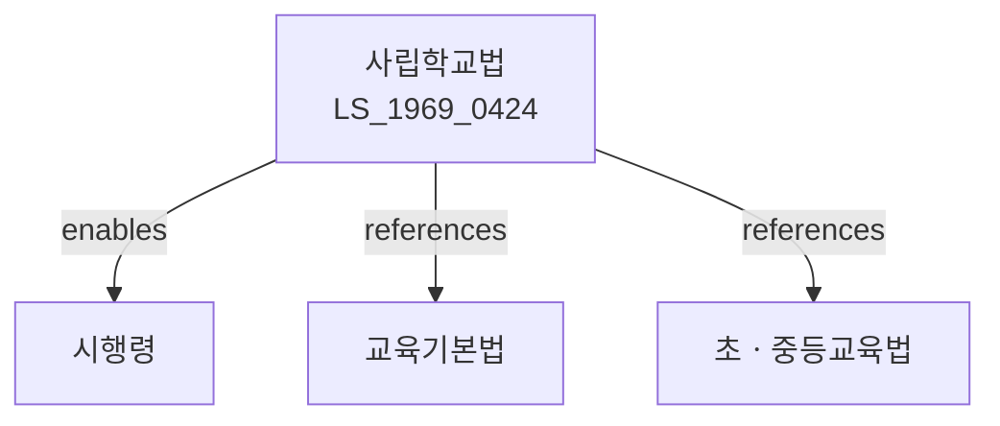

# 사립학교법

> [법률 제20083호, 2024. 1. 9., 일부개정]

---

---

## 제1장 총칙

### 제1조 (목적)

이 법은 사립학교의 자주성과 특수성을 존중하면서 국가의 일반적인 교육제도와 조화를 이루게 함으로써 건전한 사립학교의 육성과 국민교육의 건전한 발전에 이바지함을 목적으로 한다.

### 제2조 (정의)

이 법에서 사용하는 용어의 뜻은 다음과 같다.

1. "사립학교"란 지방자치단체가 아닌 자가 설치ㆍ경영하는 학교를 말한다.
2. "학교경영자"란 사립학교를 설치ㆍ경영하는 자를 말한다.
3. "교원"란 학교의 교장ㆍ교감 및 교사를 말한다.
4. "직원"란 학교에서 사무ㆍ기술ㆍ노무에 종사하는 자를 말한다.

---

## 제2장 사립학교의 설립ㆍ경영

### 제5조 (학교의 설립)

① 사립학교를 설립하려는 자는 교육부장관의 인가를 받아야 한다.

② 인가의 요건 및 절차 등에 관하여 필요한 사항은 대통령령으로 정한다.

### 제6조 (학교법인)

① 사립학교를 설립ㆍ경영하려는 자는 학교법인을 설립하여야 한다.

② 학교법인은 법인으로 한다.

### 제7조 (정관)

① 학교법인은 정관을 두어야 한다.

② 정관에는 다음 각 호의 사항을 기재하여야 한다.

1. 목적
2. 명칭
3. 사무소의 소재지
4. 재산에 관한 사항
5. 이사 및 감사에 관한 사항
6. 업무에 관한 사항

---

## 제3장 조직 및 행정

### 第14条 (이사회)

① 학교법인은 이사회를 둔다.

② 이사회는 이사로 구성한다.

③ 이사회는 다음 각 호의 사항을 의결한다.

1. 예산 및 결산에 관한 사항
2. 정관의 변경에 관한 사항
3. 학교의 설립ㆍ폐지에 관한 사항
4. 기타 대통령령으로 정하는 사항

### 第15条 (교무회의)

① 학교는 교무회의를 둔다.

② 교무회의는 교원으로 구성하며, 교육과정의 운영 등 학교교육에 관한 중요 사항을 심의한다.

---

## 제4장 교원 및 직원

### 第20条 (교원의 자격)

사립학교 교원의 자격은 국ㆍ공립학교 교원의 자격과 같다.

### 第21条 (교원의 임면)

① 교장은 이사회의 의결을 거쳐 이사장이 임면한다.

② 교사는 교장의 제청으로 이사회의 의결을 거쳐 이사장이 임면한다.

### 第22条 (교원의 신분보장)

교원은 형의 선고, 징계 처분 또는 이 법에 정하는 사유에 의하지 아니하고는 그 의사에 반하여 면직되지 아니한다.

---

## 제5장 재산 및 회계

### 第30条 (학교재산)

① 학교법인은 학교의 경영에 필요한 재산을 관리하여야 한다.

② 학교재산은 대통령령으로 정하는 바에 따라 처분의 제한 등 그 관리에 관한 사항을 정한다.

### 第31条 (회계)

① 학교법인은 학교회계와 법인회계를 구분하여 경리하여야 한다.

② 회계의 년도는 매년 3월 1일부터 다음 해 2월 말일까지로 한다.

### 第32条 (예산 및 결산)

① 이사장은 매 회계년도의 예산을 편성하여 이사회의 의결을 거쳐 확정한다.

② 이사장은 매 회계년도의 결산서를 작성하여 이사회의 승인을 받아야 한다.

---

## 제6장 감독

### 第40条 (감독)

① 교육부장관 및 교육감은 소관 사무에 관하여 사립학교 및 학교법인을 감독한다.

② 감독의 범위 및 방법 등에 관하여 필요한 사항은 대통령령으로 정한다.

### 第41条 (보고 및 검사)

교육부장관 또는 교육감은 필요하다고 인정하는 경우 사립학교 또는 학교법인에 대하여 보고를 명하거나 소속 공무원으로 하여금 장부ㆍ서류 기타 물건을 검사하게 할 수 있다.

---

## 제7장 벌칙

### 第50条 (벌칙)

다음 각 호의 어느 하나에 해당하는 자는 3년 이하의 징역 또는 3천만원 이하의 벌금에 처한다.

1. 제5조에 따른 인가 없이 학교를 설립한 자
2. 허위 기타 부정한 방법으로 인가를 받은 자

### 第51条 (과태료)

다음 각 호의 어느 하나에 해당하는 자에게는 1천만원 이하의 과태료를 부과한다.

1. 정당한 사유 없이 보고를 하지 아니한 자
2. 정당한 사유 없이 검사를 거부ㆍ기피한 자

---

## 관계 그래프

**상위 법령**
- [[헌법]] 제31조 (교육권)
- [[교육기본법]]

**관련 법령**
- [[초ㆍ중등교육법]]
- [[고등교육법]]
- [[학교보건법]]
- [[교원법]]

**하위 법령**
- [[사립학교법 시행령]]
