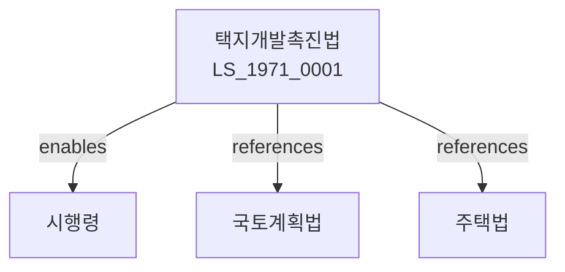

# 택지개발촉진법

> [법률 제20091호, 2024. 1. 9., 일부개정]

---

---

## 제1장 총칙

### 제1조 (목적)

이 법은 택지의 효율적인 개발과 공급을 촉진함으로써 주택건설의 원활한 추진과 국토의 이용 증진에 이바지함을 목적으로 한다。

### 제2조 (정의)

이 법에서 사용하는 용어의 뜻은 다음과 같다。

1. "택지"란 주택건설을 위하여 사용되는 토지를 말한다.
2. "택지개발사업"이란 택지를 조성하는 사업을 말한다.
3. "택지개발사업자"란 택지개발사업을 시행하는 자를 말한다.
4. "택지개발예정지구"란 택지개발사업을 시행하기 위하여 지정하는 지구를 말한다.

---

## 제2장 택지개발예정지구

### 第5条 (택지개발예정지구의 지정)

국토교통부장관은 택지개발예정지구를 지정한다。

### 第6条 (지구지정요건)

택지개발예정지구 지정요건은 다음 각 호와 같다。

1. 주택수요의 충족
2. 택지공급의 원활화
3. 도시계획과의 조화

### 第7条 (지구지정절차)

택지개발예정지구 지정절차는 대통령령으로 정한다。

### 第8条 (지구변경)

택지개발예정지구를 변경할 수 있다。

---

## 제3장 택지개발사업

### 第15条 (택지개발사업의 시행)

택지개발사업은 다음 각 호의 자가 시행한다。

1. 한국토지주택공사
2. 지방공사
3. 주택건설사업자

### 第16条 (사업시행계획)

택지개발사업자는 사업시행계획을 수립한다。

### 第17条 (사업시행인가)

사업시행계획은 국토교통부장관의 인가를 받아야 한다。

### 第18条 (토지의 수용)

택지개발사업을 위하여 토지를 수용할 수 있다。

---

## 제4장 택지의 공급

### 第25条 (택지의 공급)

택지는 주택건설을 위하여 공급한다。

### 第26条 (공급대상)

택지의 공급대상은 다음 각 호와 같다。

1. 주택건설사업자
2. 주택조합
3. 국가 및 지방자치단체

### 第27条 (공급가격)

택지의 공급가격은 공시지가를 기준으로 한다。

### 第28条 (공급순위)

택지공급의 순위는 대통령령으로 정한다。

---

## 제5장 비용 및 자금

### 第35条 (사업비용)

택지개발사업의 비용은 사업자가 부담한다。

### 第36条 (국고보조)

국가는 택지개발사업에 대하여 보조할 수 있다。

### 第37条 (자금융자)

택지개발사업에 필요한 자금을 융자할 수 있다。

### 第38条 (채권발행)

택지개발사업자는 채권을 발행할 수 있다。

---

## 제6장 감독

### 第45条 (감독)

국토교통부장관은 택지개발사업을 감독한다。

### 第46条 (보고 및 검사)

국토교통부장관은 필요한 경우 보고를 명하거나 검사할 수 있다。

### 第47条 (시정명령)

국토교통부장관은 이 법을 위반한 자에 대하여 시정명령을 할 수 있다。

### 第48条 (인가취소)

국토교통부장관은 중대한 위반사유가 있는 경우 인가를 취소할 수 있다。

---

## 제7장 벌칙

### 第55条 (벌칙)

다음 각 호의 어느 하나에 해당하는 자는 3년 이하의 징역 또는 3천만원 이하의 벌금에 처한다。

1. 인가 없이 택지개발사업을 한 자
2. 허위로 인가를 받은 자

### 第56条 (과태료)

다음 각 호의 어느 하나에 해당하는 자에게는 1천만원 이하의 과태료를 부과한다。

1. 정당한 사유 없이 보고를 하지 아니한 자
2. 시정명령을 위반한 자

---

## 관계 그래프

**상위 법령**
- [[헌법]] 제35조 (주거권)
- [[국토기본법]]

**관련 법령**
- [[국토계획법]]
- [[주택법]]
- [[도시계획법]]
- [[건축법]]

**하위 법령**
- [[택지개발촉진법 시행령]]
