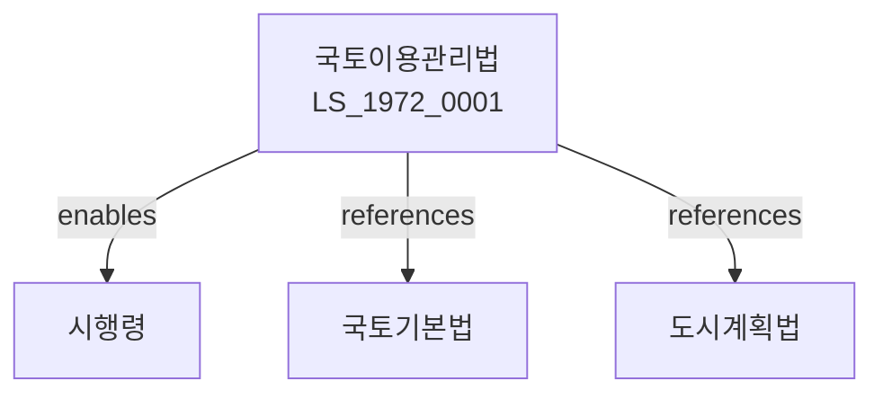

# 국토이용관리법

> [법률 제20092호, 2024. 1. 9., 일부개정]

---

---

## 제1장 총칙

### 제1조 (목적)

이 법은 국토의 효율적인 이용과 관리를 통하여 국토의 균형있는 발전과 공공복리의 증진에 이바지함을 목적으로 한다。

### 제2조 (정의)

이 법에서 사용하는 용어의 뜻은 다음과 같다。

1. "국토이용"이란 국토의 계획적인 이용을 말한다。
2. "국토이용계획"이란 국토이용에 관한 기본계획을 말한다。
3. "용도지역"이란 국토이용의 목적에 따라 지정하는 지역을 말한다。
4. "용도지구"란 용도지역 내에서 세분된 지구를 말한다。

---

## 제2장 국토이용계획

### 第5条 (국토이용계획의 수립)

국토교통부장관은 국토이용계획을 수립한다。

### 第6条 (계획의 내용)

국토이용계획의 내용은 다음 각 호와 같다。

1. 국토이용의 기본방향
2. 용도지역의 지정
3. 개발제한구역의 지정
4. 그 밖에 국토이용에 관한 사항

### 第7条 (계획의 변경)

국토이용계획을 변경할 수 있다。

### 第8条 (계획의 공고)

국토이용계획은 관보에 공고한다。

---

## 제3장 용도지역

### 第15条 (용도지역의 구분)

용도지역은 다음 각 호와 같이 구분한다。

1. 도시지역
2. 관리지역
3. 농림지역
4. 자연환경보전지역

### 第16条 (도시지역)

도시지역은 도시계획에 따라 개발하는 지역이다。

### 第17条 (관리지역)

관리지역은 보전과 개발을 조화시키는 지역이다。

### 第18条 (농림지역)

농림지역은 농업과 임업을 위한 지역이다。

### 第19条 (자연환경보전지역)

자연환경보전지역은 자연환경을 보전하는 지역이다。

---

## 제4장 행위제한

### 第25条 (행위제한)

용도지역 안에서의 행위를 제한할 수 있다。

### 第26条 (도시지역에서의 행위제한)

도시지역에서의 행위제한은 도시계획법에 따른다。

### 第27条 (관리지역에서의 행위제한)

관리지역에서의 행위제한은 대통령령으로 정한다。

### 第28条 (농림지역에서의 행위제한)

농림지역에서의 행위제한은 농지법에 따른다。

---

## 제5장 개발제한구역

### 第35条 (개발제한구역의 지정)

국토교통부장관은 도시의 무질서한 확산을 방지하기 위하여 개발제한구역을 지정할 수 있다。

### 第36条 (개발제한구역에서의 행위제한)

개발제한구역 안에서의 행위를 제한한다。

### 第37条 (개발제한구역의 해제)

개발제한구역을 해제할 수 있다。

### 第38条 (주민지원)

개발제한구역 주민에 대하여 지원한다。

---

## 제6장 감독

### 第45条 (감독)

국토교통부장관은 국토이용관리를 감독한다。

### 第46条 (보고 및 검사)

국토교통부장관은 필요한 경우 보고를 명하거나 검사할 수 있다。

### 第47条 (시정명령)

국토교통부장관은 이 법을 위반한 자에 대하여 시정명령을 할 수 있다。

### 第48条 (과태료)

다음 각 호의 어느 하나에 해당하는 자에게는 과태료를 부과한다。

1. 정당한 사유 없이 보고를 하지 아니한 자
2. 행위제한을 위반한 자

---

## 제7장 벌칙

### 第55条 (벌칙)

다음 각 호의 어느 하나에 해당하는 자는 2년 이하의 징역 또는 2천만원 이하의 벌금에 처한다。

1. 행위제한을 위반한 자
2. 허위로 허가를 받은 자

### 第56条 (과태료)

다음 각 호의 어느 하나에 해당하는 자에게는 1천만원 이하의 과태료를 부과한다。

1. 정당한 사유 없이 보고를 하지 아니한 자
2. 시정명령을 위반한 자

---

## 관계 그래프

**상위 법령**
- [[헌법]] 제120조 (국토)
- [[국토기본법]]

**관련 법령**
- [[도시계획법]]
- [[농지법]]
- [[산림기본법]]
- [[환경정책기본법]]

**하위 법령**
- [[국토이용관리법 시행령]]
