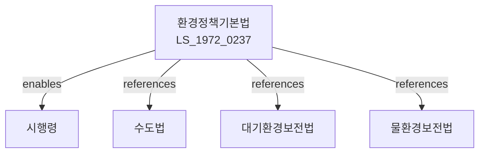

# 환경정책기본법

> [법률 제20102호, 2024. 1. 9., 일부개정]

---

---

## 제1장 총칙

### 제1조 (목적)

이 법은 환경보전에 관한 국민의 권리와 의무 및 국가와 지방자치단체의 책임을 명시하고, 환경정책의 기본이념과 환경보전에 관한 기본적 사항을 정함으로써 환경오염을 방지하고 환경을 적정하게 관리ㆍ보전하여 모든 국민이 쾌적한 환경에서 생활할 수 있게 함으로써 현재와 장래의 국민에게 환경상 혜택을 향유하게 하고 인간과 자연의 공존ㆍ공생을 이룩함을 목적으로 한다.

### 제2조 (정의)

이 법에서 사용하는 용어의 뜻은 다음과 같다.

1. "환경오염"이란 사업활동 기타 사람의 활동에 따라 발생하는 대기오염, 수질오염, 토양오염, 해양오염, 폐기물, 소음ㆍ진동 및 악취 등으로서 사람의 건강이나 환경에 피해를 주는 것을 말한다.
2. "환경보전"이란 환경오염을 방지하고 자연환경과 생태계를 보호ㆍ관리하여 쾌적한 환경을 조성하고 유지하는 것을 말한다.
3. "자연환경"이란 지형ㆍ지질, 수문, 기상, 동식물 등 자연 상태의 환경을 말한다.
4. "생태계"란 일정한 지역 안에서 생물과 그 생물을 둘러싼 환경이 상호작용하여 형성되는 체계를 말한다.
5. "기후위기"란 기후변화로 인하여 사람의 생명ㆍ재산과 생태계에 심각한 위해가 발생하거나 발생할 우려가 있는 상황을 말한다.

### 제3조 (환경보전의 기본이념)

환경보전은 국토의 보전과 이용의 균형을 유지하고, 지속가능한 발전을 도모하며, 생태계의 균형과 다양성을 유지ㆍ보전하는 것을 기본이념으로 한다.

---

## 제2장 국민의 권리와 의무

### 제6조 (환경권)

① 모든 국민은 건강하고 쾌적한 환경에서 생활할 권리를 가진다.

② 국가와 지방자치단체는 환경보전에 관한 시책을 수립ㆍ시행함에 있어서 제1항의 국민의 권리가 침해되지 아니하도록 노력하여야 한다.

### 제7조 (국민의 의무)

모든 국민은 환경보전을 위하여 국가 및 지방자치단체의 환경보전 시책에 협조하고, 환경오염의 원인이 되는 행위를 하여서는 아니 된다.

---

## 제3장 환경정책의 수립 및 추진

### 제10조 (환경보전종합계획)

① 정부는 환경보전을 위한 종합적인 시책을 추진하기 위하여 10년마다 환경보전종합계획(이하 "종합계획"이라 한다)을 수립하여야 한다.

② 종합계획에는 다음 각 호의 사항이 포함되어야 한다.

1. 환경현황 및 전망에 관한 사항
2. 대기ㆍ수질ㆍ토양ㆍ해양 등의 환경보전에 관한 사항
3. 자연환경 및 생태계 보전에 관한 사항
4. 폐기물 관리 및 자원순환에 관한 사항
5. 환경교육 및 홍보에 관한 사항
6. 환경과학 기술의 개발 및 지원에 관한 사항
7. 그 밖에 환경보전을 위하여 필요한 사항

### 제11조 (지역환경보전계획)

① 특별시장ㆍ광역시장ㆍ도지사ㆍ특별자치시장 또는 특별자치도지사는 당해 지역의 환경보전을 위하여 지역환경보전계획을 수립하여 환경부장관의 승인을 얻어야 한다.

② 제1항에 따른 지역환경보전계획의 수립기준 및 절차 등에 관하여 필요한 사항은 환경부령으로 정한다.

### 제12조 (기후위기 대응)

① 정부는 기후위기에 효율적으로 대응하기 위하여 온실가스 감축, 기후변화 적응 등 관련 시책을 수립ㆍ시행하여야 한다.

② 기후위기 대응에 관한 사항은 따로 번률로 정한다.

---

## 제4장 환경영향평가

### 제20조 (환경영향평가)

① 대통령령으로 정하는 규모 이상의 사업을 시행하려는 자는 그 사업의 시행으로 인하여 환경에 미치는 영향을 평가하여야 한다.

② 환경영향평가의 대상, 절차 및 방법 등에 관하여 필요한 사항은 따로 법률로 정한다.

---

## 제5장 환경분쟁 조정

### 제30조 (환경분쟁의 조정)

환경오염으로 인한 분쟁은 환경분쟁조정위원회에서 조정할 수 있다.

### 제31조 (환경분쟁조정위원회)

① 환경분쟁을 조정하기 위하여 환경부에 중앙환경분쟁조정위원회를, 시ㆍ도에 지방환경분쟁조정위원회를 둔다.

② 환경분쟁조정위원회의 조직ㆍ직무 및 운영 등에 관하여 필요한 사항은 대통령령으로 정한다.

---

## 제6장 환경개선비용 부담

### 제40조 (환경개선비용의 부담)

① 환경오염의 원인을 제공한 자는 환경개선에 소요되는 비용을 부담하여야 한다.

② 제1항에 따른 비용부담의 범위 및 절차 등에 관하여 필요한 사항은 대통령령으로 정한다.

---

## 제7장 보칙

### 제50조 (환경조사)

환경부장관은 환경현황과 오염도 등을 파악하기 위하여 환경조사를 실시할 수 있다.

### 제51조 (환경기술 개발)

국가와 지방자치단체는 환경보전 및 오염방지를 위한 기술의 개발과 보급을 촉진하기 위하여 필요한 시책을 수립하여야 한다.

### 제52조 (환경교육)

① 국가와 지방자치단체는 환경보전에 관한 국민의 이해를 높이기 위하여 환경교육을 실시하여야 한다.

② 학교 및 기업 등은 환경교육을 실시하도록 노력하여야 한다.

---

## 제8장 벌칙

### 제60조 (벌칙)

이 법을 위반하여 환경오염을 유발한 자는 5년 이하의 징역 또는 5천만원 이하의 벌금에 처한다.

### 제61조 (과태료)

다음 각 호의 어느 하나에 해당하는 자에게는 300만원 이하의 과태료를 부과한다.

1. 제20조에 따른 환경영향평가를 실시하지 아니한 자
2. 제50조에 따른 환경조사를 거부 또는 방해한 자

---

## 관계 그래프

**상위 법령**
- [[헌법]] 제35조 (환경권)

**관련 법령**
- [[대기환경보전법]]
- [[물환경보전법]]
- [[수도법]]
- [[폐기물관리법]]
- [[자연환경보전법]]
- [[기후위기대응을 위한 탄소중립·녹색성장 기본법]]

**하위 법령**
- [[환경정책기본법 시행령]]
