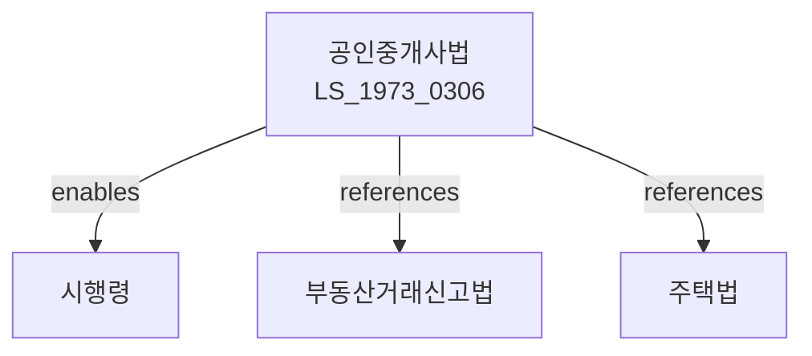

# 공인중개사의 업무 및 부동산 거래신고에 관한 법률

> [법률 제20084호, 2024. 1. 9., 일부개정]

---

---

## 제1장 총칙

### 제1조 (목적)

이 법은 공인중개사의 직무와 그에 부수하는 부동산 거래신고 등에 관한 사항을 정함으로써 부동산 중개업무의 건전한 육성과 부동산 거래의 적정화를 도모하여 국민경제의 발전에 이바지함을 목적으로 한다.

### 제2조 (정의)

이 법에서 사용하는 용어의 뜻은 다음과 같다.

1. "부동산중개"란 부동산의 매매ㆍ교환ㆍ임대차 등에 관하여 거래 당사자의 의뢰를 받아 중개하는 행위를 말한다.
2. "공인중개사"란 이 법에 따라 공인중개사 자격을 취득한 자를 말한다.
3. "중개사무소"란 공인중개사가 부동산중개업무를 수행하기 위하여 개설한 사무소를 말한다.
4. "거래당사자"란 부동산의 매매ㆍ교환ㆍ임대차 등을 의뢰한 자를 말한다.

---

## 제2장 공인중개사

### 第3条 (자격)

① 공인중개사가 되려는 자는 국토교통부장관이 실시하는 공인중개사 시험에 합격하여야 한다.

② 공인중개사 시험은 제1차 시험과 제2차 시험으로 구분하여 실시한다.

### 第4条 (시험의 과목)

공인중개사 시험의 과목은 다음 각 호와 같다.

1. 제1차 시험: 부동산학개론, 민법 및 민사특별법 중 부동산 관련 법규
2. 제2차 시험: 부동산공시법, 부동산세법, 부동산공법 중 부동산 관련 법규

### 第5条 (자격의 결격사유)

다음 각 호의 어느 하나에 해당하는 자는 공인중개사의 자격을 취득할 수 없다.

1. 금치산자 또는 한정치산자
2. 파산자로서 복권되지 아니한 자
3. 이 법을 위반하여 징역형을 선고받은 후 3년이 지나지 아니한 자

---

## 제3장 중개사무소

### 第10条 (중개사무소의 개설)

① 공인중개사는 중개사무소를 개설한 후 10일 이내에 관할 시장ㆍ군수 또는 구청장에게 신고하여야 한다.

② 중개사무소를 이전한 경우에도 제1항에 따른 신고를 하여야 한다.

### 第11条 (중개사무소의 표시)

① 중개사무소에는 간판을 부착하여야 한다.

② 간판에는 다음 각 호의 사항을 표시하여야 한다.

1. 공인중개사의 성명 및 자격등록번호
2. 중개사무소의 명칭 및 소재지
3. 전화번호

### 第12条 (보증보험의 가입)

① 공인중개사는 거래당사자의 보호를 위하여 보증보험에 가입하여야 한다.

② 보증보험의 가입금액 등에 관하여 필요한 사항은 대통령령으로 정한다.

---

## 제4장 중개업무

### 第20条 (중개업무의 수행)

공인중개사는 성실하고 공정하게 중개업무를 수행하여야 한다.

### 第21条 (중개대상물의 확인)

공인중개사는 중개대상물에 관하여 다음 각 호의 사항을 확인하여야 한다.

1. 소유권 등 권리관계
2. 등기부등본의 기재사항
3. 공부상의 기재사항
4. 그 밖에 중개대상물의 현황

### 第22条 (설명서의 교부)

공인중개사는 거래당사자에게 중개대상물에 관한 설명서를 교부하여야 한다.

### 第23条 (중개수수료)

① 중개수수료는 거래당사자가 부담한다.

② 중개수수료의 한도액은 대통령령으로 정한다.

---

## 제5장 부동산 거래신고

### 第30条 (거래신고의무)

거래당사자는 부동산거래를 한 경우 「부동산 거래신고 등에 관한 법률」에 따라 거래신고를 하여야 한다.

### 第31条 (거래정보의 제공)

공인중개사는 거래가 성사된 경우 거래정보를 거래신고관청에 제공할 수 있다.

---

## 제6장 감독

### 第40条 (감독)

① 시장ㆍ군수 또는 구청장은 관할 구역 안의 중개사무소를 감독한다.

② 시장ㆍ군수 또는 구청장은 필요한 경우 중개사무소에 대하여 보고를 명하거나 검사를 할 수 있다.

---

## 제7장 벌칙

### 第45条 (벌칙)

다음 각 호의 어느 하나에 해당하는 자는 3년 이하의 징역 또는 3천만원 이하의 벌금에 처한다.

1. 공인중개사 자격 없이 중개업무를 영위한 자
2. 허위로 중개대상물을 설명한 자

### 第46条 (과태료)

다음 각 호의 어느 하나에 해당하는 자에게는 2천만원 이하의 과태료를 부과한다.

1. 제10조에 따른 신고를 하지 아니한 자
2. 정당한 사유 없이 보고를 하지 아니한 자

---

## 관계 그래프

**상위 법령**
- [[헌법]] 제23조 (재산권)
- [[부동산거래신고법]]

**관련 법령**
- [[주택법]]
- [[건축법]]
- [[국토계획및이용에관한법률]]
- [[부동산가격공시및감정평가에관한법률]]

**하위 법령**
- [[공인중개사법 시행령]]
