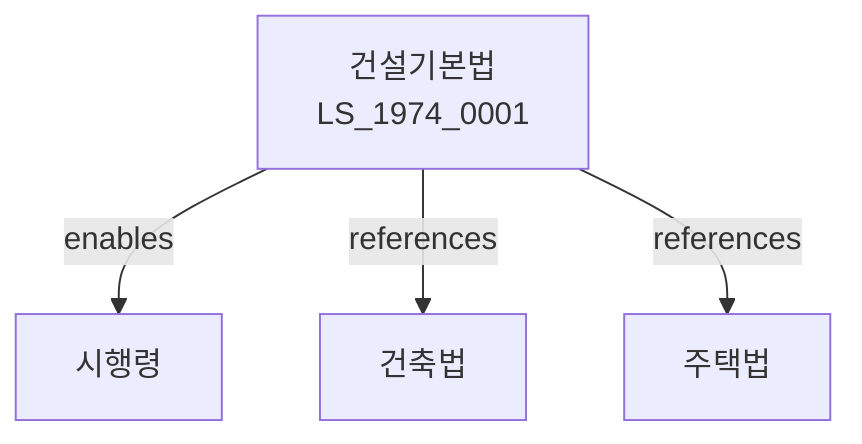

# 건설기본법

> [법률 제20093호, 2024. 1. 9., 일부개정]

---

---

## 제1장 총칙

### 제1조 (목적)

이 법은 건설산업의 건전한 발전과 건설공사의 적정한 시행을 도모함으로써 국민경제의 발전과 공공복리의 증진에 이바지함을 목적으로 한다。

### 제2조 (정의)

이 법에서 사용하는 용어의 뜻은 다음과 같다。

1. "건설공사"이란 건축물 등을 건설하는 공사를 말한다。
2. "건설사업자"란 건설공사를 업으로 하는 자를 말한다。
3. "건설기술자"란 건설공사에 관한 기술을 가진 자를 말한다。
4. "발주자"란 건설공사를 발주하는 자를 말한다。

---

## 제2장 건설사업의 등록

### 第5条 (건설사업의 등록)

건설사업을 하려는 자는 국토교통부장관에게 등록하여야 한다。

### 第6条 (등록요건)

등록요건은 다음 각 호와 같다。

1. 자본금의 확보
2. 기술인력의 보유
3. 시설 및 장비의 확보

### 第7条 (등록결격사유)

다음 각 호의 어느 하나에 해당하는 자는 등록할 수 없다。

1. 금치산자 또는 한정치산자
2. 파산자로서 복권되지 아니한 자
3. 이 법을 위반하여 등록취소 후 2년이 지나지 아니한 자

### 第8条 (등록의 유효기간)

등록의 유효기간은 대통령령으로 정한다。

---

## 제3장 건설공사의 도급

### 第15条 (도급계약)

건설공사의 도급계약은 서면으로 체결하여야 한다。

### 第16条 (하도급)

건설사업자는 하도급을 할 수 있다。

### 第17条 (하도급의 제한)

하도급의 제한은 대통령령으로 정한다。

### 第18条 (도급금액의 지급)

발주자는 도급금액을 성실하게 지급하여야 한다。

---

## 제4장 건설공사의 시공

### 第25条 (시공관리)

건설사업자는 건설공사를 적정하게 시공하여야 한다。

### 第26条 (품질관리)

건설공사의 품질관리를 하여야 한다。

### 第27条 (안전관리)

건설공사의 안전관리를 하여야 한다。

### 第28条 (환경관리)

건설공사의 환경관리를 하여야 한다。

---

## 제5장 건설기술자

### 第35条 (건설기술자의 자격)

건설기술자는 자격을 갖추어야 한다。

### 第36条 (건설기술자의 양성)

국가는 건설기술자를 양성한다。

### 第37条 (건설기술자의 교육)

건설사업자는 건설기술자에 대하여 교육을 실시하여야 한다。

### 第38条 (기술능력의 유지)

건설사업자는 기술능력을 유지하여야 한다。

---

## 제6장 입찰 및 계약

### 第45条 (입찰)

건설공사는 경쟁입찰에 부쳐야 한다。

### 第46条 (입찰참가자격)

입찰참가자격은 대통령령으로 정한다。

### 第47条 (계약의 체결)

입찰에 따라 계약을 체결한다。

### 第48条 (계약보증금)

계약체결 시 계약보증금을 납부하여야 한다。

---

## 제7장 감독

### 第55条 (감독)

국토교통부장관은 건설사업을 감독한다。

### 第56条 (보고 및 검사)

국토교통부장관은 필요한 경우 보고를 명하거나 검사할 수 있다。

### 第57条 (영업정지)

국토교통부장관은 이 법을 위반한 자에 대하여 영업정지를 명할 수 있다。

### 第58条 (등록취소)

국토교통부장관은 중대한 위반사유가 있는 경우 등록을 취소할 수 있다。

---

## 제8장 벌칙

### 第65条 (벌칙)

다음 각 호의 어느 하나에 해당하는 자는 5년 이하의 징역 또는 5천만원 이하의 벌금에 처한다。

1. 등록 없이 건설사업을 한 자
2. 허위로 등록한 자
3. 입찰에 부정한 방법으로 참여한 자

### 第66条 (과태료)

다음 각 호의 어느 하나에 해당하는 자에게는 1천만원 이하의 과태료를 부과한다。

1. 정당한 사유 없이 보고를 하지 아니한 자
2. 하도급 제한을 위반한 자

---

## 관계 그래프

**상위 법령**
- [[헌법]] 제119조 (경제질서)
- [[국토기본법]]

**관련 법령**
- [[건축법]]
- [[주택법]]
- [[산업안전보건법]]
- [[기술개발촉진법]]

**하위 법령**
- [[건설기본법 시행령]]
