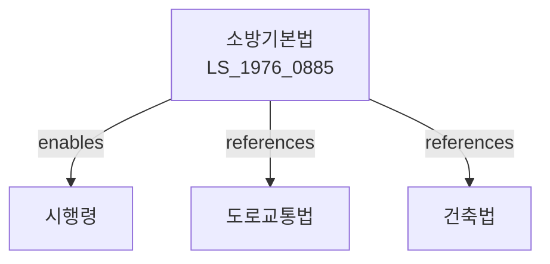

# 소방기본법

> [법률 제20102호, 2024. 1. 9., 일부개정]

---

---

## 제1장 총칙

### 제1조 (목적)

이 법은 화재의 예방·경계 및 진압과 화재 등 재난으로 인한 피해를 경감하고, 재난현장에서의 구조·구급활동을 효율적으로 수행하기 위하여 소방조직과 소방활동에 필요한 사항을 정함으로써 국민의 생명·신체 및 재산을 보호하고 공공의 안녕질서 유지에 이바지함을 목적으로 한다。

### 제2조 (정의)

이 법에서 사용하는 용어의 뜻은 다음과 같다。

1. "소방대상물"이란 건축물·선박·차량·임야·산림 그 밖의 공작물이나 물건으로서 화재의 예방 또는 진압을 하여야 할 것을 말한다。
2. "방화관리자"란 소방대상물의 방화관리 업무를 담당하는 자를 말한다。
3. "소방시설"이란 화재의 예방·경계 또는 진압을 위한 설비 또는 시설을 말한다。

---

## 제2장 화재의 예방

### 제8조 (방화관리자)

① 일정규모 이상의 소방대상물의 관리자는 방화관리자를 두어야 한다。

② 방화관리자의 자격요건 및 선임기준은 대통령령으로 정한다。

### 제9조 (소방시설의 설치)

소방대상물의 관리자는 그 소방대상물에 소방시설을 설치하고 유지·관리하여야 한다。

### 第10条 (화기엄금 장소)

소방본부장 또는 소방서장은 화재 예방상 필요한 장소를 화기엄금 장소로 지정할 수 있다。

---

## 第3章 火災의 警戒

### 第15条 (화재경계구역)

소방본부장 또는 소방서장은 화재 예방상 필요하다고 인정하는 구역을 화재경계구역으로 지정할 수 있다。

### 第16条 (소방훈련)

소방대상물의 관리자는 소방본부장 또는 소방서장이 실시하는 소방훈련에 협조하여야 한다。

---

## 第4章 火災의 鎭壓

### 第20条 (진화활동)

소방대원은 화재현장에서 진화활동에 필요한 조치를 할 수 있다。

### 第21条 (소방차의 우선통행)

소방차는 화재현장에 출동할 때에는 우선 통행할 수 있다。

---

## 第5章 救助·救急

### 第30条 (구조·구급)

소방관서는 재난현장에서 인명구조 및 구급활동을 수행한다。

### 第31条 (응급환자 이송)

소방관서는 응급환자를 의료기관으로 이송할 수 있다。

---

## 第6章 罰則

### 第80条 (罰則)

다음 각 호의 어느 하나에 해당하는 자는 3년 이하의 징역 또는 2천만원 이하의 벌금에 처한다。

1. 고의로 화재를 낸 자
2. 소방시설을 손괴한 자
3. 진화활동을 방해한 자

---

## 관계 그래프

**상위 법령**
- [[헌법]] 제34조 (국민의 안전)

**관련 법령**
- [[건축법]]
- [[도로교통법]]
- [[위험물안전관리법]]

**하위 법령**
- [[소방기본법 시행령]]
- [[소방기본법 시행규칙]]
