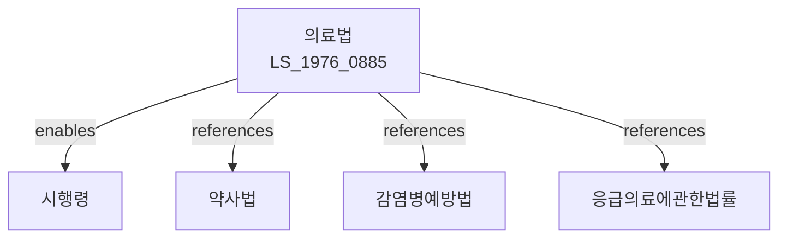

# 의료법

> [법률 제20145호, 2024. 1. 16., 일부개정]

---

---

## 제1장 총칙

### 제1조 (목적)

이 법은 국민의 생명과 건강을 보호·증진하기 위하여 의료인과 의료기관의 자질 및 시설 기준 등을 정하고 의료행위를 적정하게 관리함으로써 국민 보건 향상에 이바지함을 목적으로 한다。

### 제2조 (정의)

이 법에서 사용하는 용어의 뜻은 다음과 같다.

1. "의료인"이란 의사·치과의사·한의사·간호사 및 조산사를 말한다.
2. "의료기관"이란 의료인이 의료를 행하는 시설로서 병원·의원·치과병원·치과의원·한방병원·한의원·조산원 및 보건의료원을 말한다.
3. "의료"란 의학·치의학·한의학에 의하여 보건·의료·간호 및 조산을 행하는 것을 말한다.
4. "의료기사"란 임상병리사·방사선사·물리치료사·작업치료사·치과기공사 및 응급구조사를 말한다.

---

## 제2장 의료인

### 제8조 (면허)

① 의료인이 되려는 자는 보건복지부장관의 면허를 받아야 한다.

② 면허를 받으려면 다음 각 호의 자격요건을 갖추어야 한다.

1. 대한민국 국민
2. 의료인 양성을 목적으로 하는 대학에서 소정의 과정을 마친 자
3. 국가시험에 합격한 자

③ 다음 각 호의 어느 하나에 해당하는 자는 면허를 받을 수 없다.

1. 금치산자 또는 한정치산자
2. 마약·대마 또는 향정신성의약품 중독자
3. 정신질환자
4. 금고 이상의 실형을 선고받고 그 집행이 끝나거나 집행을 받지 아니하기로 확정된 후 2년이 지나지 아니한 자

### 第10条 (면허증)

보건복지부장관은 면허를 받은 자에게 면허증을 교부하여야 한다.

### 第11条 (면허의 취소·정지)

보건복지부장관은 의료인이 다음 각 호의 어느 하나에 해당하는 때에는 면허를 취소하거나 1년 이내의 기간을 정하여 면허의 효력을 정지할 수 있다.

1. 제8조제3항 각 호의 어느 하나에 해당하게 된 때
2. 업무와 관련하여 금품을 수수한 때
3. 고의 또는 중대한 과실로 환자에게 위해를 가한 때
4. 그 밖에 의료인으로서의 품위를 손상한 때

---

## 第3章 의료기관

### 第30条 (의료기관의 개설)

① 의료기관을 개설하려는 자는 보건복지부령으로 정하는 바에 따라 시장·군수·구청장에게 신고하여야 한다.

② 의료기관의 장은 의료인이어야 한다.

### 第31条 (의료기관의 시설기준)

의료기관은 보건복지부령으로 정하는 인력·시설 및 장비 기준에 적합하여야 한다.

### 第33条 (진료기록부)

① 의료기관의 장은 환자에 대하여 진료기록부를 작성·비치하여야 한다.

② 진료기록부에는 다음 각 호의 사항을 기재하여야 한다.

1. 환자의 성명·성별·생년월일 및 주소
2. 진료연월일
3. 진단명
4. 치료내용
5. 처방내용

③ 진료기록부는 진료 종료일부터 10년간 보관하여야 한다.

---

## 第4章 의료행위

### 第45条 (의사의 진료)

① 의사는 환자를 진찰·진단하고 치료·처방할 수 있다.

② 의사는 의학적 지식과 경험에 따라 환자의 생명과 건강을 보호하기 위하여 최선의 진료를 하여야 한다.

### 第46条 (전문의)

① 의사는 보건복지부령으로 정하는 바에 따라 전문의 자격을 취득할 수 있다.

② 전문의의 종류는 대통령령으로 정한다.

### 第47条 (응급진료)

의료기관의 장은 응급환자가 내원한 때에는 진료 능력 범위 내에서 응급진료를 하여야 한다.

---

## 第5章 광고

### 第46条의2 (의료광고의 제한)

① 의료기관 또는 의료인은 거짓되거나 과장된 광고를 하여서는 아니 된다.

② 의료광고의 범위 및 방법은 보건복지부령으로 정한다.

③ 다음 각 호의 어느 하나에 해당하는 광고는 금지된다.

1. 의료법 위반 사실을 알리는 광고
2. 환자의 증상·병력 등을 이용한 광고
3. 거짓·과장·비방 광고
4. 그 밖에 보건복지부령으로 정하는 광고

---

## 第6章 罰則

### 第90条 (罰則)

다음 각 호의 어느 하나에 해당하는 자는 3년 이하의 징역 또는 3천만원 이하의 벌금에 처한다.

1. 면허 없이 의료행위를 한 자
2. 면허증을 타인에게 대여한 자
3. 진료기록부를 허위로 작성한 자

### 第91条 (罰則)

다음 각 호의 어느 하나에 해당하는 자는 1년 이하의 징역 또는 1천만원 이하의 벌금에 처한다.

1. 정당한 사유 없이 진료를 거부한 자
2. 의료광고 제한을 위반한 자

---

## 관계 그래프

**상위 법령**
- [[헌법]] 제36조 (국민의 건강)

**관련 법령**
- [[약사법]]
- [[감염병의예방및관리에관한법률]]
- [[응급의료에관한법률]]
- [[장기등이식에관한법률]]

**하위 법령**
- [[의료법 시행령]]
- [[의료법 시행규칙]]
