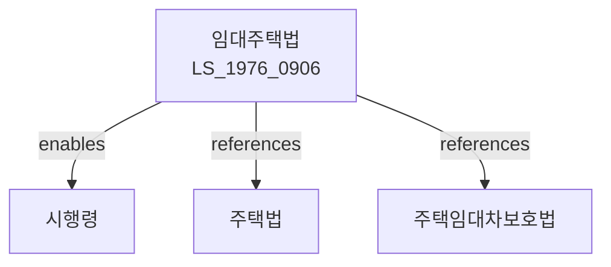

# 임대주택법

> [법률 제20098호, 2024. 1. 9., 일부개정]

---

---

## 제1장 총칙

### 제1조 (목적)

이 법은 임대주택의 건설ㆍ공급 및 관리에 관한 사항을 정함으로써 주거 안정을 도모하고 국민주거생활의 향상에 이바지함을 목적으로 한다。

### 제2조 (정의)

이 법에서 사용하는 용어의 뜻은 다음과 같다。

1. "임대주택"이란 임대목적으로 건설하거나 건설된 주택을 말한다。
2. "임대사업자"란 임대주택을 건설ㆍ공급 또는 관리하는 자를 말한다。
3. "공공임대주택"이란 국가 또는 지방자치단체의 지원을 받아 건설한 임대주택을 말한다。
4. "민간임대주택"이란 공공임대주택 외의 임대주택을 말한다。

---

## 제2장 임대주택의 건설

### 第5条 (임대주택 건설계획)

① 국토교통부장관은 5년마다 임대주택 건설계획을 수립하여야 한다。

② 건설계획에는 다음 각 호의 사항이 포함되어야 한다。

1. 임대주택의 건설목표
2. 임대주택의 유형별 공급계획
3. 건설재원의 확보방안
4. 그 밖에 임대주택 건설에 필요한 사항

### 第6条 (임대주택의 건설)

임대주택을 건설하려는 자는 주택건설촉진법에 따른 사업계획의 승인을 받아야 한다。

### 第7条 (건설기준)

임대주택은 대통령령으로 정하는 기준에 적합하게 건설하여야 한다。

---

## 제3장 임대주택의 공급

### 第15条 (공급대상)

공공임대주택은 다음 각 호의 자에게 공급한다。

1. 무주택자
2. 저소득자
3. 청년
4. 신혼부부
5. 그 밖에 대통령령으로 정하는 자

### 第16条 (공급절차)

임대주택의 공급절차는 대통령령으로 정한다。

### 第17条 (임대조건)

임대주택의 임대기간ㆍ임대료 등 임대조건은 대통령령으로 정하는 범위 안에서 정한다。

---

## 제4장 임대주택의 관리

### 第25条 (임대사업자의 의무)

임대사업자는 다음 각 호의 의무를 가진다。

1. 임대주택을 선량한 관리자의 주의로 관리할 의무
2. 적정한 임대료를 부과할 의무
3. 임차인의 거주안정을 도모할 의무

### 第26条 (임대주택의 처분제한)

임대사업자는 의무임대기간 동안 임대주택을 처분하지 못한다。 다만, 대통령령으로 정하는 경우에는 그러하지 아니하다。

### 第27条 (임차인의 의무)

임차인은 임대주택을 주거용으로만 사용하여야 하며, 목적 외 용도로 사용하여서는 아니 된다。

---

## 제5장 지원

### 第35条 (재정지원)

국가 또는 지방자치단체는 임대주택의 건설 및 관리를 위하여 재정지원을 할 수 있다。

### 第36条 (세제지원)

임대사업자에 대하여는 조세특례제한법에 따라 세제지원을 할 수 있다。

### 第37条 (금융지원)

국가는 임대주택의 건설 및 관리를 위하여 금융지원을 할 수 있다。

---

## 제6장 벌칙

### 第45条 (벌칙)

다음 각 호의 어느 하나에 해당하는 자는 2년 이하의 징역 또는 2천만원 이하의 벌금에 처한다。

1. 허위로 임대주택을 공급한 자
2. 제26조에 따른 처분제한을 위반한 자

### 第46条 (과태료)

다음 각 호의 어느 하나에 해당하는 자에게는 1천만원 이하의 과태료를 부과한다。

1. 정당한 사유 없이 보고를 하지 아니한 자
2. 임대조건을 위반한 자

---

## 관계 그래프

**상위 법령**
- [[헌법]] 제35조 (거주의 자유)
- [[주택법]]

**관련 법령**
- [[주택임대차보호법]]
- [[주택도시보증공사법]]
- [[한국토지주택공사법]]
- [[부동산거래신고법]]

**하위 법령**
- [[임대주택법 시행령]]
