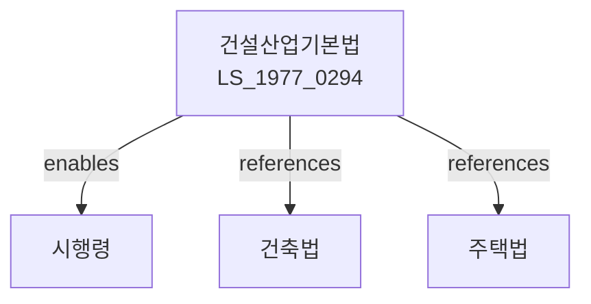

# 건설산업기본법

> [법률 제20118호, 2024. 1. 9., 일부개정]

---

---

## 제1장 총칙

### 제1조 (목적)

이 법은 건설산업의 건전한 발전과 건설공사의 적정한 시행을 도모함으로써 국민경제의 발전과 공공복리의 증진에 이바지함을 목적으로 한다。

### 제2조 (정의)

이 법에서 사용하는 용어의 뜻은 다음과 같다。

1. "건설업"이란 토목, 건축 등의 공사를 하는 업을 말한다。
2. "건설사업자"란 건설업을 영위하는 자를 말한다。
3. "건설공사"란 건축물, 토목구조물 등을 신축, 증축, 개축, 재축, 이축, 보수 또는 철거하는 공사를 말한다。
4. "주택건설등록업"이란 주택을 건설하는 업을 말한다。

---

## 제2장 건설업의 면허

### 第5条 (건설업의 면허)

건설업을 영위하려는 자는 국토교통부장관의 면허를 받아야 한다。

### 第6条 (면허의 종류)

면허의 종류는 다음 각 호와 같다。

1. 일반건설업: 토목, 건축 등 일반공사
2. 전문건설업: 전문분야의 공사
3. 주택건설업: 주택건설공사
4. 그 밖에 대통령령으로 정하는 업종

### 第7条 (면허요건)

면허요건은 다음 각 호와 같다。

1. 자본금 및 자산의 요건
2. 기술인력의 요건
3. 건설기계의 요건
4. 그 밖에 대통령령으로 정하는 요건

### 第8条 (결격사유)

다음 각 호의 어느 하나에 해당하는 자는 건설업의 면허를 받을 수 없다。

1. 파산자로서 복권되지 아니한 자
2. 이 법에 따라 면허가 취소된 후 2년이 지나지 아니한 자
3. 금고 이상의 형을 선고받고 그 집행이 종료되지 아니한 자

---

## 제3장 건설공사의 시행

### 第20条 (건설공사의 도급)

건설공사의 도급은 공정하게 이루어져야 한다。

### 第21条 (하도급의 제한)

건설사업자는 도급받은 공사의 전부를 하도급할 수 없다。 다만, 대통령령으로 정하는 경우에는 예외로 한다。

### 第22条 (하도급의 승인)

건설사업자가 공사의 일부를 하도급하려는 경우 발주자의 승인을 받아야 한다。

### 第23条 (공사이행의 보증)

건설사업자는 도급계약 체결시 공사이행을 보증하여야 한다。

---

## 제4장 건설기술자

### 第30条 (건설기술자의 자격)

건설기술자는 건설기술진흥법에 따른 자격을 가진 자로 한다。

### 第31条 (건설기술자의 배치)

건설사업자는 공사의 종류 및 규모에 따라 건설기술자를 배치하여야 한다。

### 第32条 (건설기술자의 의무)

건설기술자는 직무를 성실히 수행하고 건설공사의 품질을 확보하여야 한다。

---

## 제5장 건설공사의 품질관리

### 第40条 (품질보증)

건설사업자는 건설공사의 품질을 보증하여야 한다。

### 第41条 (하자보수)

건설사업자는 준공 후 대통령령으로 정하는 기간 동안 하자보수 의무를 진다。

### 第42条 (하자보수보증금)

건설사업자는 하자보수를 위하여 보증금을 예치하여야 한다。

---

## 제6장 감독

### 第50条 (감독)

국토교통부장관은 건설업을 감독한다。

### 第51条 (보고 및 검사)

국토교통부장관은 필요한 경우 건설사업자에게 보고를 명하거나 검사할 수 있다。

### 第52条 (영업정지)

국토교통부장관은 이 법을 위반한 건설사업자에 대하여 영업정지를 명할 수 있다。

### 第53条 (면허취소)

국토교통부장관은 중대한 위반사유가 있는 경우 면허를 취소할 수 있다。

---

## 제7장 벌칙

### 第80条 (벌칙)

다음 각 호의 어느 하나에 해당하는 자는 3년 이하의 징역 또는 3천만원 이하의 벌금에 처한다。

1. 제5조에 따른 면허 없이 건설업을 영위한 자
2. 허위로 면허를 받은 자

### 第81条 (과태료)

다음 각 호의 어느 하나에 해당하는 자에게는 2천만원 이하의 과태료를 부과한다。

1. 정당한 사유 없이 보고를 하지 아니한 자
2. 건설기술자를 배치하지 아니한 자

---

## 관계 그래프

**상위 법령**
- [[헌법]] 제119조 (경제질서)
- [[건축법]]

**관련 법령**
- [[주택법]]
- [[건설기술진흥법]]
- [[하도급거래공정화법]]
- [[국토계획및이용에관한법률]]

**하위 법령**
- [[건설산업기본법 시행령]]
