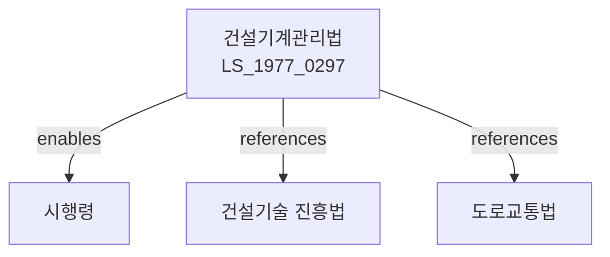

# 건설기계 관리법

> [법률 제20085호, 2024. 1. 9., 일부개정]

---

---

## 제1장 총칙

### 제1조 (목적)

이 법은 건설기계의 등록, 검사, 운전자 면허 및 건설기계사업 등에 관한 사항을 정함으로써 건설기계의 적정한 관리와 건설산업의 건전한 발전에 이바지함을 목적으로 한다.

### 제2조 (정의)

이 법에서 사용하는 용어의 뜻은 다음과 같다.

1. "건설기계"란 토목, 건축, 조선 등의 공사에 사용하는 기계로서 대통령령으로 정하는 것을 말한다.
2. "건설기계등록"이란 건설기계의 소유자에 관한 사항을 등록원부에 등재하는 것을 말한다.
3. "건설기계검사"란 건설기계의 구조 및 안전도를 검사하는 것을 말한다.
4. "건설기계사업"이란 건설기계의 대여, 매매, 정비 등을 업으로 하는 것을 말한다.

---

## 제2장 건설기계의 등록

### 第5条 (건설기계의 등록)

① 건설기계를 취득한 자는 국토교통부장관에게 건설기계등록을 하여야 한다.

② 건설기계등록의 절차 및 방법 등에 관하여 필요한 사항은 대통령령으로 정한다.

### 第6条 (등록번호의 표시)

건설기계의 소유자는 건설기계에 등록번호를 표시하여야 한다.

### 第7条 (등록사항의 변경)

건설기계의 등록사항에 변경이 있는 경우에는 변경등록을 하여야 한다.

---

## 제3장 건설기계의 검사

### 第10条 (정기검사)

① 건설기계의 소유자는 정기적으로 건설기계검사를 받아야 한다.

② 정기검사의 주기 및 방법 등에 관하여 필요한 사항은 대통령령으로 정한다.

### 第11条 (수시검사)

국토교통부장관은 필요하다고 인정하는 경우 건설기계에 대하여 수시로 검사할 수 있다.

### 第12条 (검사의 면제)

다음 각 호의 어느 하나에 해당하는 건설기계에 대하여는 검사를 면제할 수 있다.

1. 새로이 제작된 건설기계
2. 대통령령으로 정하는 경미한 구조변경을 한 건설기계

---

## 제4장 건설기계운전면허

### 第20条 (건설기계운전면허)

① 건설기계를 운전하려는 자는 국토교통부장관의 면허를 받아야 한다.

② 건설기계운전면허의 종류는 다음 각 호와 같다.

1. 제1종: 대형 건설기계
2. 제2종: 중형 건설기계
3. 제3종: 소형 건설기계

### 第21条 (면허의 결격사유)

다음 각 호의 어느 하나에 해당하는 자는 건설기계운전면허를 받을 수 없다.

1. 18세 미만인 자
2. 정신질환자
3. 마약 등 중독자
4. 건설기계 운전과 관련하여 금고 이상의 형을 선고받은 자

### 第22条 (면허의 취소)

국토교통부장관은 건설기계운전면허를 받은 자가 이 법을 위반한 경우 면허를 취소하거나 정지할 수 있다.

---

## 제5장 건설기계사업

### 第30条 (건설기계사업의 등록)

① 건설기계사업을 영위하려는 자는 시장ㆍ군수 또는 구청장에게 등록하여야 한다.

② 등록의 요건 및 절차 등에 관하여 필요한 사항은 대통령령으로 정한다。

### 第31条 (결격사유)

다음 각 호의 어느 하나에 해당하는 자는 건설기계사업의 등록을 할 수 없다.

1. 파산자로서 복권되지 아니한 자
2. 이 법을 위반하여 징역형을 선고받은 후 2년이 지나지 아니한 자

---

## 제6장 벌칙

### 第40条 (벌칙)

다음 각 호의 어느 하나에 해당하는 자는 3년 이하의 징역 또는 3천만원 이하의 벌금에 처한다.

1. 제5조에 따른 등록 없이 건설기계를 운행한 자
2. 제20조에 따른 면허 없이 건설기계를 운전한 자

### 第41条 (과태료)

다음 각 호의 어느 하나에 해당하는 자에게는 1천만원 이하의 과태료를 부과한다.

1. 제10조에 따른 정기검사를 받지 아니한 자
2. 제6조에 따른 등록번호를 표시하지 아니한 자

---

## 관계 그래프

**상위 법령**
- [[헌법]] 제119조 (경제질서)
- [[건설기술 진흥법]]

**관련 법령**
- [[도로교통법]]
- [[건설산업기본법]]
- [[노동안전보건법]]
- [[자동차관리법]]

**하위 법령**
- [[건설기계관리법 시행령]]
