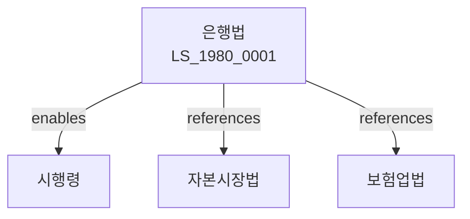

# 은행법

> [법률 제20094호, 2024. 1. 9., 일부개정]

---

---

## 제1장 총칙

### 제1조 (목적)

이 법은 은행업무의 건전한 발전과 예금자등의 보호를 도모함으로써 국민경제의 발전에 이바지함을 목적으로 한다。

### 제2조 (정의)

이 법에서 사용하는 용어의 뜻은 다음과 같다。

1. "은행"이란 금융업무를 영위하는 금융기관을 말한다。
2. "은행업무"란 예금, 대출, 환업무 등을 말한다。
3. "예금자"란 은행에 예금을 하는 자를 말한다。
4. "금융감독원장"이란 금융감독원의 원장을 말한다。

---

## 제2장 은행의 인가

### 第5条 (은행의 인가)

은행을 설립하려는 자는 금융위원회의 인가를 받아야 한다。

### 第6条 (인가요건)

인가요건은 다음 각 호와 같다。

1. 자본금의 확보
2. 인력의 확보
3. 시설의 확보
4. 공익성

### 第7条 (인가결격사유)

다음 각 호의 어느 하나에 해당하는 자는 인가를 받을 수 없다。

1. 금치산자 또는 한정치산자
2. 파산자로서 복권되지 아니한 자
3. 금융관련법을 위반하여 인가취소 후 3년이 지나지 아니한 자

### 第8条 (인가의 유효기간)

인가의 유효기간은 대통령령으로 정한다。

---

## 제3장 은행의 업무

### 第15条 (영업범위)

은행은 다음 각 호의 업무를 영위한다。

1. 예금업무
2. 대출업무
3. 환업무
4. 유가증권업무
5. 그 밖에 금융위원회가 정하는 업무

### 第16条 (예금업무)

은행은 예금을 받는다。

### 第17条 (대출업무)

은행은 자금을 대출한다。

### 第18条 (유가증권업무)

은행은 유가증권을 취급한다。

---

## 제4장 은행의 관리

### 第25条 (건전성 규제)

은행은 건전하게 경영하여야 한다。

### 第26条 (자기자본규제)

은행은 자기자본비율을 유지하여야 한다。

### 第27条 (유동성 규제)

은행은 유동성비율을 유지하여야 한다。

### 第28条 (대주주 한도)

동일인에 대한 신용공급한도를 정한다。

---

## 제5장 예금자 보호

### 第35条 (예금자 보호)

국가는 예금자를 보호한다。

### 第36条 (예금보험)

예금보험제도를 운영한다。

### 第37条 (예금지급보장)

예금지급을 보장한다。

### 第38条 (정보공시)

은행은 정보를 공시하여야 한다。

---

## 제6장 감독

### 第45条 (감독)

금융위원회는 은행을 감독한다。

### 第46条 (보고 및 검사)

금융감독원장은 필요한 경우 보고를 명하거나 검사할 수 있다。

### 第47条 (영업정지)

금융위원회는 이 법을 위반한 은행에 대하여 영업정지를 명할 수 있다。

### 第48条 (인가취소)

금융위원회는 중대한 위반사유가 있는 경우 인가를 취소할 수 있다。

---

## 제7장 벌칙

### 第55条 (벌칙)

다음 각 호의 어느 하나에 해당하는 자는 5년 이하의 징역 또는 5천만원 이하의 벌금에 처한다。

1. 인가 없이 은행업무를 한 자
2. 허위로 인가를 받은 자
3. 불법자금을 대출한 자

### 第56条 (과태료)

다음 각 호의 어느 하나에 해당하는 자에게는 2천만원 이하의 과태료를 부과한다。

1. 정당한 사유 없이 보고를 하지 아니한 자
2. 정보공시를 위반한 자

---

## 관계 그래프

**상위 법령**
- [[헌법]] 제119조 (경제질서)
- [[한국은행법]]

**관련 법령**
- [[자본시장법]]
- [[보험업법]]
- [[신용정보법]]
- [[여신전문금융업법]]

**하위 법령**
- [[은행법 시행령]]
