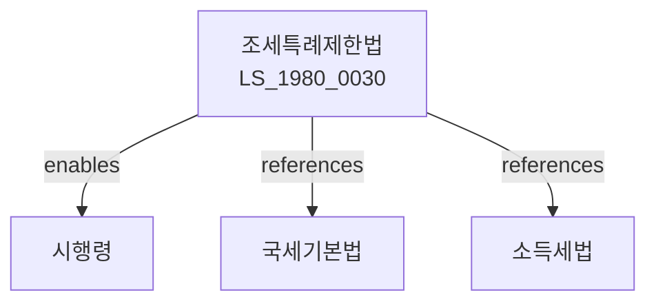

# 조세특례제한법

> [법률 제20119호, 2024. 1. 9., 일부개정]

---

---

## 제1장 총칙

### 제1조 (목적)

이 법은 조세의 감면 및 징수의 특례에 관한 사항을 정함으로써 국민경제의 건전한 발전과 사회복지의 증진에 이바지함을 목적으로 한다。

### 제2조 (정의)

이 법에서 사용하는 용어의 뜻은 다음과 같다。

1. "조세특례"란 일정한 요건을 갖춘 자에 대하여 조세의 감면 또는 징수의 특례를 적용하는 것을 말한다。
2. "감면"란 조세의 전부 또는 일부를 면제하는 것을 말한다。
3. "세액공제"란 산출세액에서 일정액을 공제하는 것을 말한다。
4. "소득공제"란 소득금액에서 일정액을 공제하는 것을 말한다。

---

## 제2장 중소기업에 대한 조세지원

### 第5条 (중소기업에 대한 소득세 등의 감면)

중소기업이 창업하는 경우 소득세 또는 법인세의 100분의 50을 감면한다。

### 第6条 (중소기업투자준비금의 손금산입)

중소기업은 투자준비금을 손금으로 산입할 수 있다。

### 第7条 (중소기업에 대한 부가가치세 면제)

대통령령으로 정하는 중소기업에 대하여 부가가치세를 면제할 수 있다。

### 第8条 (지방세 감면)

지방자치단체는 중소기업에 대하여 지방세를 감면할 수 있다。

---

## 제3장 산업지원에 대한 조세지원

### 第15条 (기술 및 인력개발에 대한 세액공제)

기술개발비 및 인력개발비의 일부를 세액공제한다。

### 第16条 (생산성향상설비투자에 대한 세액공제)

생산성향상을 위한 설비투자의 일부를 세액공제한다。

### 第17条 (연구개발특구 입주기업에 대한 감면)

연구개발특구에 입주하는 기업에 대하여 소득세 또는 법인세를 감면한다。

---

## 제4장 지역특화에 대한 조세지원

### 第25条 (수도권외 지역 이전기업에 대한 감면)

수도권외 지역으로 이전하는 기업에 대하여 소득세 또는 법인세를 감면한다。

### 第26条 (농어촌특별세)

농어촌의 발전을 위하여 농어촌특별세를 부과한다。

### 第27条 (제주특별자치도에 대한 조세지원)

제주특별자치도에 투자하는 기업에 대하여 조세를 감면한다。

---

## 제5장 사회복지에 대한 조세지원

### 第35条 (장애인 고용에 대한 세액공제)

장애인을 고용하는 사업자에 대하여 세액공제한다。

### 第36条 (근로장려금)

저소득 근로자에 대하여 근로장려금을 지급한다。

### 第37条 (자녀장려금)

자녀를 둔 저소득 가구에 대하여 자녀장려금을 지급한다。

### 第38条 (월세액에 대한 소득공제)

월세를 지급하는 근로자에 대하여 소득공제한다。

---

## 제6장 금융 및 자본시장에 대한 조세지원

### 第45条 (금융소득에 대한 분리과세)

금융소득에 대하여는 종합과세하지 아니하고 분리과세할 수 있다。

### 第46条 (증권거래에 대한 양도소득세 면제)

대통령령으로 정하는 증권거래에 대하여 양도소득세를 면제한다。

### 第47条 (상장법인에 대한 세제지원)

주식을 상장하는 법인에 대하여 소득세 또는 법인세를 감면할 수 있다。

---

## 제7장 국외투자에 대한 조세지원

### 第55条 (국외투자소득에 대한 감면)

국외에 투자하는 기업의 소득에 대하여 소득세 또는 법인세를 감면한다。

### 第56条 (외국납부세액공제)

외국에서 납부한 조세는 국내 세액에서 공제한다。

---

## 제8장 조세피난처 과세제도

### 第60条 (조세피난처 과세)

조세피난처를 이용하여 조세를 회피하는 경우 특별부가세를 부과한다。

### 第61条 (유보소득 과세)

조세피난처에 유보된 소득에 대하여 과세한다。

---

## 제9장 벌칙

### 第100条 (벌칙)

다음 각 호의 어느 하나에 해당하는 자는 3년 이하의 징역 또는 3천만원 이하의 벌금에 처한다。

1. 허위로 조세특례를 적용받은 자
2. 부정한 방법으로 감면을 받은 자

### 第101条 (가산세)

조세특례를 위반한 자에게는 가산세를 부과한다。

---

## 관계 그래프

**상위 법령**
- [[헌법]] 제38조 (납세의 의무)
- [[국세기본법]]

**관련 법령**
- [[소득세법]]
- [[법인세법]]
- [[부가가치세법]]
- [[지방세법]]

**하위 법령**
- [[조세특례제한법 시행령]]
